NFDI4Culture Data Story
{: .text-overline-m}

# Baroque Ceiling Paintings in Germany

## Exploring the Corpus of Baroque Ceiling Painting (CbDD) through Interactive Data Visualization

/// html | div[class='tile']
**Authors:** [Thanos Drossos](https://orcid.org/0009-0001-6545-9096), [Robin Kleemann](https://orcid.org/), [YiMin Cai](https://orcid.org/)  
**Persistent Identifier:** https://nfdi4culture.de/id/CbDD  
**License:** [CC-BY 4.0](https://creativecommons.org/licenses/by/4.0/)
///

**Abstract:** This data story explores the Corpus of Baroque Ceiling Painting in Germany (CbDD) through interactive visualizations powered by DuckDB WASM. We analyze the geographic distribution, temporal patterns, and thematic content of over 4,500 ceiling paintings across German regions, using client-side SQL queries for responsive data exploration. The study combines data from the NFDI4Culture Knowledge Graph with historical photographs from Bildindex, cross-referenced via GND identifiers.
{: .intro}

---

## Introduction

Baroque ceiling and wall paintings were a hallmark of interior decoration between the 16th and 18th centuries, transforming churches, palaces, and grand halls with vibrant allegorical frescoes. In Germany alone, a dedicated research corpus (Corpus der barocken Deckenmalerei in Deutschland, CbDD) has documented 4,594 such artworks along with their locations and artists. Harnessing this rich cultural heritage data, we set out to explore the careers of Baroque ceiling painters and the distribution and themes of their works. To do so, we leverage linked data and modern analysis tools to combine information from multiple sources. This integrated approach allows us to ask: Who were the key Baroque ceiling painters, when and where did they create their works, and what subjects did they depict? By uniting a specialized art-historical dataset with external knowledge graphs and archives, our data story uncovers patterns and insights that would be difficult to see in isolation. The result is an interactive narrative that not only presents quantitative analyses of these artworks and artists, but also demonstrates the power of semantic data integration in cultural heritage research.

### Methods 

We followed a multi-step data pipeline to gather and analyze the information:

1. Data Retrieval via SPARQL: We used SPARQL queries to retrieve structured data on Baroque ceiling paintings and artists from online knowledge graphs. In particular, the core list of paintings and their metadata was obtained from the CbDD’s digital dataset (via a SPARQL endpoint in NFDI). Using SPARQL ensured that we could precisely filter for relevant works (e.g. paintings dated 1550–1800 in Germany) and fetch associated attributes like titles, locations, dates, and painter names in a single query.

2. Data Enrichment: To enhance the dataset, we cross-linked entities across different sources. Painter names from the corpus were reconciled with the original CbDD knowledg graph entries to gather consistent biographical details (e.g. birth/death years) and further connections between the paintings and buildings. We also connected the paintings to the Bildindex der Kunst und Architektur (the German art and architecture image index) to retrieve image metadata and detailled arhitectural data. This was done by matching GND identifiers and other metadata fields, allowing us to enrich our dataset with historical photographs and additional contextual information about the artworks.

3. Data Integration and Cleaning: All retrieved and enriched data were then merged into a single cohesive dataset. We carefully matched paintings from the CbDD corpus with entries in the Bildindex (and other sources) by comparing titles, locations, and other attributes, flagging any ambiguities or duplicates. Each artwork entry was augmented with the identifiers from multiple sources (such as corpus IDs, ICONLASS, GND numbers, and image links) to enable seamless cross-reference. Unmatched items were reviewed and noted for exclusion. The outcome was a unified dataset of 4,594 paintings, representing the breadth of Baroque ceiling art in Germany.

4. Database and Analysis: The consolidated dataset was imported into a local DuckDB relational database, chosen for its efficiency in analytical querying. Using DuckDB via Python, we could perform complex SQL queries and manipulations on the data directly within our notebook. We analyzed key aspects of the data – for example, counting paintings per artist, examining the timeline of commissions, mapping the geographic distribution of works across regions, and identifying common iconographic themes. We utilized Python libraries (such as Polars for data handling and Altair for charting) to derive summary statistics and create visualizations. This approach allowed interactive exploration of the data with fast query performance on the ~4k records.

5. Visualization and Presentation: Finally, we presented our findings in an interactive format using SHMARQL, a Linked Data storytelling platform. SHMARQL (running in a Docker container for our project) renders the data story Markdown and executes live SPARQL queries embedded in the text. In practice, this means that each figure or chart in our story is generated on the fly by querying the underlying SPARQL endpoints or our prepared dataset. The visualizations (e.g. timelines, maps, bar charts) are thus always consistent with the latest data and can be interactive. Graphs are created using Altair, while maps are rendered with Leaflet. The DuckDB database is accessed via a WASM client-side implementation, allowing users to run SQL queries directly in their browser for a responsive experience. This setup enables us to tell a dynamic data story that combines narrative text with live data exploration.


### Limitations

While our data story provides a comprehensive overview of Baroque ceiling paintings in Germany, there are several limitations to consider:

1. **Data Completeness**: The CbDD corpus, while extensive, may not capture every existing Baroque ceiling painting in Germany. Since it CbDD is still considered a work in progress, there may be gaps in the dataset and the dataset has a bias towards weel-documented artworks in Bavaria. Hence, it may not fully represent the diversity of ceiling paintings across all regions and the biographical details of lesser-known artists may be incomplete.

2. **Data Quality and Consistency**: The data retrieved from different sources (CbDD, Bildindex, etc.) may have inconsistencies in naming conventions, metadata formats, and completeness. For example, painter names may be spelled differently across sources, and some paintings may lack precise dating or location information. This can lead to challenges in data integration and may affect the accuracy of our analyses. We have found discrepancies between NFDI and the original CbDD dataset, which we had to resolve manually. Changes in the CbDD dataset were often not reflected in the NFDI endpoint, leading to further mismatches and missing data.

3. **Analytical Scope**: Our analyses are limited to the attributes available in the dataset, which may not capture all relevant aspects of Baroque ceiling paintings. For example, we focus on quantifiable attributes such as the number of paintings per artist or geographic distribution, but we do not analyze the stylistic features, iconography, or artistic techniques in depth. Additionally, our temporal analysis is constrained by the dating information available for each painting, which may be imprecise or missing for some works.

4. **Interpretation of Results**: The patterns and trends we identify in the data may be influenced by the biases and limitations of the dataset, as well as our analytical choices. For example, the prominence of certain artists or regions may reflect historical documentation biases rather than actual production patterns. Therefore, our interpretations should be made with caution and in the context of existing art historical knowledge.

### Dataset Overview

<div id="dataset-stats" class="duckdb-query">
    <div class="loading">Loading database statistics...</div>
</div>

<script type="module">
(async function() {
    await BaroqueViz.renderDatasetStats('#dataset-stats', '/story/CbDD/baroque.duckdb');
})();
</script>

---

## Research Questions

This data story addresses the following research questions:

1. **Geographic Distribution**: How are Baroque ceiling paintings distributed across German federal states?
2. **Temporal Patterns**: When was the peak period of ceiling painting production?
3. **Artistic Networks**: Who were the most prolific painters, and where did they work?
4. **Thematic Analysis**: What iconographic subjects dominate Baroque ceiling paintings?
5. **Cross-Dataset Links**: How do CbDD records connect to historical photographs in Bildindex?

---

## User experience 

This data story invites users to explore Baroque ceiling painting between **1600 and 1750** through two complementary perspectives: a **macro perspective** and a **micro perspective**.

**Macro perspective:**
This perspective provides an overview of the period by presenting temporal, spatial, and historical information. It visualizes how ceiling paintings are distributed over time, highlights their geographical occurrence across regions and building types, and situates the artworks within broader political and historical settings of the era. This perspective is intended to support orientation and to offer contextual reference points.

**Micro perspective:**
This perspective shifts the focus to an individual level. Users can explore the period through the life and work of a representative artist associated with a selected thematic block. Biographical information, artistic output, and geographical movement are presented to allow users to experience Baroque ceiling painting from a personal viewpoint and to observe how artistic activity unfolds across time and space.

By combining aggregated views with individual trajectories, this data story enables users to navigate between overview and detail, encouraging independent exploration and reflection on Baroque ceiling painting within its historical context.

---

## Macro perspective
### Analysis 01: Geographic Distribution

Where are Baroque ceiling paintings concentrated across Germany?

<div id="state-distribution" class="baroque-chart"></div>

<script type="module">
(async function() {
    // Wait for database to be ready
    while (!BaroqueDB.isReady()) {
        await new Promise(r => setTimeout(r, 100));
    }
    await BaroqueViz.renderStateDistribution('#state-distribution');
})();
</script>

/// details | **Show SQL Query**
    type: plain
```sql
SELECT 
    location_state,
    COUNT(*) as painting_count,
    COUNT(DISTINCT building_id) as building_count
FROM paintings
WHERE location_state IS NOT NULL
GROUP BY location_state
ORDER BY painting_count DESC
```
///

**Observation:** Bavaria and Baden-Württemberg contain the highest concentrations of Baroque ceiling paintings, reflecting the Catholic cultural sphere's emphasis on elaborate church decoration during the Counter-Reformation period.

---

### Analysis 02: Temporal Distribution

When were most ceiling paintings created?

<div id="temporal-distribution" class="baroque-chart"></div>

<script type="module">
(async function() {
    while (!BaroqueDB.isReady()) {
        await new Promise(r => setTimeout(r, 100));
    }
    await BaroqueViz.renderTemporalDistribution('#temporal-distribution');
})();
</script>

/// details | **Show SQL Query**
    type: plain
```sql
SELECT 
    CAST(FLOOR(year_start / 10) * 10 AS INTEGER) as decade,
    COUNT(*) as count
FROM paintings
WHERE year_start IS NOT NULL
  AND year_start >= 1500 AND year_start <= 1900
GROUP BY FLOOR(year_start / 10) * 10
ORDER BY decade
```
///

**Observation:** The peak period for Baroque ceiling painting production was between 1700-1760, coinciding with the height of the Baroque and Rococo periods in German architecture.

---

### Analysis 03: Top Painters

Who were the most prolific ceiling painters in Germany?

<div id="top-painters" class="baroque-chart"></div>

<script type="module">
(async function() {
    while (!BaroqueDB.isReady()) {
        await new Promise(r => setTimeout(r, 100));
    }
    await BaroqueViz.renderTopPainters('#top-painters');
})();
</script>

/// details | **Show SQL Query**
    type: plain
```sql
SELECT 
    pp.person_name,
    COUNT(DISTINCT pp.nfdi_uri) as painting_count,
    MIN(p.year_start) as earliest,
    MAX(p.year_end) as latest
FROM painting_persons pp
JOIN paintings p ON pp.nfdi_uri = p.nfdi_uri
WHERE pp.role = 'PAINTER'
GROUP BY pp.person_name
ORDER BY painting_count DESC
LIMIT 20
```
///

---

### Analysis 03b: Co-painter Relationships

Which painters most frequently appear together on the same ceiling paintings?

<div id="co-painter-pairs" class="baroque-chart"></div>

<script type="module">
(async function() {
    while (!BaroqueDB.isReady()) {
        await new Promise(r => setTimeout(r, 100));
    }
    await BaroqueViz.renderCoPainterPairs('#co-painter-pairs');
})();
</script>

/// details | **Show SQL Query**
    type: plain
```sql
WITH painters AS (
  SELECT nfdi_uri, person_name AS painter
  FROM painting_persons
  WHERE role='PAINTER' AND person_name IS NOT NULL
),
pairs AS (
  SELECT a.painter AS p1, b.painter AS p2, COUNT(*) AS n_co
  FROM painters a
  JOIN painters b
    ON a.nfdi_uri = b.nfdi_uri
   AND a.painter < b.painter
  GROUP BY 1,2
),
collab_counts AS (
  SELECT painter, SUM(n_co) AS total_collab
  FROM (
    SELECT p1 AS painter, n_co FROM pairs
    UNION ALL
    SELECT p2 AS painter, n_co FROM pairs
  )
  GROUP BY painter
  ORDER BY total_collab DESC
  LIMIT 50
)
SELECT p.p1, p.p2, p.n_co
FROM pairs p
WHERE p.p1 IN (SELECT painter FROM collab_counts)
  AND p.p2 IN (SELECT painter FROM collab_counts)
  AND p.n_co >= 2
ORDER BY p.n_co DESC
```
///

**Observation:** The network graph reveals clusters of closely collaborating painters. Node size reflects each painter's total number of collaborative works, while edge thickness encodes the intensity of each specific partnership. Repeated co-painter pairs suggest stable workshop teams or recurring commissions, highlighting that ceiling painting production was often network-based rather than purely individual authorship.

---

### Analysis 04: Geographic Map of Buildings

Interactive map showing the locations of buildings with ceiling paintings.

<div id="buildings-map" class="baroque-map"></div>

<script type="module">
(async function() {
    while (!BaroqueDB.isReady()) {
        await new Promise(r => setTimeout(r, 100));
    }
    await BaroqueViz.renderBuildingsMap('#buildings-map');
})();
</script>

**Tip:** Click on markers to see building details and painting counts. Use the zoom controls to explore specific regions.

---

### Analysis 05: ICONCLASS Subject Categories

What themes dominate Baroque ceiling paintings?

<div id="iconclass-categories" class="baroque-chart"></div>

<script type="module">
(async function() {
    while (!BaroqueDB.isReady()) {
        await new Promise(r => setTimeout(r, 100));
    }
    await BaroqueViz.renderIconclassCategories('#iconclass-categories');
})();
</script>

/// details | **Show SQL Query**
    type: plain
```sql
SELECT 
    SUBSTRING(s.iconclass_code, 1, 1) as category,
    COUNT(DISTINCT ps.nfdi_uri) as painting_count
FROM painting_subjects ps
JOIN subjects s ON ps.subject_uri = s.subject_uri
WHERE s.iconclass_code IS NOT NULL
GROUP BY SUBSTRING(s.iconclass_code, 1, 1)
ORDER BY painting_count DESC
```
///

**ICONCLASS Categories:**

- *0* · Abstract, Non-representational Art
- *1* · Religion and Magic
- *2* · Nature
- *3* · Human Being, Man in General
- *4* · Society, Civilization, Culture
- *5* · Abstract Ideas and Concepts
- *6* · History
- *7* · Bible
- *8* · Literature
- *9* · Classical Mythology and Ancient History

---

### Analysis 06: Cross-Dataset Comparison

Comparing CbDD ceiling paintings with Bildindex historical photographs.

<div id="cross-dataset" class="baroque-chart"></div>

<script type="module">
(async function() {
    while (!BaroqueDB.isReady()) {
        await new Promise(r => setTimeout(r, 100));
    }
    await BaroqueViz.renderCrossDatasetComparison('#cross-dataset');
})();
</script>

The Bildindex archive contains historical photographs of ceiling paintings, many taken before restoration or destruction during World War II. These images provide invaluable documentation of artworks that may have changed significantly over time.

---

## Interactive Query Explorer

Run your own SQL queries against the database:

<div class="duckdb-query">
    <textarea id="custom-query" class="query-editor" rows="6">SELECT 
    pp.person_name as painter,
    COUNT(*) as paintings,
    STRING_AGG(DISTINCT p.location_state, ', ') as regions
FROM painting_persons pp
JOIN paintings p ON pp.nfdi_uri = p.nfdi_uri
WHERE pp.role = 'PAINTER'
GROUP BY pp.person_name
ORDER BY paintings DESC
LIMIT 10</textarea>
    <button id="run-custom-query" class="run-query">▶ Run Query</button>
    <div id="custom-query-result" class="query-result"></div>
</div>

<script type="module">
(async function() {
    while (!BaroqueDB.isReady()) {
        await new Promise(r => setTimeout(r, 100));
    }
    BaroqueViz.initQueryExplorer('custom-query', 'run-custom-query', '#custom-query-result');
})();
</script>

### Example Queries to Try

**Paintings by decade and state:**
```sql
SELECT 
    FLOOR(year_start/10)*10 as decade,
    location_state,
    COUNT(*) as count
FROM paintings
WHERE year_start BETWEEN 1650 AND 1800
GROUP BY decade, location_state
ORDER BY decade, count DESC
```

**Buildings with most paintings:**
```sql
SELECT 
    b.label as building,
    b.location_city,
    COUNT(DISTINCT p.nfdi_uri) as paintings
FROM buildings b
JOIN paintings p ON b.building_id = p.building_id
GROUP BY b.building_id, b.label, b.location_city
ORDER BY paintings DESC
LIMIT 20
```

**Subject co-occurrences:**
```sql
SELECT 
    s1.subject_label as subject1,
    s2.subject_label as subject2,
    COUNT(*) as co_occurrences
FROM painting_subjects ps1
JOIN painting_subjects ps2 ON ps1.nfdi_uri = ps2.nfdi_uri AND ps1.subject_uri < ps2.subject_uri
JOIN subjects s1 ON ps1.subject_uri = s1.subject_uri
JOIN subjects s2 ON ps2.subject_uri = s2.subject_uri
WHERE s1.subject_source = 'ICONCLASS' AND s2.subject_source = 'ICONCLASS'
GROUP BY s1.subject_label, s2.subject_label
ORDER BY co_occurrences DESC
LIMIT 20
```

---

## Technical Notes

### Data Sources

- **CbDD**: Corpus of Baroque Ceiling Painting in Germany, accessed via NFDI4Culture Knowledge Graph
- **Bildindex**: Historical photograph archive from Bildindex der Kunst und Architektur

### Technology Stack

- **DuckDB WASM**: Client-side analytical database (~16MB)
- **Plotly.js**: Interactive charts and visualizations
- **Leaflet**: Geographic mapping with marker clustering
- **DataTables**: Sortable, searchable result tables

### Database Schema

| Table | Rows | Description |
|-------|------|-------------|
| `paintings` | 4,594 | Ceiling paintings with metadata |
| `persons` | 2,831 | Artists, architects, patrons |
| `buildings` | 1,260 | Churches, palaces, castles |
| `rooms` | 2,376 | Specific rooms within buildings |
| `subjects` | 4,082 | ICONCLASS + Getty AAT subjects |
| `painting_persons` | 5,848 | Painting ↔ Person relations |
| `painting_subjects` | 17,474 | Painting ↔ Subject relations |
| `bi_items` | 968 | Bildindex historical photos |

---

## Micro perspective

Pick one of the 3 "lenses" below to dive deep into a thematic perspective on Baroque ceiling painting. Each topic opens a full, richly illustrated exploration — click to enter, and use the back button to return here.

<!-- ═══════════════════════════════════════════════════════════════════════
     TOPIC SELECTOR — CSS + HTML + JS
     ═══════════════════════════════════════════════════════════════════ -->

<div id="topic-selector" class="topic-selector">

  <div class="topic-card topic-card--church" onclick="openMicroTopic('church')">
    <div class="topic-icon">⛪</div>
    <div class="topic-title">Church &amp; Religion</div>
    <div class="topic-desc">Explore how faith, divine order, and the supernatural shaped Baroque ceiling iconography across Germany.</div>
    <button class="topic-enter">Enter ➜</button>
  </div>

  <div class="topic-card topic-card--society" onclick="openMicroTopic('society')">
    <div class="topic-icon">🏰</div>
    <div class="topic-title">Society &amp; Culture</div>
    <div class="topic-desc">Discover how aristocratic rituals, courtly life, and social hierarchies were depicted on Baroque ceilings.</div>
    <button class="topic-enter">Enter ➜</button>
  </div>

  <div class="topic-card topic-card--mythology" onclick="openMicroTopic('mythology')">
    <div class="topic-icon">🏛️</div>
    <div class="topic-title">Classical Mythology</div>
    <div class="topic-desc">Uncover how ancient myths legitimised rulers and celebrated the arts in grand palace frescoes.</div>
    <button class="topic-enter">Enter ➜</button>
  </div>

</div>

<script>
document.addEventListener('DOMContentLoaded', function() { BaroqueViz.initTopicSelector(); });
</script>

<!-- ═══════════════════════════════════════════════════════════════════════
     TOPIC 1 — CHURCH & RELIGION
     ═══════════════════════════════════════════════════════════════════ -->
<div id="topic-church" class="micro-topic micro-topic--church" markdown="1">

<button class="topic-back-bar topic-back-bar--church" onclick="backToTopics()">
  <span class="back-arrow">←</span> Back to Topic Selector
</button>

<a id="analysis-church"></a>

## Church and Religion in Baroque Ceiling Paintings

Religious and spiritual themes played a central role in Baroque visual culture.  
Ceiling paintings in the 17th and 18th centuries were not only decorative, but also served as powerful visual narratives that communicated ideas about faith, the cosmos, divine order, and the supernatural.

Beyond institutional religion, Baroque imagery also reflects a broader early modern worldview that included:
- symbolic representations of creation and the universe,
- different religious traditions,
- beliefs in miracles, magic, and supernatural forces,
- and interest in astrology and cosmic influence.

This micro perspective explores **ICONCLASS 1 (Religion & Magic)** and its five major sub-branches:

- **10** · creation, cosmos, universe, life (symbolic representations)  
- **11** · Christian religion  
- **12** · non-Christian religions  
- **13** · magic, supernaturalism, occultism  
- **14** · astrology  

Use the selector below to explore how each subtheme differs in:
- **Where** it concentrates (regional distribution)
- **When** it peaks (temporal trends)
- **Who** paints it most often (representative painters and sample works)

All counts refer to **distinct paintings (nfdi_uri)**, even if a painting has multiple subject tags.

Together, these categories illustrate how Baroque ceiling paintings visualized a comprehensive early modern worldview — one that connected institutional religion with ideas about the cosmos, divine order, and supernatural forces.

The following interactive exploration reveals how these themes were structured in space, time, and artistic production.

#### Regional patterns

This regional clustering suggests that Baroque ceiling painting was supported by stable local patronage networks and artistic centers rather than being a uniformly distributed artistic practice.

<!-- =========================
     RELIGION MICRO DASHBOARD (ICONCLASS 10–14)
     - Subtheme tabs (10..14), default 11
     - Core counts + 2 charts + gallery + representative painter card
========================= -->

#### Exploring thematic structures

Use the dashboard below to compare the five subthemes of ICONCLASS 1.  
For each category, the data reveals:

- overall scale of production,
- regional concentration,
- periods of peak activity,
- and the painters most strongly associated with the theme.

Together, these indicators show how different aspects of religious and spiritual imagery were embedded in the artistic system of the Baroque period.


<div class="rel-wrap">
  <div class="rel-header">
    <div class="rel-title">
      <span id="rel-title-main">Christian Religion</span>
      <span class="rel-sub">(ICONCLASS <span id="rel-prefix">11</span>)</span>
    </div>

    <div class="rel-controls">
      <label class="rel-label">Gallery size:</label>
      <select id="rel-gallery-n" class="rel-select">
        <option>4</option>
        <option selected>6</option>
        <option>8</option>
        <option>12</option>
      </select>
    </div>
  </div>

  <!-- Tabs -->
  <div class="rel-tabs" id="rel-tabs"></div>

  <!-- Core counts -->
  <section class="rel-card rel-corewide">
    <div class="rel-card-title">Core counts (selected subtheme)</div>
    <table class="rel-table">
      <thead>
        <tr><th>Metric</th><th style="text-align:right">Value</th></tr>
      </thead>
      <tbody id="rel-core-body">
        <tr><td>Paintings</td><td style="text-align:right">…</td></tr>
        <tr><td>Painters (role=PAINTER)</td><td style="text-align:right">…</td></tr>
        <tr><td>States</td><td style="text-align:right">…</td></tr>
        <tr><td>Buildings</td><td style="text-align:right">…</td></tr>
      </tbody>
    </table>
    <div class="rel-note">
      We filter by <b>subject_uri LIKE '%iconclass.org/&lt;prefix&gt;%'</b>.  
      Example: prefix <b>11</b> matches codes such as <b>11D…</b>.
    </div>
  </section>

<h4>Temporal development</h4>

<p>
Across subthemes, most production concentrates between <strong>1700 and 1750</strong>, the high period of Baroque and early Rococo art.  
This phase reflects a period of intensive investment in monumental interior decoration, when churches, monasteries, and courts used ceiling painting to shape powerful visual environments.
</p>

  <!-- Charts -->
  <div class="rel-grid-2">
    <section class="rel-card">
      <div class="rel-card-title">Where does it concentrate?</div>
      <div id="rel-state-chart" class="baroque-chart"></div>
      <div class="rel-hint">Top states by number of paintings.</div>
    </section>

    <section class="rel-card">
      <div class="rel-card-title">When does it peak?</div>
      <div id="rel-timeline-chart" class="baroque-chart"></div>
      <div class="rel-hint">Paintings by decade (1600–1800).</div>
    </section>
  </div>

  <!-- Gallery -->
  <section class="rel-card" style="margin-top:14px;">
    <div class="rel-card-title">Sample paintings (click a card to explore details)</div>
    <div id="rel-gallery" class="baroque-gallery"></div>
  </section>

  <!-- Representative painter -->

<h4>Artistic production</h4>

<p>
The data shows that thematic production was often dominated by a limited number of highly active painters.  
This pattern reflects the workshop-based organization of Baroque art, where experienced decorative specialists received repeated commissions across multiple buildings and regions.
</p>

  <section class="rel-card" style="margin-top:14px;">
    <div class="rel-card-title">Representative painter (most frequent in this subtheme)</div>
    <div id="rel-painter-card">Loading…</div>
  </section>
</div>

<script type="module">
(async function(){
  while (typeof BaroqueDB === 'undefined' || !BaroqueDB.isReady || !BaroqueDB.isReady()){
    await new Promise(r => setTimeout(r, 100));
  }
  await BaroqueViz.renderReligionDashboard('.rel-wrap');
})();
</script>

### What does this reveal?

The patterns across theme, region, time, and artistic activity show that religious ceiling painting was not a random collection of images, but part of a structured cultural system.

Baroque religious imagery was:
- geographically concentrated,
- historically time-bound,
- and produced within specialized artistic networks.

Together, these works formed a coordinated visual language that expressed how early modern society understood religion, the universe, and the relationship between the earthly and the divine.

</div><!-- /topic-church -->

<!-- ═══════════════════════════════════════════════════════════════════════
     TOPIC 2 — SOCIETY & CULTURE
     ═══════════════════════════════════════════════════════════════════ -->
<div id="topic-society" class="micro-topic micro-topic--society" markdown="1">

<button class="topic-back-bar topic-back-bar--society" onclick="backToTopics()">
  <span class="back-arrow">←</span> Back to Topic Selector
</button>

<a id="analysis-society"></a>

# Society & Culture

Across Baroque residences, painted interiors did more than decorate walls and ceilings — they structured how society was perceived and communicated. Hunting scenes, images of rulership, and depictions of warfare together formed visual programs that articulated hierarchy, authority, and social roles. Noble hunts showed regulated interaction between humans, animals, and landscape, while military imagery depicted conflict, equipment, and perceived threats of the time. This section follows these domains through selected interiors and artworks, using image data and iconographic categories (ICONCLASS) to trace recurring visual patterns through which painters organized representations of society and culture.

## Hunting and Social Hierarchy - Schlossanlage Weikersheim

The palace complex of Weikersheim provides a particularly comprehensive example of how hunting was integrated into a broader program of rule. 


<div class="cbdd-figure">
  
  <div class="cbdd-figure__caption">
    Schloss Weikersheim; Bildarchiv Foto Marburg; Bunz, Achim; https://www.deckenmalerei.eu/42d06165-58e7-4653-bfe4-3d5f7091fc33#top
  </div>
</div>


Weikersheim had been owned by the Lords of Hohenlohe since 1178, who divided into several different lines on several occasions. In 1586, it fell to Count Wolfgang II of Hohenlohe in a division of land by lot, who had the medieval moated castle converted into a contemporary Renaissance count's residence. During the Baroque period, a Baroque pleasure garden was added to the south of the complex [1,2].
The castle complex comprises several buildings. The oldest building still standing today is the hall, which was begun in 1595. On the first floor of this building is the Great Hall, which extends over two floors and features ceiling paintings by Balthasar Katzenberger.


<div class="cbdd-figure">
  
  <div class="cbdd-figure__caption">
    Schloss Weikersheim; Rittersaal; Bildarchiv Foto Marburg; Bunz, Achim
  </div>
</div>

<div id="rittersaal-saal-card" class="room-card-container"></div>

<script type="module">
(async function() {
    while (!BaroqueDB.isReady()) {
        await new Promise(r => setTimeout(r, 100));
    }
    await BaroqueViz.renderRoomCard('#rittersaal-saal-card', '15685f4a-3727-4110-8967-1d8287431997');
})();
</script>


This Great Hall, today known as the "Rittersaal" measures 36.4 × 11.7 meters and rises to a height of 8.25 meters [3] and was furnished between 1601 and 1605. The ceiling paintings were created by Balthasar Katzenberger, who completed the entire cycle roughly thirteen months after signing the contract, around 1602 [2,4]. Only in the early eighteenth century was the room adapted to Baroque taste and reinterpreted as "Rittersaal" [5]. 

### Hunting and Social Order in the Rittersaal

In the early modern period, hunting was far more than a means of obtaining food. It functioned as a tool for securing and displaying rule and social order and was understood as a real practice of power [6]. At the same time, hunting rights were reserved for the nobility, while the population was burdened by hunting prohibitions, compulsory services, and damage caused by game; demands for free hunting even became part of the peasants’ program during the German Peasants’ War but remained unsuccessful [7,8].

In the Baroque period this development reached its peak: elaborately prepared parforce hunts and enclosed hunts were staged with enormous personnel and financial effort and celebrated as courtly festivities serving princely self-representation [7].
High hunting remained reserved for the nobility, whereas small-game hunting and preparatory work were carried out by gamekeepers and peasants [9].
Hunting thus became a social event and a status symbol of the aristocracy [10].

This broader historical function of hunting provides the context for the decoration of the "Rittersaal" of "Weikersheimer Schloss": the ceiling paintings present hunting scenes in an ordered sequence and arrangement, reflecting contemporary ideas about hunting and social hierarchy documented for the Baroque period.

### Contract Conditions, Ceiling Paintings and Sources

The furnishing of the hall did not emerge as a purely artistic creation but followed precise specifications. A surviving contract between Count Wolfgang II and Katzenberger stipulates that the ceiling was to be executed in water- or glue-based paints on canvas with scenes of hunting and venery. Themes and motifs were determined by the patron and could be supplemented continuously [11]. The paintings were produced in the workshop and subsequently installed. As payment the painter received 195 guilders as well as daily meals of bread and soup; execution in oil would have increased the remuneration [12]. Katzenberger worked without a partner, only with assistants, exclusively in daylight, and required thirteen months for the entire cycle, which he completed on 22 November 1602 [13]. This corresponds to an average of roughly five working days per painting [14]. Only a reworking of 1710/11 intensified the colours and gave the room its today more strongly Baroque appearance [15].

The spatial arrangement also followed a fixed concept. The ceiling is designed to be viewed from the fireplace side. Access, viewing direction and the positioning of the figures refer to this standpoint [16,17]. From there a sequence unfolds from west to east [18]: beginning with Orpheus, followed by depictions of hunting exotic big game, then red and black game, and finally small game [19]. In the western half of the hall predominantly richly dressed courtly hunters on horseback appear, whereas further east increasingly peasants and servants without horses take part [19]. Many scenes are additionally based on printed models. Numerous depictions follow the engraving series of Johannes Stradanus from 1578, while others show parallels to Netherlandish emblematics [20,21]. In Weikersheim both this series and the “Venationes” published from 1596 were available, from which Katzenberger adopted several plates [22]. In total the ceiling comprises 69 paintings, structured into three pictorial groups: mammal hunting in large octagonal fields, bird hunting in rectangular fields, and fishing in half-octagons [23].

On this basis, the ceiling paintings can now be explored from the intended viewing point at the fireplace, following the spatial sequence from west to east. Selected works from each section of the cycle are presented exemplarily. In the visualization, mammal hunting is marked in orange, bird hunting in white, and fishing in blue to indicate the three thematic zones of the ceiling. Clicking on the highlighted areas reveals more detailed information about the respective scene.


<!-- ================= RITTERSAAL: OVERVIEW (3 SECTIONS) + INTERAKTIV (Hotspots) ================= -->
<div class="rittersaal-block">
<!-- ================= 1) OVERVIEW: 3 SECTION TILES (West -> East) ================= -->
<div class="rs-overview">
<div class="rs-overview-title">Explore the ceiling from west to east — choose a section to jump in:</div>

<div class="rs-overview-grid">
<!-- WEST -->
<div class="rs-tile" onclick="jumpToRoom(0)">
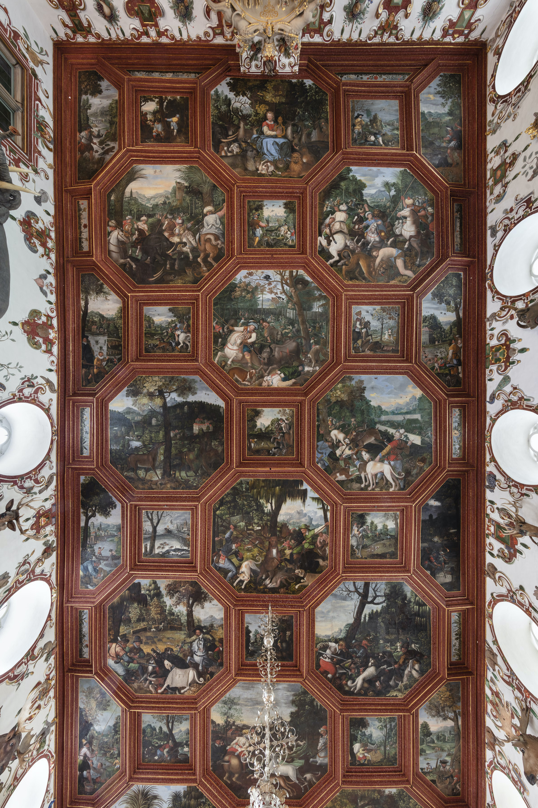
<div class="rs-tile-label">West — Fireplace side</div>
</div>

<!-- CENTER -->
<div class="rs-tile" onclick="jumpToRoom(1)">
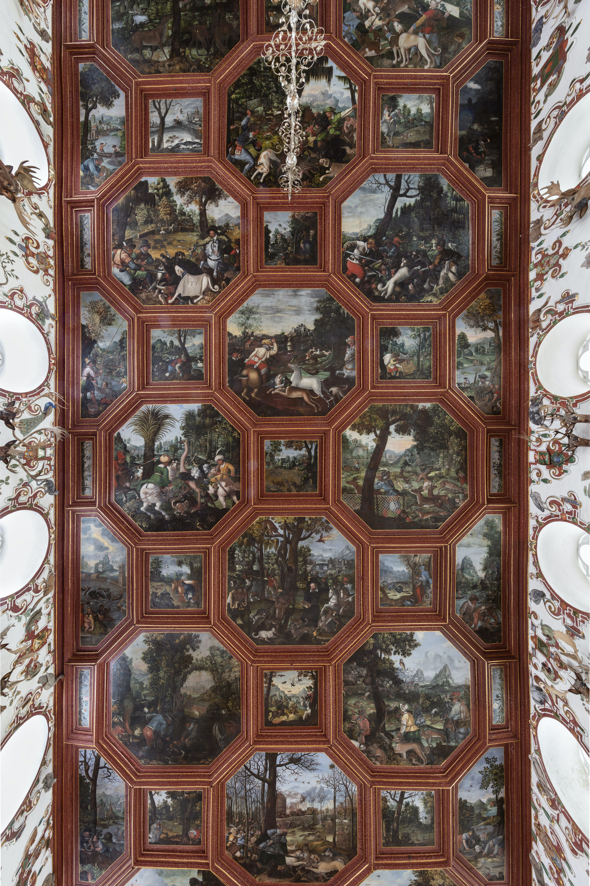
<div class="rs-tile-label">Central section</div>
</div>

<!-- EAST -->
<div class="rs-tile" onclick="jumpToRoom(2)">
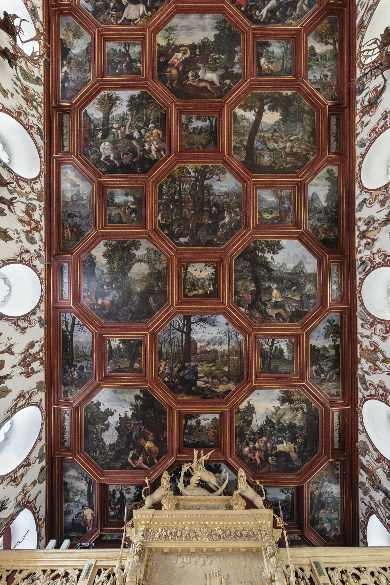
<div class="rs-tile-label">East — Towards the Tafelstube</div>
</div>
</div>
</div>

<!-- ================= 2) INTERAKTIV: Slider + Hotspots + Popups ================= -->
<a id="rittersaal-interactive"></a>

<div class="rittersaal-wrapper" id="rittersaalInteractive">

<!-- NAVIGATION -->
<button class="navbtn prev" onclick="prevImg()">❮</button>
<button class="navbtn next" onclick="nextImg()">❯</button>

<!-- DECKENBILD -->


<!-- LEGENDE -->
<div class="legend">
<div class="legend-title">Types of hunting</div>
<div class="legend-item">
<div class="legend-color legend-mammal"></div>
mammal hunting
</div>
<div class="legend-item">
<div class="legend-color legend-bird"></div>
bird hunting
</div>
<div class="legend-item">
<div class="legend-color legend-fish"></div>
fishing
</div>
</div>

<!-- ================= HOTSPOTS ================= -->

<!-- Bild 1 (Rittersaal1 / West) — A1 ORPHEUS (mammal) -->
<button class="hotspot mammal"
data-room="0"
style="left:38%; top:10%; width:27%; height:12%;"
data-title="A1 – Orpheus"
data-img="A1_Orpheus.jpg"
data-text="A1 Orpheus: The cycle of mammal hunting does not begin with a hunting scene but with Orpheus, who gathers animals around him through his “his song and the lyre of Apollo”. He sits before a densely wooded area, while in the distance to the left a view opens toward a city by a lake. Numerous animals assemble around Orpheus in peaceful unity — including elephant, elk, stag, roe deer, wolf, fox, hedgehog, and wildcat. Further species appear distributed across the scene (among them wild boar, bear, leopard, lion, badger, and rabbit). Two monkeys sit in the tree - one accompanies Orpheus, imitating a human, on a self-made violin. The only creature not affected by the spell is a hunting dog: it grooms itself, looks directly at the viewer, and reappears as the exact same dog later in the ox hunt. The dog and the physiognomy of Orpheus thus function as “connecting elements” linking the following hunting cycle to the viewer."
></button>


<!-- Bild 2 (Rittersaal1 / West) — A5 HIRSCHJAGD (mammal) -->
<button class="hotspot mammal"
data-room="0"
style="left:58%; top:47%; width:22%; height:14%;"
data-title="A5 – Hirschjagd"
data-img="A5_Hirschjagd.jpg"
data-text="A5 Stag hunting: The stag hunt takes place in two settings. On the right, the painting shows an enclosed hunt: stags and roe deer have been driven into an area surrounded by hanging cloths; in the center stands a green tent from which a courtly hunting party observes the scene through viewing slits. Two hunters shoot at the animals from the side out of the tent using firearms. In the foreground (left), a stag that had previously attacked a hunter is itself attacked by dogs. At the front right stands a hunter with a facial expression “like Orpheus.” His noble status is indicated by the “coat-of-arms collar” of one of his hunting dogs. He stands with his back to the viewer, turns his head, and gestures “invitingly” with his right hand toward the enclosed hunt. In the background, Hercules is shown in miniature fighting the Ceryneian hind.
For this scene Katzenberger combined two models by Stradanus: the stag (Nachdruck Olms, pl. 10) and the hunter with his hunting dogs (Nachdruck Olms, pl. 11). It is also explicitly noted that through the constellation of figures Katzenberger “once again takes up the motif of princely care through hunting."
></button>


<!-- Bild 3 (Rittersaal2 / Central) — A13 WILDKATZENJAGD (mammal) -->
<button class="hotspot mammal"
data-room="1"
style="left:38%; top:58%; width:22%; height:14%;"
data-title="A13 – Wildkatzenjagd"
data-img="A13_Wildkatzenjagd.jpg"
data-text="
<p>A13 Wildcat hunting: The painting of the wildcat hunt is described as an “art-historical highlight.” Katzenberger prominently includes himself in the scene “in reference to his surname.” He divides the image with a tree: on the left, peasant-clad hunters attempt to drive cats out of the trees with long lances. On the right stands Katzenberger himself, wearing yellow trousers, a black coat, white collar, and black hat. As signs of his profession he holds a “brush and palette” as well as a mahlstick. At the lower right edge of the image he places the signature: “Balthasar Katzenberger … hat diese gantze Decken in 13 monat alleins gemalet 1602.” The model for this painting can be seen here (Nachdruck Olms, Tf. 17):</p>

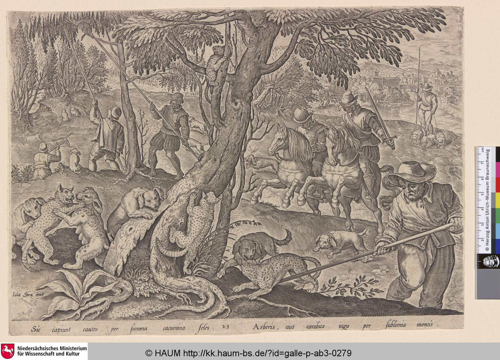

<p>The tree, a climbing cat, and close combat were retained. Katzenberger himself and a farmer with a lance were added.</p>
"
></button>


<!-- Bild 4 (Rittersaal2 / Central) — A14 HASENJAGD (mammal) -->
<button class="hotspot mammal"
data-room="1"
style="left:58%; top:72%; width:22%; height:14%;"
data-title="A14 – Hasenjagd"
data-img="A14_Hasenjagd.jpg"
data-text="
<p> A14 Rabbit hunting: In the middle ground, the hare hunt is carried out “almost single-handedly by the dogs.” In the foreground, a man in a yellow doublet leads a hunting dog on a leash while blowing a hunting horn as he walks. On the left, another hunter gives commands to a dog that is barking at a fox. On the right, a man rides a horse wearing a slouch hat with striking red pom-poms. Behind him, a wildcat or leopard sits chained to a box. The model for this painting can be seen here:</p>

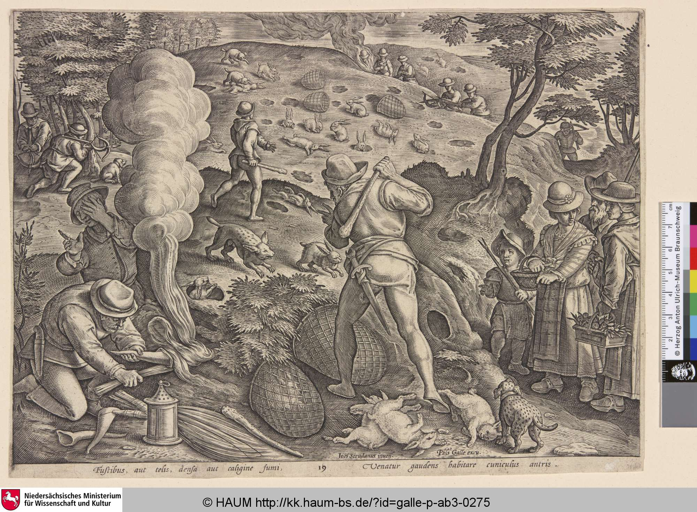

<p>Independent additions include a landscape view (a pointed mountain range), an owl, and a detail on a back-turned figure whose puffed trousers slip down slightly. The text describes this as a possible indication of the “peasant character” of small-game hunting.</p>
"
></button>


<!-- Bild 5  -->
<button class="hotspot bird"
data-room="0"
style="left:65%; top:10%; width:10%; height:10%;"
data-title="Q1 – Entenjagd"
data-img="Q1_Entenjagd.jpg"
data-text="
<p> Q1 duck hunting: The first scene of the bird hunts occupies a special position within the cycle. With the man with a black beard and black slouch hat sitting in front of a tree on the left edge of the picture, it probably contains another portrait after those of Count Wolfgang and/or his sons in the large octagonal pictures. The man wears a shiny yellow hunting suit, and a black fox tail hangs from his hat. On the right, a hunter with a shotgun crawls on the ground. Together with his dog, he observes the ducks in a body of water in the middle ground. The landscape is wintry with bare trees. A monumental rock with a castle rises from a wide river valley in the center. The model for this painting can be seen here (Nachdruck Olms, Tf. 42):</p>

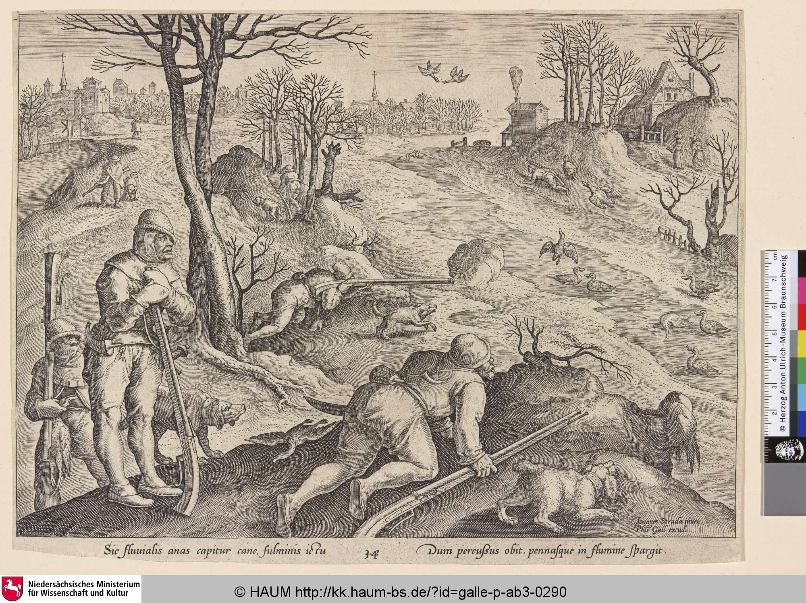
<p></p>
"
></button>

<!-- Bild 6  -->
<button class="hotspot bird"
data-room="2"
style="left:27%; top:57%; width:10%; height:8%;"
data-title=""
data-img="Q17.jpg"
data-text="The most famous tourist image of the Weikersheim ceiling shows a hunter squatting, smoking a pipe and watching a net in which a partridge is caught. Meanwhile, another hunter on the right-hand edge of the picture is relieving himself, turning his bare backside towards the viewer."
></button>

<!-- Bild 7  -->
<button class="hotspot bird"
data-room="2"
style="left:27%; top:31%; width:10%; height:8%;"
data-title="Q14 - Quail hunting with a cow decoy"
data-img="Q14.jpg"
data-text="
<p>Q14 Quail hunting with a cow decoy: A hunter with a shotgun and hunting bag sneaks up from the right on quails pecking at grain in a field. A large brown cow dummy with a bell provides him with cover. The image is based on an engraving by Stradanus (reprint Olms, Tf. 39): </p>

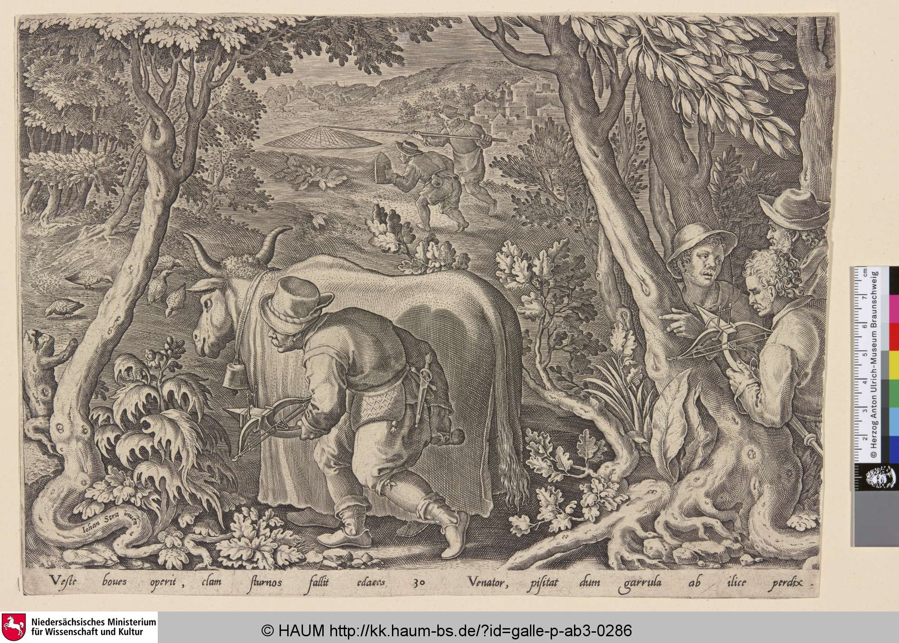
<p>In addition to the hunter, the cow dummy, and the pecking birds, the large plant in the foreground was also reproduced </p>
"
></button>

<!-- Bild 8  -->
<button class="hotspot fish"
data-room="0"
style="left:75%; top:10%; width:11%; height:13%;"
data-title="otter hunting"
data-img="HA1.jpg"
data-text="HA1 Otter hunting: A man wearing shorts, a red doublet, and rolled-up shirt sleeves stands on the riverbank holding a trident. An otter swims in the river with a fish in its mouth. Next to the man, a black poodle leans down into the water. In the background, beyond a small wooden bridge, lies the Weikersheim Palace Garden, at the end of which the palace and the town can be seen. The castle is perfectly symmetrical and beautifully finished. The knights' hall, with only seven window axes, is symmetrically flanked by three-axis risalits. The east wing, which had not yet been built at the time, is crowned by large triangular gables, as is the south wing. On the ridge behind it stands a gallows as a sign of the count's high jurisdiction. The sky is overcast, but just above the town, a hole in the clouds allows broad rays of yellow sunlight to shine down. In keeping with its task of depicting the castle grounds surrounded by the Lauter River, including the town and domain, the painting was given the highest place in the fishing cycle. It is located heraldically on the right, close to the fireplace."
></button>


<!-- Bild 9  -->
<button class="hotspot fish"
data-room="0"
style="left:75%; top:35%; width:11%; height:13%;"
data-title="HA3 Duck hunting with reed barriers"
data-img="HA3.jpg"
data-text="HA3 Duck hunting with reed barriers: The duck hunt depicted in this painting and its counterpart biologically belongs to the category of bird hunting, which has already been discussed in relation to the square paintings. However, the ducks are not shot with shotguns, as shown in the bird cycle (Q1), but caught on the water using traps and other tools. This is technically similar to fishing and probably justified its inclusion in the fishing cycle. 
The duck hunt is depicted as a courtly event. On the shore stands a three-story stone house in the most modern Renaissance style. From a loggia on the top floor, a courtly society looks down on the pond at their feet. There, naked men wearing hats use sticks to drive an otter in front of them, which in turn drives a whole fleet of ducks in front of it. The goal is a specially constructed reed enclosure on the shore, where the ducks will end up in cages. In the foreground on the right-hand edge of the picture, a magnificently dressed couple with a dog watches the scene. They are probably Count Wolfgang and his wife Magdalena von Nassau-Katzenelnbogen. The countess in particular, with her portrait-like features, is very beautifully dressed."
></button>


</div>

<!-- ================= POPUP ================= -->
<div id="popup" class="popup" onclick="closePopup()">
<div class="popup-box" onclick="event.stopPropagation()">

<div class="popup-text">
<h2 id="popup-title"></h2>
<p id="popup-desc"></p>
</div>
</div>
</div>

<script>
document.addEventListener('DOMContentLoaded', function() { BaroqueViz.initRittersaal(); });
</script>

</div><!-- /rittersaal-block -->

### From Orpheus to Authority 
 The central ceiling painting of Orpheus forms the key to the overall program of the hall. In early modern tradition, Orpheus was regarded as a symbol of the good ruler who pacifies the world not through violence, but through order, reason, and moderation. In Weikersheim, this figure is deliberately associated with Count Wolfgang II: the placement above the fireplace, recurring portrait-like features in hunting scenes, and the orientation of the sculpted animals toward the fireplace symbolically link the count with Orpheus as an ordering authority.

Against this background, the hunting scenes gain their meaning. Hunting appears not merely as an activity, but as an expression of princely responsibility: the mastery of dangerous animals stands for protection and care toward the subjects. The depicted landscapes therefore present an ordered and peaceful world — an image of legitimate rule.


### Sources

The art-historical descriptions and contextual interpretations presented here are primarily based on the research interpretations documented in the [CbDD](https://www.deckenmalerei.eu/42d06165-58e7-4653-bfe4-3d5f7091fc33#6e73f774-4b7f-4e37-937b-e11cc35c5bc8) and the primary sources referenced therein. The specific sources used are listed in the references below.

<div class="cbdd-references" markdown="0">
<ol>
<li>Die Quellen hierzu und insgesamt zum Oeuvre von Georg Robin bei Freeden, Georg Robin, 1943/44. Speziell zu Weikersheim im Jahr 1586: ebd., S.&nbsp;38. Die aktuellen Signaturen der von Freeden herangezogenen Archivalien bei Weyer, Georg Stegle, 2017.</li>
<li>Freeden, Georg Robin, 1943/44, S.&nbsp;38. Hingegen bewertet Weyer, Georg Stegle, 2017, S.&nbsp;50 den Anteil Stegles deutlich höher als Freeden. Zudem schreibt er Stegle Walther-Gerd Flecks zwischenzeitlich kritisch bewertete Rekonstruktion einer regelmäßigen Dreiflügelanlage in Weikersheim zu. Zur Kritik an Flecks Idealrekonstruktion (Fleck, Weikersheim, 1954): Großmann, Beobachtungen, 2019 und Ziegler, Idealplan, 2019. Zur weiteren Erforschung der Planungs- und Baugeschichte des Weikersheimer Renaissanceschlosses außerdem: <a href="https://www.hofkulturblog.de/das-dreiecksschloss-des-grafen-wolfgang-in-weikersheim-revision-einer-alten-kunsthistorischen-hypothese-mit-hilfe-digitaler-methoden/" target="_blank" rel="noopener">Hofkulturblog</a> sowie ausführlich mit zahlreichen Visualisierungen der Beitrag von Jan Lutteroth und Frieder Leipold: <a href="https://books.ub.uni-heidelberg.de/arthistoricum/reader/download/774/774-17-91786-1-10-20201211.pdf" target="_blank" rel="noopener">arthistoricum.net</a>.</li>
<li>Der Raum des Treppenhauses gehört zumindest in seinem äußeren Mauerwerk der Renaissancezeit an, wenngleich der Langenburger Bau in seinen aufgehenden Geschossen erst um 1680 hinzukam (Ziegler, Idealplan, 2019, S.&nbsp;140–142).</li>
<li>Freeden, Georg Robin, 1943/44, S.&nbsp;39. Ausführlich zur Baugeschichte und ihren Quellen jetzt: Ziegler, Idealplan, 2019.</li>
<li>Ziegler, Idealplan, 2019, S.&nbsp;140.</li>
<li>University of Konstanz: symbolic means for representing concepts of order. <a href="https://kops.uni-konstanz.de/server/api/core/bitstreams/a191c70e-e145-45e2-83eb-ddb302cee269/content" target="_blank" rel="noopener">KOPS</a>.</li>
<li>Joachim Hamberger: Eine kurzer Abriss der Jagdgeschichte. Von Hirschen und Menschen…. In: <em>LWF aktuell</em>, Nr.&nbsp;44, 2004, S.&nbsp;28 (<a href="https://www.lwf.bayern.de" target="_blank" rel="noopener">bayern.de</a> [PDF; abgerufen am 13.&nbsp;Dezember 2018]).</li>
<li>Peter Blickle: <em>Die Revolution von 1525</em>. 2.&nbsp;Auflage. Oldenbourg Verlag, München 1983, ISBN&nbsp;3-486-44652-5, S.&nbsp;58.</li>
<li>Bernd Ergert: <em>Die Jagd in Bayern – von der Vorzeit bis zur Gegenwart</em>. Rosenheimer Verlagshaus, Rosenheim 1984, S.&nbsp;123–127.</li>
<li>barockjagd.de: Jagen vor 250 Jahren.</li>
<li>Poser, Deckenbilder, 1980, S.&nbsp;160.</li>
<li>Poser, Deckenbilder, 1980, S.&nbsp;160.</li>
<li>Poser, Deckenbilder, 1980, S.&nbsp;161.</li>
<li>Poser, Deckenbilder, 1980, S.&nbsp;160, dort ohne das Wort „alleins". Die genaue Transkription: Drös, Inschriften Mergentheim, 2002, Nr.&nbsp;353.</li>
<li>Abschlussbericht der Restaurierung vom 05.03.1998. Den Bericht stellte der Autorin Herr Dipl.&nbsp;Ing. Erik Reinhold vom Staatlichen Hochbauamt Heilbronn zur Verfügung. Bindemittel waren Glutinleim und Stärkekleister.</li>
<li>Poser, Deckenbilder, 1980; Kniep, Glück, 2005; Käpplinger, Jagd, 2011; Käpplinger, Auf's Schönste, 2019, S.&nbsp;197. Auch Großmann, Beobachtungen, 2019, S.&nbsp;133 vermutet die Wegeführung von der Tafelstube kommend in den Saal.</li>
<li>Diese Beobachtung auch bei Käpplinger, Jagd, 2011, S.&nbsp;76, obwohl er eine Leserichtung von Ost nach West annimmt.</li>
<li>Käpplinger, Jagd, 2011.</li>
<li>Käpplinger, Jagd, 2011, der die Entwicklung jedoch aufsteigend von der niederen zur hohen Jagd beurteilte, obwohl bei dieser Betrachtungsweise alle Bilder auf dem Kopf stehen.</li>
<li>Poser, Deckenbilder, 1980, S.&nbsp;161. Ebenso Käpplinger, Jagd, 2011, S.&nbsp;74–75.</li>
<li>Käpplinger, Jagd, 2011, S.&nbsp;81–85.</li>
<li>Allerdings benennt Käpplinger bereits das Cosimo&nbsp;I. gewidmete Stichwerk als „Venationes", da ihm das nachfolgende Stichwerk der „Venationes" offenbar nicht bekannt war.</li>
<li>Die übersichtliche Darstellung der Zyklen ist Käpplinger, Jagd, 2011 zu verdanken.</li>
</ol>
</div>


## Warfare and Conflict Representation

While hunting imagery presented an ordered and controlled world, depictions of warfare introduced conflict and violence into interior decoration. Baroque interiors used such scenes to visualize military reality in different ways — ranging from generalized combat scenes to clearly identifiable historical events.

### Generic combat scenes - Leutenberg ("Schloss Friedensburg")

In the 17th century, Count Albert Anton von Schwarzburg-Rudolstadt had Friedensburg Castle decorated with room-filling murals by the court painter Seivert Lammers in two campaigns (1688 and 1698). The paintings remained intact for a long time and were only destroyed by a fire in 1934.

<div class="cbdd-figure">
  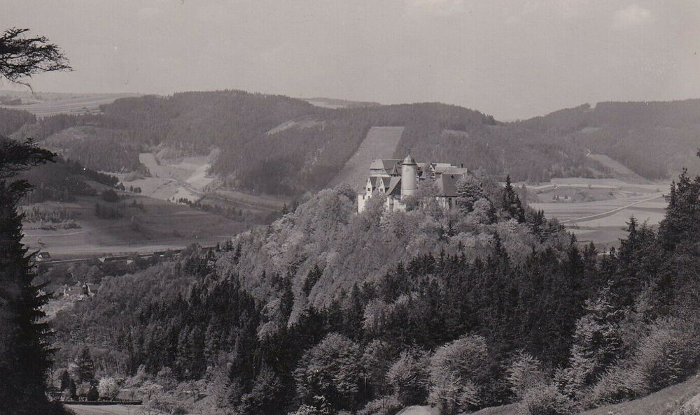
  <div class="cbdd-figure__caption">
    Leutenberg, Schloss Friedensburg; Postkarte; Corpus der barocken Deckenmalerei; https://www.deckenmalerei.eu/de638dcc-a435-4778-8a28-e9c3276e1843 
  </div>
</div>


The so-called Battle Hall ("Schlachtensaal") on the third floor was probably the main hall of the castle. Its seven wall panels, framed by heart-shaped friezes, mainly depicted war scenes in grisaille painting with strong light-dark contrasts, giving the room its name.

War was depicted “in all its diversity, but not glorified.” No specific historical event can be identified: “The scenes are neither from the Old Testament nor ancient mythology, nor are they depictions of current events – such as the Turkish Wars.” Above the windows and doors were additional painted curtain draperies.

The depictions are spread across all walls of the room and include battle scenes, cavalry skirmishes, and camp and everyday scenes.


<!-- =========================
     Leutenberg (Schloss Friedensburg) — Battle Hall (2x2)
     - click card opens image in lightbox (bigger)
     - separate link opens CbDD anchor
     - adds metadata (artist, date, patron, technique, location)
========================= -->

<div class="leutenberg-block">
<div class="cbdd-grid-2x2">

<!-- SOUTH -->
<div class="cbdd-card">
<button class="cbdd-imgbtn"
data-full="sued.jpg"
data-caption="South wall — Large battle painting (“Das Schlachtfeld”), executed in glue paint (grisaille). Estimated size: 2.2 × 5.5 m."
aria-label="Open image larger">
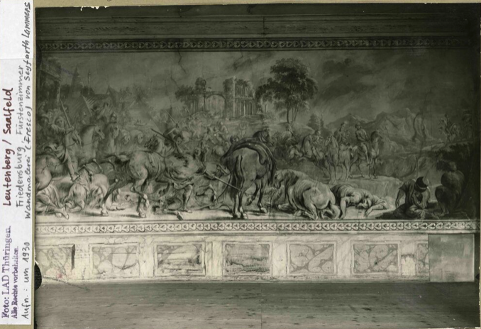
</button>
<div class="cbdd-body">
<p class="cbdd-title">South wall</p>

<p class="cbdd-metaLine">
<strong>Artist:</strong> Seivert Lammers ·
<strong>Date:</strong> 1698 (inscribed) ·
<strong>Technique:</strong> glue paint, grisaille
</p>
<p class="cbdd-metaLine">
<strong>Site:</strong> Schloss Friedensburg, Battle Hall (3rd floor, north wing) ·
<strong>Status:</strong> destroyed by fire (1934)
</p>

<p class="cbdd-desc">A large multi-figure battle panorama covers the entire wall above the socle zone (known in research as “Das Schlachtfeld”). The background includes a temple ruin and a tree. The center is emphasized by the rear view of a packhorse.</p>

<div class="cbdd-meta">
<a target="_blank" rel="noopener"
href="https://www.deckenmalerei.eu/d8ff05f9-cca7-4875-8f82-be4e1670678d">
Open on CbDD →
</a>
</div>
</div>
</div>

<!-- EAST -->
<div class="cbdd-card">
<button class="cbdd-imgbtn"
data-full="ost.jpg"
data-caption="East wall — Two cavalry combats (“Das Gemetzel” / “Der Überfall”), documented by photographs (1925). Connected by a continuous heart-band frieze."
aria-label="Open image larger">
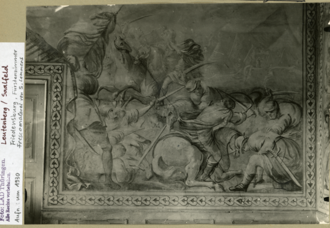
</button>
<div class="cbdd-body">
<p class="cbdd-title">East wall</p>

<p class="cbdd-metaLine">
<strong>Artist:</strong> Seivert Lammers ·
<strong>Date:</strong> before/around 1698 ·
<strong>Evidence:</strong> photo documentation (1925)
</p>
<p class="cbdd-metaLine">
<strong>Technique:</strong> glue paint, grisaille ·
<strong>Status:</strong> destroyed by fire (1934)
</p>

<p class="cbdd-desc">On either side of the central door, one cavalry combat is shown. Research refers to them as “Das Gemetzel” and “Der Überfall”. Both scenes were originally conceived as one composition connected by the frieze.</p>

<div class="cbdd-meta">
<a target="_blank" rel="noopener"
href="https://www.deckenmalerei.eu/cf9d56be-2913-4cbb-a9f5-e62c036ceac7">
Open on CbDD →
</a>
</div>
</div>
</div>

<!-- WEST -->
<div class="cbdd-card">
<button class="cbdd-imgbtn"
data-full="west.jpg"
data-caption="West wall — Pack animals and canteen women (Marketenderinnen). Partial photographic survival; a tent weather-vane reportedly carried the date 1695."
aria-label="Open image larger">
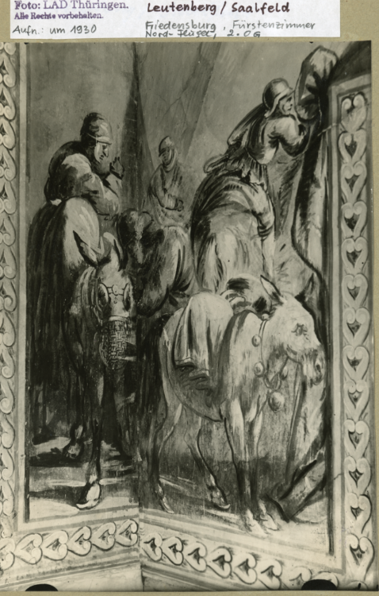
</button>
<div class="cbdd-body">
<p class="cbdd-title">West wall</p>

<p class="cbdd-metaLine">
<strong>Artist:</strong> Seivert Lammers ·
<strong>Date:</strong> 1698 (room) / 1695 (reported detail) ·
<strong>Evidence:</strong> partial photos
</p>
<p class="cbdd-metaLine">
<strong>Motifs:</strong> pack donkey with rider; canteen scene ·
<strong>Status:</strong> destroyed by fire (1934)
</p>

<p class="cbdd-desc">The surviving documentation shows a pack donkey with rider and canteen women. At the transition from the south to the west wall, riders continued across the corner of the room.</p>

<div class="cbdd-meta">
<a target="_blank" rel="noopener"
href="https://www.deckenmalerei.eu/6559a9c1-e9e7-4ef5-8be2-24c266714c4f">
Open on CbDD →
</a>
</div>
</div>
</div>

<!-- NORTH -->
<div class="cbdd-card">
<button class="cbdd-imgbtn"
data-full="nord.jpg"
data-caption="North wall — Scenes between three windows: a wine-serving scene and a fight over a flag. Photographically documented."
aria-label="Open image larger">
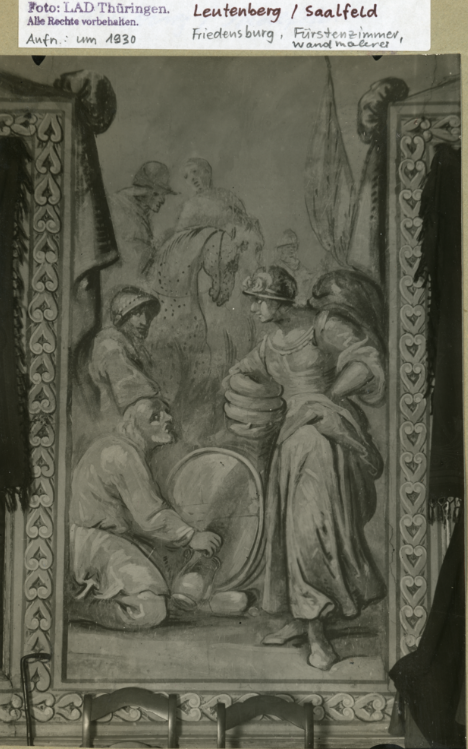
</button>
<div class="cbdd-body">
<p class="cbdd-title">North wall</p>

<p class="cbdd-metaLine">
<strong>Artist:</strong> Seivert Lammers ·
<strong>Date:</strong> 1698 (inscribed) ·
<strong>Evidence:</strong> photos (scenes between windows)
</p>
<p class="cbdd-metaLine">
<strong>Technique:</strong> glue paint, grisaille ·
<strong>Status:</strong> destroyed by fire (1934)
</p>

<p class="cbdd-desc">Between the windows, one scene shows a wine-serving situation (tapper, woman with bread, soldier).</p>

<div class="cbdd-meta">
<a target="_blank" rel="noopener"
href="https://www.deckenmalerei.eu/96d3d340-bcd1-4d5c-ad4f-3be8bc4ddfba">
Open on CbDD →
</a>
</div>
</div>
</div>

</div>

<!-- Lightbox -->
<div class="cbdd-lightbox" id="cbdd-lightbox" aria-hidden="true">
<div class="cbdd-lightbox__panel" role="dialog" aria-modal="true">
<button class="cbdd-lightbox__close" id="cbdd-lightbox-close" aria-label="Close">✕</button>

<div class="cbdd-lightbox__cap" id="cbdd-lightbox-cap"></div>
</div>
</div>

<script>
document.addEventListener('DOMContentLoaded', function() { BaroqueViz.initBattleHallLightbox(); });
</script>

</div><!-- /leutenberg-block -->


While the Battle Hall in Leutenberg presents war without reference to a specific historical conflict, other Baroque interiors depict clearly identifiable military events. In several rooms, battles are no longer shown as generic combat scenes but are linked to concrete historical confrontations. In particular, the wars against the Ottoman Empire appear as a recurring theme. To illustrate this, we will examine two representative examples: a fresco in the Asamkirche in Munich and a cycle of siege paintings in Weikersheim.


### Wars against the Ottoman Empire - Asamkirche

<div class="cbdd-figure">
  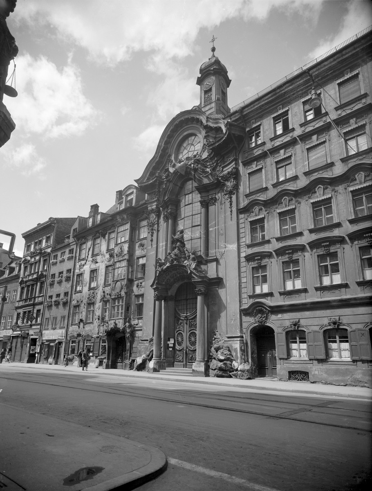
  <div class="cbdd-figure__caption">
    Asamkirche in Munich; Bildarchiv Foto Marburg; Schmidt-Glassner, Helga; https://www.deckenmalerei.eu/ee55b797-2950-49b8-9204-1c0fcf6b671b
  </div>
</div>

The Asam Church (St. Johann Nepomuk) in Munich was built by Egid Quirin Asam as a private chapel next to his home starting in 1733 and was consecrated in 1746. The painting was done by his brother Cosmas Damian Asam, who created the frescoes starting in 1734; a chronogram dates the main fresco to 1735. The church is considered one of the most important works of South German Baroque and Rococo fresco painting.


<!-- =========================
     Image Detail Viewer 
========================= -->

<div class="turk-carousel">

  <div class="turk-frame">
    <button class="turk-btn turk-prev" onclick="turkChange(-1)">❮</button>
    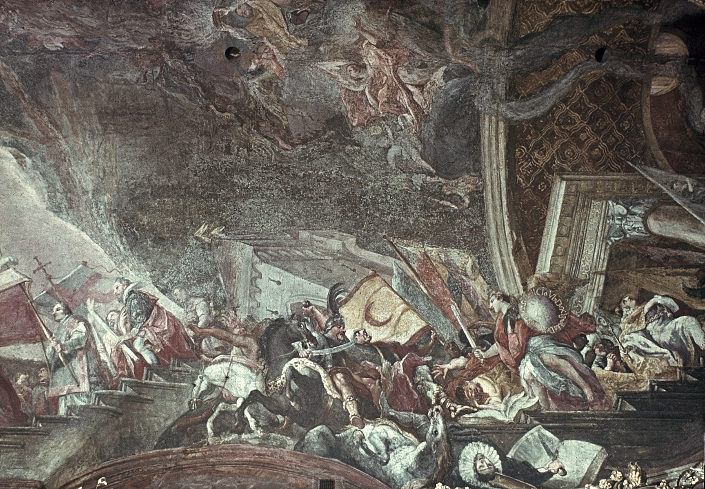
    <button class="turk-btn turk-next" onclick="turkChange(1)">❯</button>
  </div>

  <div class="turk-meta">
    <b>Artist:</b> Cosmas Damian Asam<br>
    <b>Location:</b> Asamkirche, Munich (Germany)<br>
    <b>Date:</b> 1735
  </div>

</div>

<script>
document.addEventListener('DOMContentLoaded', function() {
  BaroqueViz.initAsamCarousel('.turk-carousel', [
    'asam1.jpg', 'asam2.jpg', 'asam3.jpg', 'asam4.jpg'
  ]);
});
</script>

The archangel Michael, armed with sword and shield, charges from the right into a battlefield. Riders marked by crescent banners and curved sabres identify the opponents as Ottoman soldiers. The inscription on Michael’s shield “DeXtra rebeLLes DeLLo VlnDeX IgnaVos” describes him as a defender of the Christian faith. Among the defeated figures is also a heretic in Calvinist dress falling into the abyss. Behind Michael, a procession of allied rulers leads toward the main altar scene.


### Wars against the Ottoman Empire - Schloss Weikersheim

Another example of this representation can be found at Schloss Weikersheim, previously introduced in this story.

The twelve large-format siege scenes originally belonged to the ceiling of the former dining room of Weikersheim Palace. They were removed when the room was divided up in 1837 and reappeared in the palace in 1946. Today, some of them are on display in the hallway in front of Count Wolfgang's former apartment in the kitchen building [1,2]. Stylistically, they can be attributed almost entirely to Balthasar Katzenberger and were probably created immediately after the ceiling paintings in the hall, i.e. around 1603–1604 [3].

The paintings depict sieges of Hungarian fortresses during the Long Turkish War (1593–1606) between the Ottoman Empire and the Habsburgs [4]. This war was a fortress war with mutual sieges of fortified complexes, which ended with the Peace of Zsitvatorok [4]. The events depicted range from 1594 to 1604 at the latest.

Copperplate engravings from Hieronymus Oertl's chronicle, published in Nuremberg in 1602, served as the basis for the illustrations [5,6]. The scenes were taken from these engravings, including the captions with place names and dates [7]. The selection included actions on both the imperial and Ottoman sides and was presumably determined by the fact that members of the House of Hohenlohe were involved [8]. The latest scene commemorates the death of Ludwig Kasimir during the siege of Gran in 1604 and serves as a memorial image [9].

The scenes follow a uniform structure: in the foreground, a battle scene; in the middle and background, the siege of the fortress in a wide landscape with tents, skirmishes, and smaller battles [3]. Their order is based on the chronology of events [10].

Thus, the paintings do not depict generic battle scenes but a sequence of identifiable historical sieges derived from contemporary printed war chronicles and connected to the participation of the Hohenlohe family.


<!-- =========================
     Schloss Weikersheim — 12 siege scenes (click-through gallery)
     - uses direct image URLs (no local jpg needed)
     - click image opens CbDD page/anchor in new tab
     - includes: prev/next, dots, keyboard arrows, swipe
========================= -->

<div class="wk-gallery" id="wk-gallery-12">
  <div class="wk-top">
    <div>
      <p class="wk-title">Schloss Weikersheim — Siege scenes of the Long Turkish War (12 paintings)</p>
      <p class="wk-sub">
        Click through the sequence (Prev/Next or dots). Click the image to open the corresponding CbDD entry in a new tab.
        Use ← / → on your keyboard; swipe on mobile.
      </p>
    </div>
  </div>

  <div class="wk-stage" id="wk-stage">
    <button class="wk-navBtn wk-prev" type="button" aria-label="Previous" id="wk-prev">‹</button>

    <!-- Clicking image opens CbDD -->
    <a id="wk-link" href="#" target="_blank" rel="noopener">
      
    </a>

    <button class="wk-navBtn wk-next" type="button" aria-label="Next" id="wk-next">›</button>
    <div class="wk-counter" id="wk-counter">1 / 12</div>
  </div>

  <div class="wk-caption" aria-live="polite">
    <p class="wk-capTitle" id="wk-capTitle">—</p>
    <p class="wk-capMeta" id="wk-capMeta">—</p>
    <p class="wk-capText" id="wk-capText">—</p>
  </div>

  <div class="wk-dots" id="wk-dots" aria-label="Slide navigation"></div>

  <!-- Optional: thumbnail overview -->
  <div class="wk-thumbrow" id="wk-thumbs" aria-label="Thumbnails"></div>

  <p class="wk-hint">Tip: If a thumbnail doesn’t load, the URL is probably not a direct image file. Make sure it opens as an image in a browser tab.</p>
</div>


<script>
document.addEventListener('DOMContentLoaded', function() {
  BaroqueViz.initSiegeGallery('wk-gallery-12', [
    { key:'I', title:'Siege I — Vestung Tottis (night capture) — 1590', img:'https://previous.bildindex.de/bilder/fmd10005851a.jpg', href:'https://www.deckenmalerei.eu/74e85492-8198-4a28-bd77-17d107f9b9a0#42d6f0a1-179a-4193-9904-7386e0dc61da', meta:'Schloss Weikersheim · former dining room ceiling (Tafelstube) · Long Turkish War', text:'Wide format: riders with large flags enter from the front right. In the background is the Hungarian fortress Totis (Tata) after Sibmacher’s copper engraving. The very dark scene is sparsely lit by two lanterns. The date 1590 may be “an error,” since Totis was captured in 1597/1598.' },
    { key:'II', title:'Siege II — Vestung Gran (besieged by Christians) — 1594', img:'https://previous.bildindex.de/bilder/fmd10005841a.jpg', href:'https://www.deckenmalerei.eu/74e85492-8198-4a28-bd77-17d107f9b9a0#aa3bf686-14d2-4d2e-b5d8-abf9200e3867', meta:'Schloss Weikersheim · former dining room ceiling (Tafelstube) · Long Turkish War', text:'Narrow format: a halberdier and an assistant handling black cannonballs appear in the foreground, while a rider in a red cloak enters dynamically from the right and can “presumably” be identified as Count Georg Friedrich (eldest son of Count Wolfgang II.). In the middle ground the imperial camp is shown and the water town of Gran is shelled; above it lies the fortress with the cathedral façade and several minarets.' },
    { key:'III', title:'Siege III — Vestung Raab (besieged by the Turks) — 1594', img:'https://previous.bildindex.de/bilder/fmd10005843a.jpg', href:'https://www.deckenmalerei.eu/74e85492-8198-4a28-bd77-17d107f9b9a0#29c6c293-693f-4d34-b6ee-c36a90fe6d8e', meta:'Schloss Weikersheim · former dining room ceiling (Tafelstube) · Long Turkish War', text:'Wide format: Turkish riders enter from the right; across the Danube the square fortress of Raab (Győr) is visible with cannon-occupied bastions and is heavily bombarded. In the foreground, close combat between Christians and Turks unfolds near two transport wagons; fortress and fighting follow the model in Ortelius “faithfully.”' },
    { key:'IV', title:'Siege IV — Vestung Comorna (besieged by the Turks) — 1594', img:'https://previous.bildindex.de/bilder/fmd10005850a.jpg', href:'https://www.deckenmalerei.eu/74e85492-8198-4a28-bd77-17d107f9b9a0#d3bb7616-fecf-4589-8763-4a03df87a8d5', meta:'Schloss Weikersheim · former dining room ceiling (Tafelstube) · Long Turkish War', text:'Wide format: Turkish riders enter from the left, including a blue-clad figure thrusting a lance with a blue flag diagonally into the image. At the lower right two dromedaries kneel in front of Turkish tents. The Danube divides the scene, and opposite lies the Christian-held fortress of Komorn (Komárom), which survived the siege while the adjoining town burns.' },
    { key:'V', title:'Siege V — Vestung Gran (recaptured by Christians)', img:'https://previous.bildindex.de/bilder/fmd10005848a.jpg', href:'https://www.deckenmalerei.eu/74e85492-8198-4a28-bd77-17d107f9b9a0#43223295-fe64-4973-9722-6a29c8a4b649', meta:'Schloss Weikersheim · former dining room ceiling (Tafelstube) · Long Turkish War', text:'Wide format: at the left a figure bends forward as a back view; at the lower right stands the half-figure of a courtly man with a musket and a brown horse, whose face suggests “one of Count Wolfgang’s sons.” In the background the fortress of Gran, the water town and the Ratzenstadt are clearly visible. The flags indicate the stage of conquest as explained by Ortelius (including the Turkish flag above the fortress and imperial flags over other positions).' },
    { key:'VI', title:'Siege VI — Vestung Vizzegrad (besieged by Christians)', img:'https://previous.bildindex.de/bilder/fmd10005840a.jpg', href:'https://www.deckenmalerei.eu/74e85492-8198-4a28-bd77-17d107f9b9a0#1a5f9651-0bc5-4052-82c2-931af07e304b', meta:'Schloss Weikersheim · former dining room ceiling (Tafelstube) · Long Turkish War', text:'Wide format: two richly dressed officers dominate the left foreground (one as a back view in armour with a plume, one in a grey shimmering garment with a striking helmet), while men work at cannons on the right. In the background, the citadel of Visegrád rises on a conical hill by the Danube and commands a large natural harbour with many transport ships.' },
    { key:'VII', title:'Siege VII — Statt Waitzen (besieged by the Turks) — 1597', img:'https://previous.bildindex.de/bilder/fmd10005842a.jpg', href:'https://www.deckenmalerei.eu/74e85492-8198-4a28-bd77-17d107f9b9a0#eec605b1-e1e4-4ecc-83f6-808bb11130a6', meta:'Schloss Weikersheim · former dining room ceiling (Tafelstube) · Long Turkish War', text:'Narrow format: in the right foreground a Turk with turban and mace rides frontally toward the viewer. A Turkish tent stands to the left beneath him. In the background Waitzen (Vác) lies on the Danube as a fortified town with a fortified monastery; several houses burn, and town and monastery are shown “mirror-reversed” compared to Ortelius.' },
    { key:'VIII', title:'Siege VIII — Vestung Raab (night recapture by Christians)', img:'https://previous.bildindex.de/bilder/fmd10005846a.jpg', href:'https://www.deckenmalerei.eu/74e85492-8198-4a28-bd77-17d107f9b9a0#f4327f2f-39e6-4656-bd63-976685a535ed', meta:'Schloss Weikersheim · former dining room ceiling (Tafelstube) · Long Turkish War', text:'Narrow format: the siege is presented as a night scene. At the front right two sentries stand with armour and clothing catching the lantern light. In the background the fortress of Raab (Győr) is shown with two large explosions at its bastions, which Katzenberger copied “exactly” from Sibmacher.' },
    { key:'IX', title:'Siege IX — Hauptstatt Offen (besieged by Christians) — 1598', img:'https://previous.bildindex.de/bilder/fmd10005847a.jpg', href:'https://www.deckenmalerei.eu/74e85492-8198-4a28-bd77-17d107f9b9a0#a175d3bc-d51a-41ce-adc3-dc879519b644', meta:'Schloss Weikersheim · former dining room ceiling (Tafelstube) · Long Turkish War', text:'Wide format: in the foreground a large cannon is pulled left by horses. The driver sits on the cannon and swings a long whip, while a hunting dog runs behind. In the background Offen (Óbuda/Buda) appears as a splendid walled city with castle, churches and minarets. The pleasure garden and the Turkish cemetery are taken from Sibmacher.' },
    { key:'X', title:'Siege X — Hauptstatt Offen (besieged by Christians)', img:'https://previous.bildindex.de/bilder/fmd10005844a.jpg', href:'https://www.deckenmalerei.eu/74e85492-8198-4a28-bd77-17d107f9b9a0#038123be-6142-456c-a90e-ff6e1366e272', meta:'Schloss Weikersheim · former dining room ceiling (Tafelstube) · Long Turkish War', text:'Wide format: at the front right an armoured imperial commander on a grey horse rides into the picture with a white plume and, by facial features and blond beard, appears to be “a son of Count Wolfgang.” A page in a red cloak runs ahead to guide him toward the camp. Troops stand in formation beyond a Danube tributary and cannons are fired from an entrenchment, while the city of Offen is cropped at the left edge and recognizable via the Danube islands and bridges.' },
    { key:'XI', title:'Siege XI — Hauptstatt Offen (besieged by Christians)', img:'https://previous.bildindex.de/bilder/fmd10005845a.jpg', href:'https://www.deckenmalerei.eu/74e85492-8198-4a28-bd77-17d107f9b9a0#3b70965e-4f71-4793-b841-5de99378db4e', meta:'Schloss Weikersheim · former dining room ceiling (Tafelstube) · Long Turkish War', text:'Wide format: in the foreground a brown horse is shown in profile with a rider in a white doublet and a voluminous red sash; “the figure depicted is Count Ludwig Kasimir,” who died during the siege of Gran (Eszergom) in 1604. At the bottom edge, on a smaller scale, a courtly dressed woman is shown being guided by a soldier. She holds a goldfinch that “was regarded as a symbol of Christ’s sacrificial death”.' },
    { key:'XII', title:'Siege XII — Vestung Gran (besieged by the Turks) — 1604', img:'https://previous.bildindex.de/bilder/fmd10005849a.jpg', href:'https://www.deckenmalerei.eu/74e85492-8198-4a28-bd77-17d107f9b9a0#c6bc65b4-9705-4a71-a121-1d3531542230', meta:'Schloss Weikersheim · former dining room ceiling (Tafelstube) · Long Turkish War', text:'Narrow format: two horses seen from behind carry cannon barrels, wagon wheels and kettledrums; beside them walks a man dressed in black with a grey floppy hat. In the background, the Danube near Offen (Óbuda) and Pest is rendered in steep bird’s-eye view like a map. A small skirmish takes place on open ground in front of tents and a hill with cannons, and the broad fortified city of Offen appears at the upper left.' }
  ]);
});
</script>

### Sources

<div class="cbdd-references" markdown="0">
<ol>
<li>Merten, Weikersheim, o.&nbsp;J., S.&nbsp;40. Trentin-Meyer, Georg Friedrich von Hohenlohe, 2019, S.&nbsp;90 spricht versehentlich von 13 Gemälden.</li>
<li>Freeden, Kamin, 1950, S.&nbsp;142.</li>
<li>Die Maße bei Drös, Inschriften Mergentheim, 2002, S.&nbsp;248. Ebd., S.&nbsp;249 die bislang ausführlichste Auseinandersetzung mit den Gemälden.</li>
<li>Zum Langen Türkenkrieg: Niederkorn, Langer Türkenkrieg, 1993.</li>
<li>Diese wichtige Vorlage bereits bei Fandrey, Weikersheim, 2010, S.&nbsp;60.</li>
<li>Ortelius, Chronologia, 1602.</li>
<li>Ebd. Außerdem Ortelius, Chronologia, 1602, „Ad Lectorem".</li>
<li>Drös, Inschriften Mergentheim, 2002, S.&nbsp;248–249.</li>
<li>Drös, Inschriften Mergentheim, 2002, S.&nbsp;248–250.</li>
<li>Drös, Inschriften Mergentheim, 2002, Nr.&nbsp;366.</li>
</ol>
</div>


</div><!-- /topic-society -->

<!-- ═══════════════════════════════════════════════════════════════════════
     TOPIC 3 — CLASSICAL MYTHOLOGY
     ═══════════════════════════════════════════════════════════════════ -->
<div id="topic-mythology" class="micro-topic micro-topic--mythology" markdown="1">

<button class="topic-back-bar topic-back-bar--mythology" onclick="backToTopics()">
  <span class="back-arrow">←</span> Back to Topic Selector
</button>

<a id="analysis-mythology"></a>

## Classical Mythology

The Baroque era in German-speaking lands produced a dazzling array of ceiling and wall paintings filled with scenes from classical mythology. These grand frescoes and allegorical programs served not merely as decoration, but as visual sermons of princely virtue, power, and Enlightenment ideals. Commissioned for palaces and grand halls, they wove ancient myths into the narrative of contemporary rulers – celebrating peace after war, exalting dynastic glory, and extolling the arts and sciences. In this data-driven exploration, we trace a red thread through several emblematic Baroque interiors in Germany, uncovering how mythology was employed to transform architecture into theatre of statecraft. From the Olympian gods on the ceilings of Munich’s Nymphenburg Palace to Ovid’s metamorphic tales in a Thuringian castle, these case studies reveal a common language of allegory that early modern patrons used to legitimize and immortalize their reigns. We also examine how the tempo of artistic commissions rose and fell with historical tides – ravaging wars followed by renewed prosperity – and briefly highlight two Italian masters behind these works. The result is a panoramic story of Baroque mythological imagery, presented in academic depth yet accessible and engaging.

<div id="mythology-intro-gallery"></div>

<script type="module">
(async function() {
    while (!BaroqueDB.isReady()) {
        await new Promise(r => setTimeout(r, 100));
    }
    await BaroqueViz.renderMythologyIntroGallery('#mythology-intro-gallery', { count: 3 });
})();
</script>


### Nymphenburg Palace: An Olympian Vision of Peace and Prosperity

The ceiling of the Steinerner Saal (Stone Hall) at Nymphenburg Palace presents an Olympian assembly celebrating the return of a golden age of peace. Painted by Johann Baptist Zimmermann in 1755–57, this monumental fresco – framed by lush Rococo stucco – allegorically links the reign of the Bavarian elector to a time of prosperity and plenty.

Nymphenburg Palace was founded in 1664 as a summer residence for Elector Ferdinand Maria of Bavaria and his wife Henriette Adelaide, to celebrate the birth of their heir Max Emanuel. The central pavilion (the core of today’s palace) was constructed in the late 1660s, but major expansions stalled during subsequent conflicts. For example, during the War of the Spanish Succession, after Bavaria’s defeat at the Battle of Höchstädt in 1704, work on Nymphenburg was halted – at that point only the main pavilion and one wing were habitable. It was only after peace was restored and Elector Max Emanuel returned from exile in 1715 that construction resumed with renewed vigor. By the mid-18th century, Max Emanuel’s grandson Max III. Joseph undertook a final magnificent refurbishment of the palace’s great hall, the Steinerner Saal, to serve as the symbolic heart of his court.

Under Max III. Joseph’s patronage, between 1755 and 1758 the aging Johann Baptist Zimmermann – one of Bavaria’s premier fresco painters – created his last masterpiece on the ceiling of the Steinerner Saal. This vast composition is explicitly allegorical. “Alluding to the ruler’s duty to bring and preserve peace, the huge ceiling painting depicts the Olympian sky”, notes the official palace description. In the center, the gods of Mount Olympus convene under a radiant sky, celebrating the restoration of peace and prosperity under the Elector’s enlightened rule. Jupiter presides, while Apollo in his sun chariot brings light – a reference to the elector as a sun bringing enlightenment to his lands. On the west side of the fresco (facing the gardens), a train of cheerful nymphs pays homage to Flora, a nymph-turned-goddess of flowering abundance, which pointedly nods to the palace’s name (Nymphenburg, “castle of the nymphs”) and its idyllic park.

Surrounding the central scene are smaller mythological vignettes that reinforce the message of peace and flourishing. For instance, one corner shows Mars and Venus, an allegory of love triumphing over war; another panel depicts Zephyr and Flora, symbolizing gentle winds and springtime fecundity. We also find Fama and Clio (the personifications of Fame and History) – suggesting that the fame of the Wittelsbach dynasty will be recorded for posterity – and Astronomy and Urania (muse of astronomy), underscoring patronage of knowledge and science. Even cautionary tales appear: the fresco cycle includes Latona turning the Lycian peasants into frogs (a myth about disrespect to the divine), perhaps as a moral reminder to viewers, and playful putti (cherubs) at play, symbolizing the joy and innocence of a peaceful era. Together, these seven mythological scenes and the colossal central tableau form a visual hymn to the Wohlstand und Blüte des Landes im Frieden – the prosperity and blossoming of the land in peace, as contemporary sources described the theme. Zimmermann’s ceiling, completed in 1758, remained untouched through the centuries and still today greets visitors with its authentic Rococo splendor, a testament to how Baroque art glorified peace after turmoil.

<div id="steinerer-saal-card" class="room-card-container"></div>

 
*caption: Schloss Nymphenburg, Steinerer Saal Hauptfresko: Wohlstand und Blüte des Landes im Frieden (c) CbDD*

<script type="module">
(async function() {
    while (!BaroqueDB.isReady()) {
        await new Promise(r => setTimeout(r, 100));
    }
    await BaroqueViz.renderRoomCard('#steinerer-saal-card', 'ca990351-642b-4739-9753-59c5f7c1da1f');
})();
</script>

### Mannheim Palace: Epic Tales of Destiny and Dynasty

While Nymphenburg’s frescoes celebrated peace and plenty, elsewhere mythological paintings carried more martial and dynastic themes. In the Electoral Palace of Mannheim, built in the 1720s–30s, Elector Carl Philipp of the Palatinate commissioned grand ceiling paintings to decorate the main stairhall (Haupttreppenhaus) and adjoining state rooms. The task fell to the renowned Bavarian artist Cosmas Damian Asam. Between 1729 and 1730, Asam executed a trilogy of frescos for the stairhall that drew upon Virgil’s epic Aeneid and related myths, creating an erudite iconographic program that linked the Elector’s lineage to the heroes and gods of antiquity.

At the center of the Mannheim stairway ceiling shone “Das Urteil des Paris” – the Judgment of Paris, a scene that set in motion the events of the Trojan War and eventually the founding of Rome. Asam’s original fresco (signed “Cosmas D. Asam von München 1730”) was destroyed in World War II, but descriptions and reconstructions allow us to envision its content. Paris, depicted as a shepherd prince under a tree, is approached by Mercury (Hermes) delivering the gods’ command that he choose the fairest goddess. Before Paris stand the three goddesses contending for the golden apple: Juno (Hera) with her peacock, Venus (Aphrodite) receiving the prize apple of victory, and Minerva (Athena) off to the side with her attendant nymphs. A winged figure of Fama brings a wreath to crown Venus as the victor in this fateful beauty contest. By including this scene, the fresco symbolically alluded to the origins of the Trojan War – an epic conflict that ultimately led, via Aeneas, to the rise of Rome and thus (by medieval extension) to the ancestry of European rulers. It was a subtle way for the Palatine Elector to insert his rule into the grand sweep of classical destiny.

<div id="parisurteil-card" class="painting-card-container"></div>

<script type="module">
(async function() {
    while (!BaroqueDB.isReady()) {
        await new Promise(r => setTimeout(r, 100));
    }
    await BaroqueViz.renderPaintingCard('#parisurteil-card', '56698022-bbf7-4859-94b5-10646493da8e');
})();
</script> 

Flanking the central Paris panel were two large oval tondi with further episodes from the Aeneid saga, one on each side of the ceiling vault. On the eastern side, Asam painted “Venus and Aeneas in the Forge of Vulcan”: the goddess Venus, mother of Aeneas, persuades Vulcan to forge weapons for her son before he goes to war. In Asam’s rendition, Venus descends from her swan-drawn chariot and sits enthroned at the center, accompanied by the youthful hero Aeneas and the smith-god Vulcan himself. Around them bustle Cyclops and helpers carrying a heavy shield, while in the background three elegant ladies in modern baroque court dress watch the scene – a charming anachronism, these were likely meant to represent the three granddaughters of Elector Carl Philipp, thus tying the ancient myth to the living dynasty. On the western side, the fresco “Juno, Aeolus and the Storm at Sea” portrayed an episode where Juno, queen of the gods, enlists Aeolus, god of the winds, to wreck Aeneas’s fleet at sea. Asam depicted Juno enthroned under a billowing canopy with her peacocks, gesturing commandingly to Aeolus on a rocky shore; below them, muscular personifications of the winds and waters are shown unleashing a tempest – putti stoke storms, river-gods pour out floods from urns. This dramatic scene of divine wrath balanced the Venus vignette across the hall, illustrating both divine favor and divine opposition in Aeneas’s journey.

Taken together, Mannheim’s stairhall paintings formed a three-part narrative: the Judgment of Paris (the cause of the Trojan War) in the center, flanked by Aeneas’s divine aid (Venus and Vulcan) and trials (Juno’s storm) on either side. The choice of these subjects was rich in meaning. The Aeneid was a favored source in Baroque art because Aeneas, legendary survivor of Troy and ancestor of the Romans, was seen as a model of pietas (duty) and the mythical forefather of rulers (even the Habsburgs traced lineage to him). By having Asam paint Aeneas’s story, Elector Carl Philipp aligned himself with this hero’s virtues and destiny. Contemporary guidelines on fresco programs advised that depictions of ancient battles and adventures could “through their examples incite the viewer to virtuous life”, and Virgil’s epic was considered especially apt for its themes of heroism, founding a new homeland, and devotion to the gods. Mannheim’s implementation was accordingly didactic: the viewer ascending the grand staircase would see, step by step, how gods and heroes shaped the Elector’s illustrious antecedents, implicitly urging loyalty and bravery.

<div id="mannheim-treppenhaus-card" class="room-card-container"></div>

<script type="module">
(async function() {
    while (!BaroqueDB.isReady()) {
        await new Promise(r => setTimeout(r, 100));
    }
    await BaroqueViz.renderRoomCard('#mannheim-treppenhaus-card', '7430f064-80a8-4b74-b447-55c655cfab4e');
})();
</script>

It is notable that Cosmas Damian Asam’s originals were lost to wartime fires in the 1940s, but the ceiling paintings were later reconstructed (1955–61) by artist Carolus Vocke using surviving photographs. While Vocke’s secco reproductions lack some of Asam’s original vibrancy and Baroque dynamism – one critic found the modern colors “cool and dry, without radiance” – the iconography was preserved intact. Today, visitors can once again admire Paris with his golden apple and Aeneas amid the gods on the ceiling of Mannheim’s reconstructed staircase, a modern echo of the Baroque ambition to connect local dynastic glory with epic myth.


### Arolsen Castle: Apollo and the Muses – Patronage of the Arts

Not all Baroque mythological ceilings emphasized war or political allegory; some celebrated cultural enlightenment and the arts themselves. A case in point is the Residenzschloss Arolsen in Hesse, residence of the Princes of Waldeck. Built largely in the early 18th century (construction from 1713 to 1728, with interiors continuing into the 1740s), Arolsen’s design included a splendid Gartensaal (Garden Hall) also known as the Steinerner Saal. Around 1721–1722, the Italian painter Carlo Ludovico Castelli was commissioned to decorate the vaulted ceiling of this hall with a fresco that exalts the arts and sciences in classical guise.

Castelli’s ceiling painting in Arolsen’s Garden Hall depicts Apollo, the god of light and the arts, accompanied by the nine Muses. The composition shows Apollo seated at the center on an elevated cloud, strumming his lyre as leader of the Muses, who array themselves around him on the billowing clouds of Mount Parnassus. A key detail is the inclusion of Pegasus, the winged horse: in the fresco, Pegasus is shown flying off into the sky in the background. In mythology Pegasus’s hooves released the spring of the Muses (Hippocrene), symbolizing the wellspring of poetic inspiration – an appropriate nod in a gathering of the Muses. Scattered about are putti (cherubs) bearing laurel wreaths and branches, which they bring toward Apollo and the poetic goddesses. The laurel, sacred to Apollo, here signifies eternal glory bestowed on achievement in the arts. The entire scene, set against an ethereal blue sky, radiates a serene harmony. Apollo’s presence as sun-god and leader of the chorus suggests that under the Waldeck princes, the arts flourish in a divinely sanctioned golden age. This message would not have been lost on contemporaries: small princely courts like Waldeck were eager to present themselves as enlightened patrons of culture, keeping pace with larger realms.

<div id="arolsen-musen-card" class="painting-card-container"></div>

<script type="module">
(async function() {
    while (!BaroqueDB.isReady()) {
        await new Promise(r => setTimeout(r, 100));
    }
    await BaroqueViz.renderPaintingCard('#arolsen-musen-card', 'd1c42fea-214e-4652-b77e-74e9978ccbb8');
})();
</script>


Stylistically, Castelli’s work in Arolsen is interesting for its mixture of influences. Research shows that Castelli, who hailed from the Italian-Swiss Ticino region, compiled his design from prints after famous Roman Baroque works. Apollo’s pose, for example, was lifted from a depiction of the gods by Giovanni Lanfranco (1624), while some of the Muses were inspired by Andrea Sacchi’s fresco of Divine Wisdom (1629–30) – likely known to Castelli through engraving reproductions. Such creative borrowing was common practice, enabling artists far from Rome to keep up with the latest artistic models. Castelli executed the Arolsen ceiling in a mixed secco technique (painted on dry plaster with layered glazes), rather than true fresco, which has allowed the work to survive, albeit darkened, into the 21st century. In the late 20th century (1987–2006) the Apollo and Muses painting was carefully restored to its former brightness, so modern visitors can once more appreciate its delicate color harmonies and lively figures.

The iconography of Apollo and the Muses was perfectly suited to a Festsaal of an Enlightenment-era prince. By featuring Apollo Musagetes (leader of Muses), Prince Friedrich Anton Ulrich of Waldeck advertised himself as a cultivated ruler under whose beneficent light the arts thrive. The hall would have hosted musical performances and literary receptions, literally bringing the theme to life. In this way, Arolsen’s mythological ceiling is less about political power and more about cultural prestige. It proclaims that this small German court participates in the grand tradition of artistic patronage, guided by Apollo’s divine inspiration. Such an image was an important part of a prince’s self-fashioning in the Baroque era, complementing the more overtly political allegories elsewhere.


### Sondershausen Palace: Ovidian Transformations and Princely Elevation

One of the most extensive mythological programs of German Baroque adorns the Riesensaal (Giants’ Hall) of Residenzschloss Sondershausen in Thuringia. Sondershausen was the seat of the Counts of Schwarzburg-Sondershausen, who in 1697 were elevated to princely status within the Holy Roman Empire. To reflect this elevation, Fürst (Prince) Christian Wilhelm undertook a lavish redecoration of the palace’s state rooms around 1700. Central to this was the Riesensaal, a great hall on the second floor of the south wing, completed by 1703 with an elaborate stucco ceiling containing no fewer than 22 painted scenes from Ovid’s Metamorphoses. This unified cycle of myths about transformation was uniquely apt, as it subtly paralleled the “metamorphosis” of Christian Wilhelm’s own dynasty – from minor counts to high princes – and placed his court in dialogue with the international vogue for Ovidian imagery.

The Riesensaal’s ceiling is a marvel of quadratura stuccowork and narrative painting. The surface is divided by ornate plaster frames into a grid of oval and rectangular compartments (coffers), each containing a vividly rendered mythological episode. The broad cove (vault springing) of the ceiling also carries larger fresco scenes in monochrome (grisaille) that act as visual transitions between the main panels. All the chosen stories come from Ovid’s Metamorphoses, a classical poem that recounts hundreds of tales of gods and mortals undergoing transformations. The selection in Sondershausen emphasizes heroic quests, divine justice, and love’s consequences – fitting themes for a Baroque princely hall. For instance, one oval shows Apollo slaying the Python, affirming the triumph of light over darkness; another depicts Apollo and Daphne, the nymph transforming into a laurel tree to escape the god’s pursuit. We find scenes of youthful hubris punished, such as Phaeton crashing the sun-chariot and Marsyas being flayed by Apollo, as well as tales of piety rewarded, like Philemon and Baucis (noted in other sources, likely included). Hunting scenes feature prominently – Meleager and Atalanta defeating the Calydonian boar, for example – as do episodes from the Trojan cycle, such as Achilles killing the Amazon Penthesilea, or Aeneas’s adventures (the program included images of Thetis imploring Vulcan to forge Achilles’ armor and Juno’s wrath against Troy, aligning with the broader Trojan theme we saw in Mannheim).

This Ovidian gallery of gods and heroes in action created a rich allegorical environment. A contemporary description notes that the Sondershausen ceiling “shows hunting, battle, and love scenes from the Metamorphoses of Ovid” in a lively, dramatic style. The paintings are executed in a warm color palette – lots of earthy reds, greens, and blues, with bright highlights – and the figures are rendered with the energetic, somewhat provincial Baroque manner of central Germany around 1700. The stucco framing was provided by the Italian Carlo Domenico and Antonio Carcani, whose workshop of Ticinese stuccoists was active across Thuringia at the time. They sculpted life-sized Atlas figures (giants) at the corners to “support” the vault and added trophy reliefs of weapons and armor in the coves – an allusion to martial prowess appropriate for a knightly hall.

Importantly, the choice of Metamorphoses as the unifying theme carried symbolic resonance for the patron. Christian Wilhelm’s elevation to Reichsfürst (Imperial Prince) was a dramatic social transformation – a metamorphosis of rank – and the ceiling’s parade of transformations could be read as an elaborate metaphor for that change. While no written “program” survives to explicate the intent, scholars surmise that the prince wished to associate his regime with the cycle of renewal and change depicted by Ovid. Just as the characters in the frescoes are elevated, chastised, or transfigured by divine forces, so too had the House of Schwarzburg been transformed by imperial grace. One can imagine the prince’s contemporaries, gathered in this hall for ceremonies or balls, glancing up at Jupiter’s eagle or Diana’s hounds and drawing parallels to the fortunes of their own realm. The very abundance of mythological exempla was a statement: this small principality knew the great stories of the classical world and saw its own story as part of that continuum.

<div id="sondershausen-card" class="building-card-container"></div>
<script type="module">
(async function() {
    while (!BaroqueDB.isReady()) {
        await new Promise(r => setTimeout(r, 100));
    }
    await BaroqueViz.renderBuildingCard('#sondershausen-card', 'c644529c-1edc-4ad4-9b48-c8348b14283b');
})();
</script>

Even beyond the political subtext, the Riesensaal’s decorative scheme spoke to Baroque viewers on a moral level. The scenes offered lessons on virtue and vice: Apollo versus Marsyas taught the value of humility before the gods, Mercury’s theft of Apollo’s cattle (also depicted in a corner medallion) illustrated cunning and consequences, and so forth. A 19th-century restoration by artist Julius Meyer in 1859 repainted sections of the frescoes, altering some colors (blue skies and green landscapes were refreshed) but otherwise left the compositions intact. Thus, the cycle remains a rare surviving example of a full Ovidian ceiling in northern Europe. It stands as a Baroque encyclopedia of metamorphosis – both artistic and dynastic – witnessing how a newly-minted prince used mythology to legitimize his ancien régime-style authority.


### Rastatt Palace: Hercules in Olympus – The Apotheosis of a Warrior Prince

If one Baroque fresco cycle epitomizes personal dynastic glorification, it is the Ancestral Hall (Ahnensaal) ceiling of Schloss Rastatt in Baden. Here, the central theme is the apotheosis (deification) of a hero – a transparent parallel to the glorification of the building’s owner, Margrave Ludwig Wilhelm of Baden-Baden. Ludwig Wilhelm (1655–1707), famed as the military hero “Türkenlouis” for his battles against Ottoman forces, constructed Rastatt Palace around 1700 to rival the grandest courts. For the crowning ceiling of his great hall, he brought in Italian talent: Giuseppe Maria Roli of Bologna, who in 1704–1705 painted “Die Aufnahme des Herkules in den Olymp” – The Reception of Hercules into Olympus. This fresco, surrounded by smaller corner scenes and sumptuous stucco, explicitly casts the margrave’s life in allegorical terms of Herculean virtue rewarded by eternal fame.


<div id="ahnensaal-saal-card" class="room-card-container"></div>

<script type="module">
(async function() {
    while (!BaroqueDB.isReady()) {
        await new Promise(r => setTimeout(r, 100));
    }
    await BaroqueViz.renderRoomCard('#ahnensaal-saal-card', '72df9922-340f-42fa-b7cc-df0ef351cc57');
})();
</script>

Roli stages the apotheosis of Hercules within a circular opening of painted sky where the Olympian gods receive him. Jupiter presides at the top with his eagle (sometimes implied rather than shown). Hercules rises on the right, muscular, in a blue cloak with club and laurel wreath. He looks downward, not up to Jupiter, toward the ancestral portrait gallery around the cornice, turning Hercules into a surrogate for Margrave Ludwig Wilhelm, acknowledging lineage while ascending to divine status. Virtue accompanies him, and putti remove the lion-skin and weapons, signaling his labors are finished and peace achieved.

Opposite, Venus reclines with cherubs but recoils in rejection, shielding her face with red drapery as Hercules chooses immortal virtue over temptation. A Cupid breaks his bow and another spills arrows, showing lust and sin defeated. Above, Minerva (wisdom and strategic war), Mars (war), and especially Justitia appear: Justice sits near Jupiter within a zodiac ring (touching Libra) and raises a sword that forms the composition’s highest point, framing righteous rule as the crowning virtue. A flying Fama blows a trumpet and brings a laurel wreath to proclaim Hercules’ eternal fame.

At the fresco’s lower edge, Roli adds a large eagle’s nest with a mother and eaglets, painted as if on the architectural rim. In a surviving preparatory drawing in Karlsruhe, he labels it with Horace’s motto “Non generant aquilae columbas” (eagles do not beget doves), linking the House of Baden-Baden to power, imperial favor, and dynastic continuity. Placed between earth and Olympus, the nest implies the margrave’s heirs will inherit and continue his virtues, reinforced by Jupiter’s gaze toward it.


<div id="hercules-rastatt-card" class="painting-card-container"></div>

<script type="module">
(async function() {
    while (!BaroqueDB.isReady()) {
        await new Promise(r => setTimeout(r, 100));
    }
    await BaroqueViz.renderPaintingCard('#hercules-rastatt-card', '32229efd-3f75-4a6a-80c4-470b40e7e79d');
})();
</script>

Overall, the Rastatt Ahnensaal ceiling is Baroque political theatre: the ruler-as-Hercules theme is tailored to Ludwig Wilhelm (“Türkenlouis”) and his victories against the Ottomans, echoed by corner sculptures of chained Turks supporting the cornice. The program celebrates military success, moral virtue, just sovereignty, and lineage. The fresco remains well preserved and is often cited as a major Italian Baroque work north of the Alps, with an iconography that later influenced comparable Hercules apotheosis cycles, including Würzburg in the 1740s.

#### Excursus: Hercules in Baroque Art

Hercules (German: Herkules) was among the most popular mythological figures in Baroque ceiling painting. His labors symbolized virtuous struggle, and his apotheosis represented the reward of immortal fame for earthly deeds – themes that resonated deeply with noble patrons seeking to glorify their dynasties:


<div id="hercules-gallery" class="baroque-gallery"></div>

<script type="module">
(async function() {
    while (!BaroqueDB.isReady()) {
        await new Promise(r => setTimeout(r, 100));
    }
    await BaroqueViz.renderMythFigureGallery('#hercules-gallery', 'Herkules', { limit: 9 });
})();
</script>

### Commissions Over Time: War, Peace, and the Rhythm of Baroque Art

Ceiling-painting commissions in German Baroque courts rose and fell with war and peace. From 1650 to 1750, you’d see peaks during stable periods and troughs when conflicts drained money and attention.

**Post-1648 rebound:** After the Thirty Years’ War ended (1648), recovery in the 1650s–1670s restarted commissions, first in churches and then palaces. Early palace work included the first phase of Nymphenburg in the 1660s once Bavaria stabilized. Prince-bishops and electors (e.g., Würzburg, Mainz) also began smaller refurbishments.

**1680s–1690s boom, then setbacks:** Late 17th-century rulers, often Italy/France-trained and inspired by Versailles, launched major palace programs and hired many Italian painters. The boom was checked by the Nine Years’ War (1688–1697) and the War of the Spanish Succession (1701–1714). In 1689, French devastation of the Palatinate (Mannheim, Heidelberg) stalled projects. Some courts rebuilt elsewhere, Ludwig Wilhelm shifted from Baden-Baden to Rastatt and began his palace in 1698. Nymphenburg shows the pattern: by 1704 construction halted, parts were repurposed, and artists lost work as funds went to war.

**1715–1730 High Baroque flourishing:** After the Treaty of Rastatt ended the Spanish Succession War (1714), commissions surged. Many princes returned and resumed building, with intense fresco patronage roughly 1715–1730. Major cycles include Mannheim stairhall/chapel by Cosmas Damian Asam (1720s), grand halls at Würzburg and Bruchsal (some extending into the 1740s), Rastatt’s Ahnensaal by Roli (1704–05), Arolsen garden halls by Castelli (1721–22), and Sondershausen’s Riesensaal (finished 1703). Peace and 1720s prosperity enabled importing Italian artists and training locals, producing a pan-German “painted heavens” moment that impressed visitors.

**Mid-century adjustments:** New wars strained budgets again, the War of the Austrian Succession (1740–1748) and Seven Years’ War (1756–1763). Projects slowed in the early 1750s, though some rulers kept commissioning: Bavaria’s Max III Joseph backed Nymphenburg’s Steinener Saal fresco by Zimmermann in the 1750s, and Würzburg’s Prince-Bishop Adam Friedrich von Seinsheim continued patronage, with Tiepolo finishing the Würzburg Residenz fresco in 1753, just before the Seven Years’ War. Still, these conflicts were close to the last peak for high Baroque fresco.

**1760s–1770s shift to Neoclassicism:** By the 1760s, Baroque/Rococo ceilings lost favor as Enlightenment tastes preferred cleaner neoclassicism and treated mythological allegory as dated. In Bavaria, Max III Joseph and later Karl Theodor curtailed Rococo; Nymphenburg’s 1766 refurbishment already looked simpler, and in 1769 Karl Theodor effectively ended Rococo decoration in Bavaria, accelerating neoclassicism. Prussia and Saxony moved similarly by the 1770s. Large mythological ceiling commissions dwindled, some remained incomplete or moved to canvas instead of fresco. Napoleonic-era upheavals finally extinguished the tradition.

Overall: peace and economic strength (roughly the 1660s, 1720s, mid-1740s to mid-1750s) align with bursts of commissions, while wars and fiscal crises create gaps. These ceilings functioned as luxury propaganda, cut first in hard times and showcased most in good times, a practical indicator of a state’s confidence and resources.


<div id="commissions-timeline" class="baroque-chart"></div>

<script type="module">
(async function() {
    while (!BaroqueDB.isReady()) {
        await new Promise(r => setTimeout(r, 100));
    }
    await BaroqueViz.renderCommissionsTimeline('#commissions-timeline', { startYear: 1550, endYear: 1800 });
})();
</script>

### Italian Masters in German Courts: Carlo Ludovico Castelli and Alessandro Paduano

Castelli and Paduano were two prolific painters of mythological scenes in Baroque Germany. Their works often featured gods, heroes, and allegorical figures, making them ideal representatives of the mythology theme. Below are galleries showcasing some of their most notable mythological ceiling paintings:

#### Carlo Ludovico Castelli (1671–1738)

Carlo Ludovico Castelli was an Italian painter and decorator from Melide in the Ticino (Swiss-Italian) region, part of a renowned family of artists. Active in Germany in the early 18th century, Castelli made his mark primarily in Thuringia, Franconia, and Hesse. He was one of many itinerant craftsmen from Ticino who supplied central Europe with Baroque artistry in stucco and paint. Castelli’s specialty was ceiling frescoes and secco paintings for palaces. We encountered his work at Arolsen Castle, where he painted the Apollo and the Muses ceiling in 1721/22. Prior to that, Castelli had collaborated on projects in Kassel (he worked on the Orangerie of Kassel around 1715–1719) and possibly at other minor courts. In 1728, he completed the decoration of the Arolsen palace chapel and other rooms, but the Garden Hall remains his best-known achievement there.

Castelli’s style was informed by the High Baroque models of Italy – he cleverly adapted compositions from artists like Lanfranco and Sacchi, as noted, blending them into new syntheses. Working often in fresco-secco (a technique allowing more time for detail by painting on dry plaster with binder), he produced durable works that could withstand the northern climate. Outside Arolsen, Castelli is documented to have participated in decorative schemes in Würzburg (the Juliusspital hospital church, early 1720s) and possibly in Altenburg and Gera. Records indicate he partnered with his brother or cousin, the stuccoist Giovanni Pietro Castelli, on some of these commissions. Carlo Ludovico was esteemed enough that several German princes sought his service; for example, the Duke of Sachsen-Gotha engaged him briefly. By the mid-1730s, Castelli returned to Italy, where he died in 1738.


<div id="castelli-gallery" class="baroque-gallery"></div>

<script type="module">
(async function() {
    while (!BaroqueDB.isReady()) {
        await new Promise(r => setTimeout(r, 100));
    }
    await BaroqueViz.renderPainterGallery('#castelli-gallery', ['Castelli, Carlo Ludovico'], { limit: 6 });
})();
</script>

### Alessandro Paduano (active 1568–1596)

Alessandro Paduano was an earlier Italian artist whose career foreshadowed the Baroque fascination with myth in Bavaria. Active roughly from 1568 to 1596, Paduano was a painter from Italy (as his surname suggests, likely originating from Padua) who became a Hofkünstler (court artist) in Munich during the late Renaissance period. He is best known as the close collaborator – indeed “the right hand” – of the great architect-painter Friedrich Sustris, who served Duke Wilhelm V of Bavaria. In the 1570s–1580s, Munich’s court was a hive of artistic innovation, and Paduano played a significant role in executing the large decorative programs designed by Sustris.


One of Paduano’s notable contributions was his work on the so-called Narrentreppe (Fools’ Staircase) at the ducal residence in Landshut (Trausnitz Castle). Between 1575 and 1579, he and Sustris adorned this staircase with life-sized fresco scenes of Commedia dell’arte characters – a fascinating mixture of theatrical whimsy and allegory, unprecedented in north of the Alps. Paduano’s hand is evident in the lively figures of masked actors and courtly spectators that still faintly survive on those walls. Additionally, Paduano was involved in creating mythological grottos and bath hall decorations for Duke Wilhelm V. An example is the famous Grottenhof in the Munich Residenz (circa 1580), an artificial grotto courtyard rich with mosaic and painted scenes where classical gods like Venus and water deities were depicted – Paduano likely executed or assisted in those paintings, translating Sustris’s designs into reality.


Historically, Alessandro Paduano is recorded in the Bavarian court accounts and was described as an essential assistant. He is even said to have been Sustris’s brother-in-law, which explains the close partnership. His versatility extended from secular to religious projects, but it’s his secular mythological work that stands out. Paduano brought Italian Mannerist training to Bavaria, helping to lay the groundwork for what would become the German Baroque ceiling tradition. Though he worked a few generations before the likes of Zimmermann or Asam, he directly influenced the courtly aesthetic of integrating classical myths into architectural space. After about 1596, Paduano fades from the records, and it’s presumed he either died or left Bavaria. By then, however, he had helped decorate multiple palatial rooms and perhaps even taught younger German artists (one Hans Werl apprenticed under him in 1588–89).


<div id="paduano-gallery" class="baroque-gallery" style="margin-top: 20px;"></div>

<script type="module">
(async function() {
    while (!BaroqueDB.isReady()) {
        await new Promise(r => setTimeout(r, 100));
    }
    await BaroqueViz.renderPainterGallery('#paduano-gallery', 'Paduano, Alessandro', { limit: 6 });
})();
</script>


In conclusion, the mythological ceiling and wall paintings of the German Baroque were far more than opulent ornament; they were visual manifestos of an age. Through the examples of Nymphenburg, Mannheim, Arolsen, Sondershausen, and Rastatt, we have seen how ancient myths were ingeniously repurposed to celebrate contemporary themes – peace after war, the heroism and legitimacy of rulers, the flourishing of arts, the transformation and continuity of dynasties, and the ultimate aspiration for eternal fame. These grand compositions required a convergence of talents (patron, painter, stucco sculptor, architect) and could only thrive under favorable historical conditions. When those conditions waned – under the strain of war or changing taste – the commissions slowed and finally ceased, giving way to new artistic paradigms.

</div><!-- /topic-mythology -->

---

<a id="painter-explorer"></a>
## Painter Biography Explorer

Explore the life and works of individual Baroque ceiling painters through an interactive map and chronological listing. Select a painter to see:

- **Geographic journey**: Where they worked throughout their career
- **Chronological works**: All paintings ordered by date and grouped by building
- **Detailed information**: Click any painting or building for more details

<div id="painter-explorer-container" class="baroque-explorer"></div>

<script type="module">
(async function() {
    while (!BaroqueDB.isReady()) {
        await new Promise(r => setTimeout(r, 100));
    }
    const hash = window.location.hash;
    let initialPainter = null;
    if (hash.startsWith('#painter=')) {
        initialPainter = decodeURIComponent(hash.replace('#painter=', ''));
    }
    await BaroqueViz.renderPainterExplorer('#painter-explorer-container', initialPainter);
})();
</script>

**Tips for using the explorer:**

- **Search**: Type in the search box to find a specific painter by name
- **Navigate**: Use the ◀ Previous / Next ▶ buttons to move chronologically between buildings
- **Click on map**: Click markers to see building details and jump to that location in the list
- **Click on building header**: Click any building name to pan to its location on the map
- **View details**: Click "Info" for building details, or click any painting for full information
- **Direct links**: You can link directly to a painter using `#painter=Name` in the URL

### Featured Painters to Explore

Try exploring these notable Baroque ceiling painters:

<div class="painter-grid">
    <button class="painter-grid__btn" onclick="if(window.loadPainterInExplorer){window.loadPainterInExplorer('Asam, Cosmas Damian');document.getElementById('painter-explorer-container').scrollIntoView({behavior:'smooth'});}">
        🎨 Cosmas Damian Asam
    </button>
    <button class="painter-grid__btn painter-grid__btn--rose" onclick="if(window.loadPainterInExplorer){window.loadPainterInExplorer('Lammers, Seivert');document.getElementById('painter-explorer-container').scrollIntoView({behavior:'smooth'});}">
        🎨 Lammers Seivert
    </button>
    <button class="painter-grid__btn painter-grid__btn--cyan" onclick="if(window.loadPainterInExplorer){window.loadPainterInExplorer('Castelli, Carlo Ludovico');document.getElementById('painter-explorer-container').scrollIntoView({behavior:'smooth'});}">
        🎨 Carlo Ludovico Castelli
    </button>
    <button class="painter-grid__btn painter-grid__btn--pastel" onclick="if(window.loadPainterInExplorer){window.loadPainterInExplorer('Katzenberger, Balthasar');document.getElementById('painter-explorer-container').scrollIntoView({behavior:'smooth'});}">
        🎨 Balthasar Katzenberger
    </button>
</div>

## Sources

Baroque:

Art and the thirty years’ war. Die Welt Der Habsburger. Abgerufen 5. Februar 2026, von https://www.habsburger.net/en/chapter/art-and-thirty-years-war

Bayerische schlösserverwaltung | nymphenburg | schloss | rundgang. Abgerufen 5. Februar 2026, von https://www.schloss-nymphenburg.de/deutsch/schloss/raum01.htm

Corpus der barocken Deckenmalerei in Deutschland (Cbdd). Abgerufen 5. Februar 2026, von https://www.deckenmalerei.eu/

Mannheim, kurfürstliches residenzschloss, haupttreppenhaus, ausschnitt aus dem deckengemälde von cosmas damian asam, „urteil des paris“. Google Arts & Culture. Abgerufen 5. Februar 2026, von https://artsandculture.google.com/asset/mannheim-kurfürstliches-residenzschloss-haupttreppenhaus-ausschnitt-aus-dem-deckengemälde-von-cosmas-damian-asam-„urteil-des-paris“/RwHZdS1VCPSpzw

network,  romoe conservators.. Residenzschloss, riesensaal, deckengemälde. Romoe Netzwerk. Abgerufen 5. Februar 2026, von https://www.romoe.com/de/artikel/residenzschloss-riesensaal-deckengemaelde_ef5kcvlt.html

Residenzschloss mannheim. Abgerufen 5. Februar 2026, von https://www.zum.de/Faecher/G/BW/Landeskunde/rhein/ma/schloss/treppenhaus.htm

Pietro, Carlo. Die Stuckateure und Baumeister Castelli aus Melide und Bissone. Abgerufen 5. Februar 2026, von https://www.sueddeutscher-barock.ch/PDF-Bio_M/Castelli_Melide.pdf
