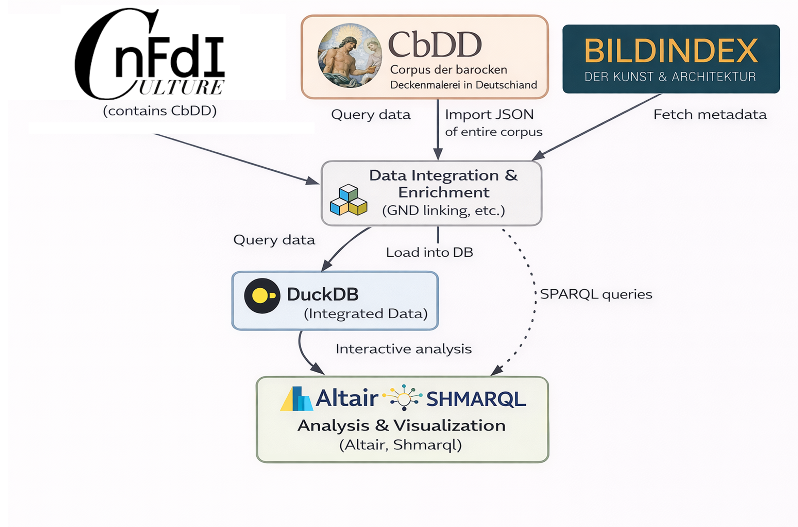
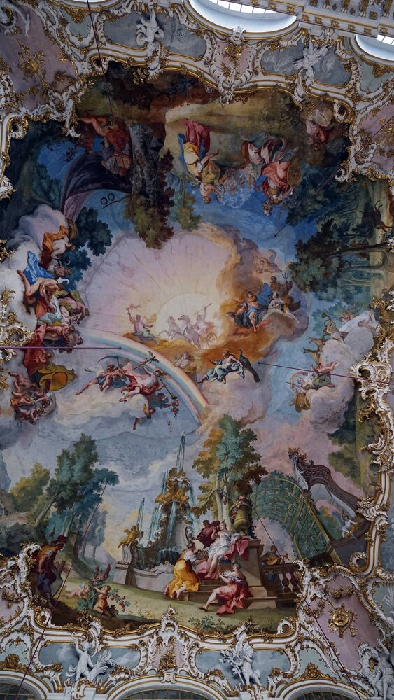

NFDI4Culture Data Story
{: .text-overline-m}

# Baroque Ceiling Paintings in Germany

## Exploring the Corpus of Baroque Ceiling Painting (CbDD) through Interactive Data Visualization

/// html | div[class='tile']
**Authors:** [Thanos Drossos](https://orcid.org/0009-0001-6545-9096), [Robin Kleemann](https://orcid.org/), [YiMin Cai](https://orcid.org/)  
**Persistent Identifier:** https://nfdi4culture.de/id/CbDD  
**License:** [CC-BY 4.0](https://creativecommons.org/licenses/by/4.0/)
///

**Abstract:** This data story explores the Corpus of Baroque Ceiling Painting in Germany (CbDD) through interactive visualizations powered by DuckDB WASM. We analyze the geographic distribution, temporal patterns, and thematic content of over 4,500 ceiling paintings across German regions, using client-side SQL queries for responsive data exploration. The study combines data from the NFDI4Culture Knowledge Graph with historical photographs from Bildindex, cross-referenced via GND identifiers.
{: .intro}

---

## Introduction

Baroque ceiling and wall paintings were a hallmark of interior decoration between the 16th and 18th centuries, transforming churches, palaces, and grand halls with vibrant allegorical frescoes. In Germany alone, a dedicated research corpus (Corpus der barocken Deckenmalerei in Deutschland, CbDD) has documented over 4,000 (CHECK EXACT NUMBER) such artworks along with their locations and artists. Harnessing this rich cultural heritage data, we set out to explore the careers of Baroque ceiling painters and the distribution and themes of their works. To do so, we leverage linked data and modern analysis tools to combine information from multiple sources. This integrated approach allows us to ask: Who were the key Baroque ceiling painters, when and where did they create their works, and what subjects did they depict? By uniting a specialized art-historical dataset with external knowledge graphs and archives, our data story uncovers patterns and insights that would be difficult to see in isolation. The result is an interactive narrative that not only presents quantitative analyses of these artworks and artists, but also demonstrates the power of semantic data integration in cultural heritage research.

### Methods 

We followed a multi-step data pipeline to gather and analyze the information:

1. Data Retrieval via SPARQL: We used SPARQL queries to retrieve structured data on Baroque ceiling paintings and artists from online knowledge graphs. In particular, the core list of paintings and their metadata was obtained from the CbDD’s digital dataset (via a SPARQL endpoint in NFDI). Using SPARQL ensured that we could precisely filter for relevant works (e.g. paintings dated 1550–1800 in Germany) and fetch associated attributes like titles, locations, dates, and painter names in a single query.

2. Data Enrichment: To enhance the dataset, we cross-linked entities across different sources. Painter names from the corpus were reconciled with the original CbDD knowledg graph entries to gather consistent biographical details (e.g. birth/death years) and further connections between the paintings and buildings.. We also connected the paintings to the Bildindex der Kunst und Architektur (the German art and architecture image index) to confirm the existence of high-quality photographs and to retrieve image metadata. This enrichment step added valuable context and helped unify records that refer to the same person or artwork under different identifiers.

3. Data Integration and Cleaning: All retrieved and enriched data were then merged into a single cohesive dataset. We carefully matched paintings from the CbDD corpus with entries in the Bildindex (and other sources) by comparing titles, locations, and other attributes, flagging any ambiguities or duplicates. Each artwork entry was augmented with the identifiers from multiple sources (such as corpus IDs, ICONLASS, GND numbers, and image links) to enable seamless cross-reference. Unmatched items were reviewed and noted for exclusion. The outcome was a unified table of 4,594 paintings by 332 painters, representing the breadth of Baroque ceiling art in Germany.

4. Database and Analysis: The consolidated dataset was imported into a local DuckDB relational database, chosen for its efficiency in analytical querying. Using DuckDB via Python, we could perform complex SQL queries and manipulations on the data directly within our notebook. We analyzed key aspects of the data – for example, counting paintings per artist, examining the timeline of commissions, mapping the geographic distribution of works across regions, and identifying common iconographic themes. We utilized Python libraries (such as Polars for data handling and Altair for charting) to derive summary statistics and create visualizations. This approach allowed interactive exploration of the data with fast query performance on the ~4k records.

5. Visualization and Presentation: Finally, we presented our findings in an interactive format using SHMARQL, a Linked Data storytelling platform. SHMARQL (running in a Docker container for our project) renders the data story Markdown and executes live SPARQL queries embedded in the text. In practice, this means that each figure or chart in our story is generated on the fly by querying the underlying SPARQL endpoints or our prepared dataset. The visualizations (e.g. timelines, maps, bar charts) are thus always consistent with the latest data and can be interactive. By deploying the story via a SHMARQL instance, readers can engage with dynamic charts and even adjust queries or filters in real time. This containerized setup made it straightforward to share the story: the Docker-based SHMARQL server encapsulates the environment needed to serve the narrative and ensures that our integrated data (and any external endpoints required) can be queried seamlessly. In summary, the methods combine semantic data querying, data integration, and modern analytics to transform raw cultural data into a coherent, engaging analysis.



### Dataset Overview

<div id="dataset-stats" class="duckdb-query">
    <div class="loading">Loading database statistics...</div>
</div>

<script type="module">
// Initialize database and show stats
(async function() {
    const statsEl = document.getElementById('dataset-stats');
    
    try {
        // Show loading progress
        statsEl.innerHTML = `
            <div class="db-progress">
                <div class="db-progress-bar" style="width: 0%"></div>
            </div>
            <div class="db-progress-text">Initializing DuckDB WASM...</div>
        `;
        
        await BaroqueDB.init('/story/CbDD/baroque.duckdb', (progress) => {
            statsEl.querySelector('.db-progress-bar').style.width = progress.percent + '%';
            statsEl.querySelector('.db-progress-text').textContent = progress.message;
        });
        
        // Query dataset statistics
        const stats = await BaroqueDB.query(`
            SELECT 
                (SELECT COUNT(*) FROM paintings) as paintings,
                (SELECT COUNT(*) FROM persons) as persons,
                (SELECT COUNT(*) FROM buildings) as buildings,
                (SELECT COUNT(*) FROM rooms) as rooms,
                (SELECT COUNT(*) FROM subjects) as subjects,
                (SELECT COUNT(*) FROM bi_items) as bildindex_items
        `);
        
        const s = stats[0];
        statsEl.innerHTML = `
            <div style="display: grid; grid-template-columns: repeat(3, 1fr); gap: 15px; text-align: center;">
                <div style="padding: 20px; background: #3498db22; border-radius: 8px;">
                    <div style="font-size: 2rem; font-weight: bold; color: #3498db;">${s.paintings.toLocaleString()}</div>
                    <div>Ceiling Paintings</div>
                </div>
                <div style="padding: 20px; background: #27ae6022; border-radius: 8px;">
                    <div style="font-size: 2rem; font-weight: bold; color: #27ae60;">${s.persons.toLocaleString()}</div>
                    <div>Artists & Architects</div>
                </div>
                <div style="padding: 20px; background: #9b59b622; border-radius: 8px;">
                    <div style="font-size: 2rem; font-weight: bold; color: #9b59b6;">${s.buildings.toLocaleString()}</div>
                    <div>Buildings</div>
                </div>
                <div style="padding: 20px; background: #e67e2222; border-radius: 8px;">
                    <div style="font-size: 2rem; font-weight: bold; color: #e67e22;">${s.rooms.toLocaleString()}</div>
                    <div>Rooms</div>
                </div>
                <div style="padding: 20px; background: #e74c3c22; border-radius: 8px;">
                    <div style="font-size: 2rem; font-weight: bold; color: #e74c3c;">${s.subjects.toLocaleString()}</div>
                    <div>Subject Classifications</div>
                </div>
                <div style="padding: 20px; background: #1abc9c22; border-radius: 8px;">
                    <div style="font-size: 2rem; font-weight: bold; color: #1abc9c;">${s.bildindex_items.toLocaleString()}</div>
                    <div>Bildindex Photos</div>
                </div>
            </div>
        `;
    } catch (error) {
        statsEl.innerHTML = `<div class="error">Failed to load database: ${error.message}</div>`;
    }
})();
</script>

---

## Research Questions

This data story addresses the following research questions:

1. **Geographic Distribution**: How are Baroque ceiling paintings distributed across German federal states?
2. **Temporal Patterns**: When was the peak period of ceiling painting production?
3. **Artistic Networks**: Who were the most prolific painters, and where did they work?
4. **Thematic Analysis**: What iconographic subjects dominate Baroque ceiling paintings?
5. **Cross-Dataset Links**: How do CbDD records connect to historical photographs in Bildindex?

---

## User experience 

This data story invites users to explore Baroque ceiling painting between **1600 and 1750** through two complementary perspectives: a **macro perspective** and a **micro perspective**.

**Macro perspective:**
This perspective provides an overview of the period by presenting temporal, spatial, and historical information. It visualizes how ceiling paintings are distributed over time, highlights their geographical occurrence across regions and building types, and situates the artworks within broader political and historical settings of the era. This perspective is intended to support orientation and to offer contextual reference points.

**Micro perspective:**
This perspective shifts the focus to an individual level. Users can explore the period through the life and work of a representative artist associated with a selected thematic block. Biographical information, artistic output, and geographical movement are presented to allow users to experience Baroque ceiling painting from a personal viewpoint and to observe how artistic activity unfolds across time and space.

By combining aggregated views with individual trajectories, this data story enables users to navigate between overview and detail, encouraging independent exploration and reflection on Baroque ceiling painting within its historical context.

---

## Macro perspective
### Analysis 01: Geographic Distribution

Where are Baroque ceiling paintings concentrated across Germany?

<div id="state-distribution" class="baroque-chart"></div>

<script type="module">
(async function() {
    // Wait for database to be ready
    while (!BaroqueDB.isReady()) {
        await new Promise(r => setTimeout(r, 100));
    }
    await BaroqueViz.renderStateDistribution('#state-distribution');
})();
</script>

/// details | **Show SQL Query**
    type: plain
```sql
SELECT 
    location_state,
    COUNT(*) as painting_count,
    COUNT(DISTINCT building_id) as building_count
FROM paintings
WHERE location_state IS NOT NULL
GROUP BY location_state
ORDER BY painting_count DESC
```
///

**Observation:** Bavaria and Baden-Württemberg contain the highest concentrations of Baroque ceiling paintings, reflecting the Catholic cultural sphere's emphasis on elaborate church decoration during the Counter-Reformation period.

---

### Analysis 02: Temporal Distribution

When were most ceiling paintings created?

<div id="temporal-distribution" class="baroque-chart"></div>

<script type="module">
(async function() {
    while (!BaroqueDB.isReady()) {
        await new Promise(r => setTimeout(r, 100));
    }
    await BaroqueViz.renderTemporalDistribution('#temporal-distribution');
})();
</script>

/// details | **Show SQL Query**
    type: plain
```sql
SELECT 
    CAST(FLOOR(year_start / 10) * 10 AS INTEGER) as decade,
    COUNT(*) as count
FROM paintings
WHERE year_start IS NOT NULL
  AND year_start >= 1500 AND year_start <= 1900
GROUP BY FLOOR(year_start / 10) * 10
ORDER BY decade
```
///

**Observation:** The peak period for Baroque ceiling painting production was between 1700-1760, coinciding with the height of the Baroque and Rococo periods in German architecture.

---

### Analysis 03: Top Painters

Who were the most prolific ceiling painters in Germany?

<div id="top-painters" class="baroque-chart"></div>

<script type="module">
(async function() {
    while (!BaroqueDB.isReady()) {
        await new Promise(r => setTimeout(r, 100));
    }
    await BaroqueViz.renderTopPainters('#top-painters');
})();
</script>

/// details | **Show SQL Query**
    type: plain
```sql
SELECT 
    pp.person_name,
    COUNT(DISTINCT pp.nfdi_uri) as painting_count,
    MIN(p.year_start) as earliest,
    MAX(p.year_end) as latest
FROM painting_persons pp
JOIN paintings p ON pp.nfdi_uri = p.nfdi_uri
WHERE pp.role = 'PAINTER'
GROUP BY pp.person_name
ORDER BY painting_count DESC
LIMIT 20
```
///

---

### Analysis 03b: Co-painter Relationships

Which painters most frequently appear together on the same ceiling paintings?

<div id="co-painter-pairs" class="baroque-chart"></div>

<script type="module">
(async function() {
    while (!BaroqueDB.isReady()) {
        await new Promise(r => setTimeout(r, 100));
    }
    await BaroqueViz.renderCoPainterPairs('#co-painter-pairs');
})();
</script>

/// details | **Show SQL Query**
    type: plain
```sql
WITH painters AS (
  SELECT nfdi_uri, person_name AS painter
  FROM painting_persons
  WHERE role='PAINTER' AND person_name IS NOT NULL
),
pairs AS (
  SELECT
    a.painter AS p1,
    b.painter AS p2,
    COUNT(*) AS n_co
  FROM painters a
  JOIN painters b
    ON a.nfdi_uri = b.nfdi_uri
   AND a.painter < b.painter
  GROUP BY 1,2
)
SELECT *
FROM pairs
WHERE n_co >= 8
ORDER BY n_co DESC
LIMIT 30
```
///

**Observation:** Repeated co-painter pairs suggest stable collaboration (e.g., workshop teams or recurring commissions). This highlights that ceiling painting production was often network-based rather than purely individual authorship.

---

### Analysis 04: Geographic Map of Buildings

Interactive map showing the locations of buildings with ceiling paintings.

<div id="buildings-map" class="baroque-map"></div>

<script type="module">
(async function() {
    while (!BaroqueDB.isReady()) {
        await new Promise(r => setTimeout(r, 100));
    }
    await BaroqueViz.renderBuildingsMap('#buildings-map');
})();
</script>

**Tip:** Click on markers to see building details and painting counts. Use the zoom controls to explore specific regions.

---

### Analysis 05: ICONCLASS Subject Categories

What themes dominate Baroque ceiling paintings?

<div id="iconclass-categories" class="baroque-chart"></div>

<script type="module">
(async function() {
    while (!BaroqueDB.isReady()) {
        await new Promise(r => setTimeout(r, 100));
    }
    await BaroqueViz.renderIconclassCategories('#iconclass-categories');
})();
</script>

/// details | **Show SQL Query**
    type: plain
```sql
SELECT 
    SUBSTRING(s.iconclass_code, 1, 1) as category,
    COUNT(DISTINCT ps.nfdi_uri) as painting_count
FROM painting_subjects ps
JOIN subjects s ON ps.subject_uri = s.subject_uri
WHERE s.iconclass_code IS NOT NULL
GROUP BY SUBSTRING(s.iconclass_code, 1, 1)
ORDER BY painting_count DESC
```
///

**ICONCLASS Categories:**

- *0* · Abstract, Non-representational Art
- *1* · Religion and Magic
- *2* · Nature
- *3* · Human Being, Man in General
- *4* · Society, Civilization, Culture
- *5* · Abstract Ideas and Concepts
- *6* · History
- *7* · Bible
- *8* · Literature
- *9* · Classical Mythology and Ancient History

---

### Analysis 06: Cross-Dataset Comparison

Comparing CbDD ceiling paintings with Bildindex historical photographs.

<div id="cross-dataset" class="baroque-chart"></div>

<script type="module">
(async function() {
    while (!BaroqueDB.isReady()) {
        await new Promise(r => setTimeout(r, 100));
    }
    await BaroqueViz.renderCrossDatasetComparison('#cross-dataset');
})();
</script>

The Bildindex archive contains historical photographs of ceiling paintings, many taken before restoration or destruction during World War II. These images provide invaluable documentation of artworks that may have changed significantly over time.

---

## Interactive Query Explorer

Run your own SQL queries against the database:

<div class="duckdb-query">
    <textarea id="custom-query" class="query-editor" rows="6">SELECT 
    pp.person_name as painter,
    COUNT(*) as paintings,
    STRING_AGG(DISTINCT p.location_state, ', ') as regions
FROM painting_persons pp
JOIN paintings p ON pp.nfdi_uri = p.nfdi_uri
WHERE pp.role = 'PAINTER'
GROUP BY pp.person_name
ORDER BY paintings DESC
LIMIT 10</textarea>
    <button id="run-custom-query" class="run-query">▶ Run Query</button>
    <div id="custom-query-result" class="query-result"></div>
</div>

<script type="module">
document.getElementById('run-custom-query').addEventListener('click', async () => {
    const sql = document.getElementById('custom-query').value;
    const resultEl = document.getElementById('custom-query-result');
    const btn = document.getElementById('run-custom-query');
    
    btn.disabled = true;
    btn.textContent = 'Running...';
    
    try {
        await BaroqueViz.renderCustomQuery('#custom-query-result', sql, 'Query Results');
    } catch (error) {
        resultEl.innerHTML = `<div class="error">Query Error: ${error.message}</div>`;
    }
    
    btn.disabled = false;
    btn.textContent = '▶ Run Query';
});
</script>

### Example Queries to Try

**Paintings by decade and state:**
```sql
SELECT 
    FLOOR(year_start/10)*10 as decade,
    location_state,
    COUNT(*) as count
FROM paintings
WHERE year_start BETWEEN 1650 AND 1800
GROUP BY decade, location_state
ORDER BY decade, count DESC
```

**Buildings with most paintings:**
```sql
SELECT 
    b.label as building,
    b.location_city,
    COUNT(DISTINCT p.nfdi_uri) as paintings
FROM buildings b
JOIN paintings p ON b.building_id = p.building_id
GROUP BY b.building_id, b.label, b.location_city
ORDER BY paintings DESC
LIMIT 20
```

**Subject co-occurrences:**
```sql
SELECT 
    s1.subject_label as subject1,
    s2.subject_label as subject2,
    COUNT(*) as co_occurrences
FROM painting_subjects ps1
JOIN painting_subjects ps2 ON ps1.nfdi_uri = ps2.nfdi_uri AND ps1.subject_uri < ps2.subject_uri
JOIN subjects s1 ON ps1.subject_uri = s1.subject_uri
JOIN subjects s2 ON ps2.subject_uri = s2.subject_uri
WHERE s1.subject_source = 'ICONCLASS' AND s2.subject_source = 'ICONCLASS'
GROUP BY s1.subject_label, s2.subject_label
ORDER BY co_occurrences DESC
LIMIT 20
```

---

## Technical Notes

### Data Sources

- **CbDD**: Corpus of Baroque Ceiling Painting in Germany, accessed via NFDI4Culture Knowledge Graph
- **Bildindex**: Historical photograph archive from Bildindex der Kunst und Architektur

### Technology Stack

- **DuckDB WASM**: Client-side analytical database (~16MB)
- **Plotly.js**: Interactive charts and visualizations
- **Leaflet**: Geographic mapping with marker clustering
- **DataTables**: Sortable, searchable result tables

### Database Schema

| Table | Rows | Description |
|-------|------|-------------|
| `paintings` | 4,594 | Ceiling paintings with metadata |
| `persons` | 2,831 | Artists, architects, patrons |
| `buildings` | 1,260 | Churches, palaces, castles |
| `rooms` | 2,376 | Specific rooms within buildings |
| `subjects` | 4,082 | ICONCLASS + Getty AAT subjects |
| `painting_persons` | 5,848 | Painting ↔ Person relations |
| `painting_subjects` | 17,474 | Painting ↔ Subject relations |
| `bi_items` | 968 | Bildindex historical photos |

---

## Micro perspective


This section provides an overview of the ICONCLASS categories represented across the corpus of Baroque ceiling paintings.

The dashboard below allows you to explore basic statistics for each category, including the number of paintings, artists, locations, and key actors such as commissioners. By switching between categories, you can quickly compare thematic emphases within the dataset.

The level of detail can be adjusted using the Top N selector, enabling a closer look at the most frequent painters, states, buildings, or commissioners for each ICONCLASS category.

Have fun while exploring the data! 


---

<a id="analysis-society"></a>
## Politics and Military Affairs in Baroque Ceiling Paintings

This section provides an overview of how themes of social order, political life, and cultural practices are represented across the corpus of Baroque ceiling paintings.

---

<a id="analysis-mythology"></a>
## Mythology in Baroque Ceiling Paintings

---
<a id="analysis-church"></a>
## Church and Religion in Baroque Ceiling Paintings


This micro perspective zooms into **ICONCLASS 1 (Religion & Magic)** and its five major sub-branches:

- **10** · creation, cosmos, universe, life (symbolic representations)  
- **11** · Christian religion  
- **12** · non-Christian religions  
- **13** · magic, supernaturalism, occultism  
- **14** · astrology  

Use the selector below to explore **where** each subtheme concentrates (states), **when** it peaks (timeline), and **who** paints it most often (top painter + gallery).  
Tip: the counts always refer to **distinct paintings (nfdi_uri)**, even if a painting has multiple related subject tags.

<!-- =========================
     RELIGION MICRO DASHBOARD (ICONCLASS 10–14)
     - Subtheme tabs (10..14), default 11
     - Core counts + 2 charts + gallery + representative painter card
========================= -->

<div class="rel-wrap">
  <div class="rel-header">
    <div class="rel-title">
      <span id="rel-title-main">Christian Religion</span>
      <span class="rel-sub">(ICONCLASS <span id="rel-prefix">11</span>)</span>
    </div>

    <div class="rel-controls">
      <label class="rel-label">Gallery size:</label>
      <select id="rel-gallery-n" class="rel-select">
        <option>4</option>
        <option selected>6</option>
        <option>8</option>
        <option>12</option>
      </select>
    </div>
  </div>

  <!-- Tabs -->
  <div class="rel-tabs" id="rel-tabs"></div>

  <!-- Core counts -->
  <section class="rel-card rel-corewide">
    <div class="rel-card-title">Core counts (selected subtheme)</div>
    <table class="rel-table">
      <thead>
        <tr><th>Metric</th><th style="text-align:right">Value</th></tr>
      </thead>
      <tbody id="rel-core-body">
        <tr><td>Paintings</td><td style="text-align:right">…</td></tr>
        <tr><td>Painters (role=PAINTER)</td><td style="text-align:right">…</td></tr>
        <tr><td>States</td><td style="text-align:right">…</td></tr>
        <tr><td>Buildings</td><td style="text-align:right">…</td></tr>
      </tbody>
    </table>
    <div class="rel-note">
      We filter by <b>subject_uri LIKE '%iconclass.org/&lt;prefix&gt;%'</b>.  
      Example: prefix <b>11</b> matches codes such as <b>11D…</b>.
    </div>
  </section>

  <!-- Charts -->
  <div class="rel-grid-2">
    <section class="rel-card">
      <div class="rel-card-title">Where does it concentrate?</div>
      <div id="rel-state-chart" class="baroque-chart"></div>
      <div class="rel-hint">Top states by number of paintings.</div>
    </section>

    <section class="rel-card">
      <div class="rel-card-title">When does it peak?</div>
      <div id="rel-timeline-chart" class="baroque-chart"></div>
      <div class="rel-hint">Paintings by decade (1600–1800).</div>
    </section>
  </div>

  <!-- Gallery -->
  <section class="rel-card" style="margin-top:14px;">
    <div class="rel-card-title">Sample paintings (click to open in CbDD)</div>
    <div id="rel-gallery" class="baroque-gallery"></div>
  </section>

  <!-- Representative painter -->
  <section class="rel-card" style="margin-top:14px;">
    <div class="rel-card-title">Representative painter (most frequent in this subtheme)</div>
    <div id="rel-painter-card">Loading…</div>
  </section>
</div>

<style>
  .rel-wrap{ margin: 10px 0 26px; }
  .rel-header{
    display:flex; align-items:flex-end; justify-content:space-between;
    gap:14px; margin-bottom: 10px;
  }
  .rel-title{ font-weight:800; font-size:18px; line-height:1.2; }
  .rel-sub{ font-weight:600; font-size:13px; opacity:.65; margin-left:8px; }

  .rel-controls{ display:flex; align-items:center; gap:8px; }
  .rel-label{ font-size:13px; opacity:.7; }
  .rel-select{
    border: 1px solid rgba(0,0,0,.18);
    border-radius: 10px;
    padding: 8px 10px;
    font-size: 14px;
    background: white;
  }

  .rel-tabs{ display:flex; flex-wrap:wrap; gap:8px; margin: 8px 0 14px; }
  .rel-tab{
    border: 1px solid rgba(0,0,0,.14);
    border-radius: 999px;
    padding: 7px 10px;
    font-size: 13px;
    background: rgba(255,255,255,.92);
    cursor:pointer;
    user-select:none;
    transition: transform .05s ease, box-shadow .12s ease, border-color .12s ease;
  }
  .rel-tab:hover{ box-shadow: 0 8px 18px rgba(0,0,0,.06); border-color: rgba(0,0,0,.22); }
  .rel-tab:active{ transform: scale(.99); }
  .rel-tab.is-active{
    border-color: rgba(20,110,200,.55);
    box-shadow: 0 10px 22px rgba(20,110,200,.12);
  }

  .rel-card{
    border-radius: 16px;
    background: rgba(255,255,255,.92);
    box-shadow: 0 6px 24px rgba(0,0,0,.06);
    padding: 14px;
  }
  .rel-card-title{ font-weight:800; margin-bottom:10px; }
  .rel-corewide{ width:100%; margin-bottom: 14px; }

  .rel-grid-2{
    display:grid;
    grid-template-columns: 1fr 1fr;
    gap: 14px;
    align-items: start;
  }

  .rel-table{ width:100%; border-collapse: collapse; font-size: 14px; }
  .rel-table th{
    text-align:left;
    font-size: 12.5px;
    letter-spacing:.01em;
    opacity:.65;
    border-bottom: 1px solid rgba(0,0,0,.10);
    padding: 8px 4px;
  }
  .rel-table td{ padding: 10px 4px; border-bottom: 1px solid rgba(0,0,0,.06); }
  .rel-note{ margin-top: 10px; font-size: 12.5px; opacity: .65; }
  .rel-hint{ margin-top: 6px; font-size: 12.5px; opacity: .65; }

  @media (max-width: 980px){
    .rel-grid-2{ grid-template-columns: 1fr; }
  }
</style>

<script type="module">
(async function(){
  const wait = (ms) => new Promise(r => setTimeout(r, ms));
  const $ = (id) => document.getElementById(id);

  while (typeof BaroqueDB === 'undefined' || !BaroqueDB.isReady || !BaroqueDB.isReady()){
    await wait(100);
  }

  // --- Subtheme labels (ICONCLASS 1 → 10..14) ---
  const REL_LABELS = {
    '10': '(symbolic) creation, cosmos, universe, life',
    '11': 'Christian religion',
    '12': 'non-Christian religions',
    '13': 'magic, supernaturalism, occultism',
    '14': 'astrology'
  };

  let currentPrefix = '11';

  // Render tabs
  const tabsEl = $('rel-tabs');
  tabsEl.innerHTML = Object.keys(REL_LABELS).map(p => `
    <div class="rel-tab ${p===currentPrefix ? 'is-active':''}" data-prefix="${p}">
      ${p} · ${REL_LABELS[p]}
    </div>
  `).join('');

  function setActiveTab(){
    for (const el of tabsEl.querySelectorAll('.rel-tab')){
      el.classList.toggle('is-active', el.dataset.prefix === currentPrefix);
    }
    $('rel-title-main').textContent = REL_LABELS[currentPrefix] || 'ICONCLASS';
    $('rel-prefix').textContent = currentPrefix;
  }

  function esc(s){
    return String(s ?? '').replace(/[&<>"']/g, (c) => ({
      '&':'&amp;','<':'&lt;','>':'&gt;','"':'&quot;',"'":'&#039;'
    }[c]));
  }

  async function query(sql){ return await BaroqueDB.query(sql); }

  function iconclassPrefixCTE(){
    return `
      WITH rel_paintings AS (
        SELECT DISTINCT ps.nfdi_uri
        FROM painting_subjects ps
        JOIN subjects s ON ps.subject_uri = s.subject_uri
        WHERE s.subject_source='ICONCLASS'
          AND s.subject_uri LIKE '%iconclass.org/${currentPrefix}%'
      )
    `;
  }

  async function refresh(){
    setActiveTab();

    const galleryN = parseInt($('rel-gallery-n').value, 10);

    // 1) Core counts
    const core = await query(`
      ${iconclassPrefixCTE()}
      SELECT
        (SELECT COUNT(*) FROM rel_paintings) AS paintings,
        (SELECT COUNT(DISTINCT pp.person_name)
           FROM painting_persons pp
           JOIN rel_paintings rp ON rp.nfdi_uri=pp.nfdi_uri
          WHERE pp.role='PAINTER' AND pp.person_name IS NOT NULL) AS painters,
        (SELECT COUNT(DISTINCT p.location_state)
           FROM paintings p
           JOIN rel_paintings rp ON rp.nfdi_uri=p.nfdi_uri
          WHERE p.location_state IS NOT NULL AND p.location_state <> '') AS states,
        (SELECT COUNT(DISTINCT p.building_name)
           FROM paintings p
           JOIN rel_paintings rp ON rp.nfdi_uri=p.nfdi_uri
          WHERE p.building_name IS NOT NULL AND p.building_name <> '') AS buildings
    `);
    const c = core?.[0] || {paintings:0,painters:0,states:0,buildings:0};
    $('rel-core-body').innerHTML = `
      <tr><td>Paintings (ICONCLASS ${currentPrefix}…)</td><td style="text-align:right"><b>${c.paintings ?? 0}</b></td></tr>
      <tr><td>Painters (role=PAINTER)</td><td style="text-align:right"><b>${c.painters ?? 0}</b></td></tr>
      <tr><td>States</td><td style="text-align:right"><b>${c.states ?? 0}</b></td></tr>
      <tr><td>Buildings</td><td style="text-align:right"><b>${c.buildings ?? 0}</b></td></tr>
    `;

    // 2) State distribution (top 12)
    const byState = await query(`
      ${iconclassPrefixCTE()}
      SELECT
        p.location_state AS state,
        COUNT(DISTINCT p.nfdi_uri) AS painting_count
      FROM paintings p
      JOIN rel_paintings rp ON rp.nfdi_uri = p.nfdi_uri
      WHERE p.location_state IS NOT NULL AND p.location_state <> ''
      GROUP BY p.location_state
      ORDER BY painting_count DESC
      LIMIT 12
    `);

    Plotly.newPlot($('rel-state-chart'), [{
      x: byState.map(d => d.painting_count),
      y: byState.map(d => d.state),
      type: 'bar',
      orientation: 'h',
      hovertemplate: '%{y}<br>%{x} paintings<extra></extra>'
    }], {
      margin: {l: 140, r: 20, t: 20, b: 40},
      height: 360,
      xaxis: {title: 'Paintings'},
      yaxis: {automargin: true}
    }, {responsive: true});

    // 3) Timeline by decade (1600–1800)
    const byDecade = await query(`
      ${iconclassPrefixCTE()}
      SELECT
        CAST(FLOOR(p.year_start/10)*10 AS INTEGER) AS decade,
        COUNT(DISTINCT p.nfdi_uri) AS painting_count
      FROM paintings p
      JOIN rel_paintings rp ON rp.nfdi_uri = p.nfdi_uri
      WHERE p.year_start IS NOT NULL AND p.year_start BETWEEN 1600 AND 1800
      GROUP BY FLOOR(p.year_start/10)*10
      ORDER BY decade
    `);

    Plotly.newPlot($('rel-timeline-chart'), [{
      x: byDecade.map(d => d.decade),
      y: byDecade.map(d => d.painting_count),
      type: 'bar',
      hovertemplate: '%{x}s<br>%{y} paintings<extra></extra>'
    }], {
      margin: {l: 60, r: 20, t: 20, b: 60},
      height: 360,
      xaxis: {title: 'Decade', tickangle: -45},
      yaxis: {title: 'Paintings'}
    }, {responsive: true});

    // 4) Gallery
    const gallery = await query(`
      ${iconclassPrefixCTE()}
      SELECT DISTINCT
        p.nfdi_uri,
        p.label,
        p.painters,
        p.year_start,
        p.building_name,
        p.imageUrl
      FROM paintings p
      JOIN rel_paintings rp ON rp.nfdi_uri = p.nfdi_uri
      WHERE p.imageUrl IS NOT NULL AND p.imageUrl <> ''
      ORDER BY p.year_start
      LIMIT ${galleryN}
    `);

    $('rel-gallery').innerHTML = `
      <div style="display:grid; grid-template-columns: repeat(auto-fill, minmax(240px, 1fr)); gap: 14px;">
        ${gallery.map(g => `
          <figure style="margin:0; border: 1px solid rgba(0,0,0,.12); border-radius: 12px; overflow:hidden; background: white;">
            <a href="${g.nfdi_uri}" target="_blank" rel="noopener">
              
            </a>
            <figcaption style="padding:10px; font-size:.85em; line-height:1.35;">
              <strong style="display:block; margin-bottom:4px;">${esc(g.label)}</strong>
              <span style="opacity:.75">${esc(g.painters || 'Unknown')} · ${g.year_start || '?'}<br>${esc(g.building_name || '')}</span>
            </figcaption>
          </figure>
        `).join('')}
      </div>
    `;

    // 5) Representative painter (most frequent)
    const topPainter = await query(`
      ${iconclassPrefixCTE()}
      SELECT
        pp.person_name AS painter,
        COUNT(DISTINCT pp.nfdi_uri) AS painting_count
      FROM painting_persons pp
      JOIN rel_paintings rp ON rp.nfdi_uri = pp.nfdi_uri
      WHERE pp.role='PAINTER' AND pp.person_name IS NOT NULL AND pp.person_name <> ''
      GROUP BY pp.person_name
      ORDER BY painting_count DESC
      LIMIT 1
    `);

    const painterName = topPainter?.[0]?.painter;
    if (!painterName){
      $('rel-painter-card').innerHTML = '<div class="ic-empty">No painter found for this subtheme.</div>';
    } else {
      await BaroqueViz.renderPainterBiography('#rel-painter-card', painterName);
    }
  }

  // Events
  tabsEl.addEventListener('click', (e) => {
    const t = e.target.closest('.rel-tab');
    if (!t) return;
    currentPrefix = t.dataset.prefix;
    refresh();
  });
  $('rel-gallery-n').addEventListener('change', refresh);

  refresh();
})();
</script>


---
<a id="analysis-church"></a>

---
<a id="analysis-society"></a>

## Society & Culture

In der Barockzeit war die Jagd ein exklusives Vorrecht des Adels und ein repräsentatives Standessymbol, während die Bevölkerung keinerlei Jagdrechte besaß und sogar unter Verboten sowie Frondiensten für die höfischen Jagden litt. Die eigentliche Wildpflege und Alltagsjagd erledigten angestellte Jäger, während der Adel die Jagd vor allem als prunkvolles gesellschaftliches Ereignis inszenierte (vgl.http://barockjagd.de/jagen-vor-250-jahren/index.html#:~:text=Sein%20Plaisier%20fand%20der%20Adel,Fest%20mit%20viel%20Prunk%20zelebriert.)

Diese Ins


---
<a id="analysis-mythology"></a>

## Classical Mythology

The Baroque era in German-speaking lands produced a dazzling array of ceiling and wall paintings filled with scenes from classical mythology. These grand frescoes and allegorical programs served not merely as decoration, but as visual sermons of princely virtue, power, and Enlightenment ideals. Commissioned for palaces and grand halls, they wove ancient myths into the narrative of contemporary rulers – celebrating peace after war, exalting dynastic glory, and extolling the arts and sciences. In this data-driven exploration, we trace a red thread through several emblematic Baroque interiors in Germany, uncovering how mythology was employed to transform architecture into theatre of statecraft. From the Olympian gods on the ceilings of Munich’s Nymphenburg Palace to Ovid’s metamorphic tales in a Thuringian castle, these case studies reveal a common language of allegory that early modern patrons used to legitimize and immortalize their reigns. We also examine how the tempo of artistic commissions rose and fell with historical tides – ravaging wars followed by renewed prosperity – and briefly highlight two Italian masters behind these works. The result is a panoramic story of Baroque mythological imagery, presented in academic depth yet accessible and engaging.

<div id="mythology-intro-gallery" class="baroque-gallery"></div>

<script type="module">
(async function() {
    while (!BaroqueDB.isReady()) {
        await new Promise(r => setTimeout(r, 100));
    }
    // Show a selection of mythology paintings as an introductory gallery
    await BaroqueViz.renderMythologyGallery('#mythology-intro-gallery', { limit: 6 });
})();
</script>

### Rebuilding Splendor after the Thirty Years’ War

In the first half of the 17th century, Germany was devastated by the Thirty Years’ War (1618–1648). This protracted conflict not only decimated populations and economies, but also brought high art patronage to a standstill. As one contemporary art historian lamented, “Queen Germania saw her palaces and churches with their magnificent paintings go up in flames... those who made it their profession fell into poverty and contempt, putting away their palette and instead taking up a pike or beggar’s staff”. Indeed, the war was a catastrophe that caused a sharp decline in artistic production – many artists fled or turned to other trades to survive.

Yet, once peace was established in 1648, the German states slowly recovered. By the late 17th century, a generation of rulers embarked on ambitious building projects to assert their renewed power and prestige. These post-war princes drew inspiration from Italian and French Baroque models, adorning their new palaces with lavish mythological frescoes that proclaimed a return of stability and the arts. As we will see, each major commission carried an implicit message: the horrors of war have given way to a golden age under wise and victorious leadership. Nowhere is this more evident than in Nymphenburg Palace near Munich, whose very inception and decoration are tied to themes of peace and prosperity.


### Patronage and the Baroque Cult of Magnificence

Importantly, these grand mythological paintings did not emerge in a vacuum – they were typically commissioned by the nobility of the Baroque era. Kings, princes, dukes, prince-bishops and other aristocrats (Adel) enthusiastically paid artists to fill their residences with scenes from antiquity. The practice was rooted in the Baroque (and Renaissance) notion of princely magnificence. Following the examples of ancient Roman emperors and the Italian Renaissance princes, Baroque rulers embraced the idea that a sovereign’s greatness should be manifest in lavish art and architecture. In the Baroque age of absolutism, art was a form of propaganda and self-fashioning: monarchs and princes used mythological allegory to magnify their status. As art historians note, “absolute monarchs embraced the ancient notion of princely magnificence… translated into expensive and sumptuous displays of wealth through… monumental scale, and allegorical symbolism”. Nowhere was this more evident than in the painted ceiling frescoes and grand canvases adorning Baroque palaces. These works often literally placed the patron among the gods – sometimes the ruler’s portrait features would appear on a figure like Apollo or Hercules – or at least drew flattering parallels between the patron and the virtues of mythic heroes.

<div id="apollo-gallery" class="baroque-gallery"></div>

<script type="module">
(async function() {
    while (!BaroqueDB.isReady()) {
        await new Promise(r => setTimeout(r, 100));
    }
    await BaroqueViz.renderMythFigureGallery('#apollo-gallery', 'Apollo', { limit: 6 });
})();
</script>


---


### Nymphenburg Palace: An Olympian Vision of Peace and Prosperity

The ceiling of the Steinerner Saal (Stone Hall) at Nymphenburg Palace presents an Olympian assembly celebrating the return of a golden age of peace. Painted by Johann Baptist Zimmermann in 1755–57, this monumental fresco – framed by lush Rococo stucco – allegorically links the reign of the Bavarian elector to a time of prosperity and plenty.

Nymphenburg Palace was founded in 1664 as a summer residence for Elector Ferdinand Maria of Bavaria and his wife Henriette Adelaide, to celebrate the birth of their heir Max Emanuel. The central pavilion (the core of today’s palace) was constructed in the late 1660s, but major expansions stalled during subsequent conflicts. For example, during the War of the Spanish Succession, after Bavaria’s defeat at the Battle of Höchstädt in 1704, work on Nymphenburg was halted – at that point only the main pavilion and one wing were habitable. It was only after peace was restored and Elector Max Emanuel returned from exile in 1715 that construction resumed with renewed vigor. By the mid-18th century, Max Emanuel’s grandson Max III. Joseph undertook a final magnificent refurbishment of the palace’s great hall, the Steinerner Saal, to serve as the symbolic heart of his court.

Under Max III. Joseph’s patronage, between 1755 and 1758 the aging Johann Baptist Zimmermann – one of Bavaria’s premier fresco painters – created his last masterpiece on the ceiling of the Steinerner Saal. This vast composition is explicitly allegorical. “Alluding to the ruler’s duty to bring and preserve peace, the huge ceiling painting depicts the Olympian sky”, notes the official palace description. In the center, the gods of Mount Olympus convene under a radiant sky, celebrating the restoration of peace and prosperity under the Elector’s enlightened rule. Jupiter presides, while Apollo in his sun chariot brings light – a reference to the elector as a sun bringing enlightenment to his lands. On the west side of the fresco (facing the gardens), a train of cheerful nymphs pays homage to Flora, a nymph-turned-goddess of flowering abundance, which pointedly nods to the palace’s name (Nymphenburg, “castle of the nymphs”) and its idyllic park.

Surrounding the central scene are smaller mythological vignettes that reinforce the message of peace and flourishing. For instance, one corner shows Mars and Venus, an allegory of love triumphing over war; another panel depicts Zephyr and Flora, symbolizing gentle winds and springtime fecundity. We also find Fama and Clio (the personifications of Fame and History) – suggesting that the fame of the Wittelsbach dynasty will be recorded for posterity – and Astronomy and Urania (muse of astronomy), underscoring patronage of knowledge and science. Even cautionary tales appear: the fresco cycle includes Latona turning the Lycian peasants into frogs (a myth about disrespect to the divine), perhaps as a moral reminder to viewers, and playful putti (cherubs) at play, symbolizing the joy and innocence of a peaceful era. Together, these seven mythological scenes and the colossal central tableau form a visual hymn to the Wohlstand und Blüte des Landes im Frieden – the prosperity and blossoming of the land in peace, as contemporary sources described the theme. Zimmermann’s ceiling, completed in 1758, remained untouched through the centuries and still today greets visitors with its authentic Rococo splendor, a testament to how Baroque art glorified peace after turmoil.

### Nymphenburg Palace: An Olympian Vision of Peace and Prosperity

The ceiling of the Steinerner Saal (Stone Hall) at Nymphenburg Palace presents an Olympian assembly celebrating the return of a golden age of peace. Painted by Johann Baptist Zimmermann in 1755–57, this monumental fresco – framed by lush Rococo stucco – allegorically links the reign of the Bavarian elector to a time of prosperity and plenty.

Nymphenburg Palace was founded in 1664 as a summer residence for Elector Ferdinand Maria of Bavaria and his wife Henriette Adelaide, to celebrate the birth of their heir Max Emanuel. The central pavilion (the core of today’s palace) was constructed in the late 1660s, but major expansions stalled during subsequent conflicts. For example, during the War of the Spanish Succession, after Bavaria’s defeat at the Battle of Höchstädt in 1704, work on Nymphenburg was halted – at that point only the main pavilion and one wing were habitable. It was only after peace was restored and Elector Max Emanuel returned from exile in 1715 that construction resumed with renewed vigor. By the mid-18th century, Max Emanuel’s grandson Max III. Joseph undertook a final magnificent refurbishment of the palace’s great hall, the Steinerner Saal, to serve as the symbolic heart of his court.

Under Max III. Joseph’s patronage, between 1755 and 1758 the aging Johann Baptist Zimmermann – one of Bavaria’s premier fresco painters – created his last masterpiece on the ceiling of the Steinerner Saal. This vast composition is explicitly allegorical. “Alluding to the ruler’s duty to bring and preserve peace, the huge ceiling painting depicts the Olympian sky”, notes the official palace description. In the center, the gods of Mount Olympus convene under a radiant sky, celebrating the restoration of peace and prosperity under the Elector’s enlightened rule. Jupiter presides, while Apollo in his sun chariot brings light – a reference to the elector as a sun bringing enlightenment to his lands. On the west side of the fresco (facing the gardens), a train of cheerful nymphs pays homage to Flora, a nymph-turned-goddess of flowering abundance, which pointedly nods to the palace’s name (Nymphenburg, “castle of the nymphs”) and its idyllic park.

Surrounding the central scene are smaller mythological vignettes that reinforce the message of peace and flourishing. For instance, one corner shows Mars and Venus, an allegory of love triumphing over war; another panel depicts Zephyr and Flora, symbolizing gentle winds and springtime fecundity. We also find Fama and Clio (the personifications of Fame and History) – suggesting that the fame of the Wittelsbach dynasty will be recorded for posterity – and Astronomy and Urania (muse of astronomy), underscoring patronage of knowledge and science. Even cautionary tales appear: the fresco cycle includes Latona turning the Lycian peasants into frogs (a myth about disrespect to the divine), perhaps as a moral reminder to viewers, and playful putti (cherubs) at play, symbolizing the joy and innocence of a peaceful era. Together, these seven mythological scenes and the colossal central tableau form a visual hymn to the Wohlstand und Blüte des Landes im Frieden – the prosperity and blossoming of the land in peace, as contemporary sources described the theme. Zimmermann’s ceiling, completed in 1758, remained untouched through the centuries and still today greets visitors with its authentic Rococo splendor, a testament to how Baroque art glorified peace after turmoil.

<div id="steinerer-saal-card" class="room-card-container"></div>

 
*caption: Schloss Nymphenburg, Steinerer Saal Hauptfresko: Wohlstand und Blüte des Landes im Frieden (c) CbDD*

<script type="module">
(async function() {
    while (!BaroqueDB.isReady()) {
        await new Promise(r => setTimeout(r, 100));
    }
    await BaroqueViz.renderRoomCard('#steinerer-saal-card', 'ca990351-642b-4739-9753-59c5f7c1da1f');
})();
</script>

### Mannheim Palace: Epic Tales of Destiny and Dynasty

While Nymphenburg’s frescoes celebrated peace and plenty, elsewhere mythological paintings carried more martial and dynastic themes. In the Electoral Palace of Mannheim, built in the 1720s–30s, Elector Carl Philipp of the Palatinate commissioned grand ceiling paintings to decorate the main stairhall (Haupttreppenhaus) and adjoining state rooms. The task fell to the renowned Bavarian artist Cosmas Damian Asam. Between 1729 and 1730, Asam executed a trilogy of frescos for the stairhall that drew upon Virgil’s epic Aeneid and related myths, creating an erudite iconographic program that linked the Elector’s lineage to the heroes and gods of antiquity.

At the center of the Mannheim stairway ceiling shone “Das Urteil des Paris” – the Judgment of Paris, a scene that set in motion the events of the Trojan War and eventually the founding of Rome. Asam’s original fresco (signed “Cosmas D. Asam von München 1730”) was destroyed in World War II, but descriptions and reconstructions allow us to envision its content. Paris, depicted as a shepherd prince under a tree, is approached by Mercury (Hermes) delivering the gods’ command that he choose the fairest goddess. Before Paris stand the three goddesses contending for the golden apple: Juno (Hera) with her peacock, Venus (Aphrodite) receiving the prize apple of victory, and Minerva (Athena) off to the side with her attendant nymphs. A winged figure of Fama brings a wreath to crown Venus as the victor in this fateful beauty contest. By including this scene, the fresco symbolically alluded to the origins of the Trojan War – an epic conflict that ultimately led, via Aeneas, to the rise of Rome and thus (by medieval extension) to the ancestry of European rulers. It was a subtle way for the Palatine Elector to insert his rule into the grand sweep of classical destiny.

<div id="parisurteil-card" class="painting-card-container"></div>

<script type="module">
(async function() {
    while (!BaroqueDB.isReady()) {
        await new Promise(r => setTimeout(r, 100));
    }
    await BaroqueViz.renderPaintingCard('#parisurteil-card', '56698022-bbf7-4859-94b5-10646493da8e');
})();
</script> 

Flanking the central Paris panel were two large oval tondi with further episodes from the Aeneid saga, one on each side of the ceiling vault. On the eastern side, Asam painted “Venus and Aeneas in the Forge of Vulcan”: the goddess Venus, mother of Aeneas, persuades Vulcan to forge weapons for her son before he goes to war. In Asam’s rendition, Venus descends from her swan-drawn chariot and sits enthroned at the center, accompanied by the youthful hero Aeneas and the smith-god Vulcan himself. Around them bustle Cyclops and helpers carrying a heavy shield, while in the background three elegant ladies in modern baroque court dress watch the scene – a charming anachronism, these were likely meant to represent the three granddaughters of Elector Carl Philipp, thus tying the ancient myth to the living dynasty. On the western side, the fresco “Juno, Aeolus and the Storm at Sea” portrayed an episode where Juno, queen of the gods, enlists Aeolus, god of the winds, to wreck Aeneas’s fleet at sea. Asam depicted Juno enthroned under a billowing canopy with her peacocks, gesturing commandingly to Aeolus on a rocky shore; below them, muscular personifications of the winds and waters are shown unleashing a tempest – putti stoke storms, river-gods pour out floods from urns. This dramatic scene of divine wrath balanced the Venus vignette across the hall, illustrating both divine favor and divine opposition in Aeneas’s journey.

Taken together, Mannheim’s stairhall paintings formed a three-part narrative: the Judgment of Paris (the cause of the Trojan War) in the center, flanked by Aeneas’s divine aid (Venus and Vulcan) and trials (Juno’s storm) on either side. The choice of these subjects was rich in meaning. The Aeneid was a favored source in Baroque art because Aeneas, legendary survivor of Troy and ancestor of the Romans, was seen as a model of pietas (duty) and the mythical forefather of rulers (even the Habsburgs traced lineage to him). By having Asam paint Aeneas’s story, Elector Carl Philipp aligned himself with this hero’s virtues and destiny. Contemporary guidelines on fresco programs advised that depictions of ancient battles and adventures could “through their examples incite the viewer to virtuous life”, and Virgil’s epic was considered especially apt for its themes of heroism, founding a new homeland, and devotion to the gods. Mannheim’s implementation was accordingly didactic: the viewer ascending the grand staircase would see, step by step, how gods and heroes shaped the Elector’s illustrious antecedents, implicitly urging loyalty and bravery.

<div id="mannheim-treppenhaus-card" class="room-card-container"></div>

<script type="module">
(async function() {
    while (!BaroqueDB.isReady()) {
        await new Promise(r => setTimeout(r, 100));
    }
    await BaroqueViz.renderRoomCard('#mannheim-treppenhaus-card', '7430f064-80a8-4b74-b447-55c655cfab4e');
})();
</script>

It is notable that Cosmas Damian Asam’s originals were lost to wartime fires in the 1940s, but the ceiling paintings were later reconstructed (1955–61) by artist Carolus Vocke using surviving photographs. While Vocke’s secco reproductions lack some of Asam’s original vibrancy and Baroque dynamism – one critic found the modern colors “cool and dry, without radiance” – the iconography was preserved intact. Today, visitors can once again admire Paris with his golden apple and Aeneas amid the gods on the ceiling of Mannheim’s reconstructed staircase, a modern echo of the Baroque ambition to connect local dynastic glory with epic myth.


### Arolsen Castle: Apollo and the Muses – Patronage of the Arts

Not all Baroque mythological ceilings emphasized war or political allegory; some celebrated cultural enlightenment and the arts themselves. A case in point is the Residenzschloss Arolsen in Hesse, residence of the Princes of Waldeck. Built largely in the early 18th century (construction from 1713 to 1728, with interiors continuing into the 1740s), Arolsen’s design included a splendid Gartensaal (Garden Hall) also known as the Steinerner Saal. Around 1721–1722, the Italian painter Carlo Ludovico Castelli was commissioned to decorate the vaulted ceiling of this hall with a fresco that exalts the arts and sciences in classical guise.

Castelli’s ceiling painting in Arolsen’s Garden Hall depicts Apollo, the god of light and the arts, accompanied by the nine Muses. The composition shows Apollo seated at the center on an elevated cloud, strumming his lyre as leader of the Muses, who array themselves around him on the billowing clouds of Mount Parnassus. A key detail is the inclusion of Pegasus, the winged horse: in the fresco, Pegasus is shown flying off into the sky in the background. In mythology Pegasus’s hooves released the spring of the Muses (Hippocrene), symbolizing the wellspring of poetic inspiration – an appropriate nod in a gathering of the Muses. Scattered about are putti (cherubs) bearing laurel wreaths and branches, which they bring toward Apollo and the poetic goddesses. The laurel, sacred to Apollo, here signifies eternal glory bestowed on achievement in the arts. The entire scene, set against an ethereal blue sky, radiates a serene harmony. Apollo’s presence as sun-god and leader of the chorus suggests that under the Waldeck princes, the arts flourish in a divinely sanctioned golden age. This message would not have been lost on contemporaries: small princely courts like Waldeck were eager to present themselves as enlightened patrons of culture, keeping pace with larger realms.

<div id="arolsen-musen-card" class="painting-card-container"></div>

<script type="module">
(async function() {
    while (!BaroqueDB.isReady()) {
        await new Promise(r => setTimeout(r, 100));
    }
    await BaroqueViz.renderPaintingCard('#arolsen-musen-card', 'd1c42fea-214e-4652-b77e-74e9978ccbb8');
})();
</script>


Stylistically, Castelli’s work in Arolsen is interesting for its mixture of influences. Research shows that Castelli, who hailed from the Italian-Swiss Ticino region, compiled his design from prints after famous Roman Baroque works. Apollo’s pose, for example, was lifted from a depiction of the gods by Giovanni Lanfranco (1624), while some of the Muses were inspired by Andrea Sacchi’s fresco of Divine Wisdom (1629–30) – likely known to Castelli through engraving reproductions. Such creative borrowing was common practice, enabling artists far from Rome to keep up with the latest artistic models. Castelli executed the Arolsen ceiling in a mixed secco technique (painted on dry plaster with layered glazes), rather than true fresco, which has allowed the work to survive, albeit darkened, into the 21st century. In the late 20th century (1987–2006) the Apollo and Muses painting was carefully restored to its former brightness, so modern visitors can once more appreciate its delicate color harmonies and lively figures.

The iconography of Apollo and the Muses was perfectly suited to a Festsaal of an Enlightenment-era prince. By featuring Apollo Musagetes (leader of Muses), Prince Friedrich Anton Ulrich of Waldeck advertised himself as a cultivated ruler under whose beneficent light the arts thrive. The hall would have hosted musical performances and literary receptions, literally bringing the theme to life. In this way, Arolsen’s mythological ceiling is less about political power and more about cultural prestige. It proclaims that this small German court participates in the grand tradition of artistic patronage, guided by Apollo’s divine inspiration. Such an image was an important part of a prince’s self-fashioning in the Baroque era, complementing the more overtly political allegories elsewhere.


### Sondershausen Palace: Ovidian Transformations and Princely Elevation

One of the most extensive mythological programs of German Baroque adorns the Riesensaal (Giants’ Hall) of Residenzschloss Sondershausen in Thuringia. Sondershausen was the seat of the Counts of Schwarzburg-Sondershausen, who in 1697 were elevated to princely status within the Holy Roman Empire. To reflect this elevation, Fürst (Prince) Christian Wilhelm undertook a lavish redecoration of the palace’s state rooms around 1700. Central to this was the Riesensaal, a great hall on the second floor of the south wing, completed by 1703 with an elaborate stucco ceiling containing no fewer than 22 painted scenes from Ovid’s Metamorphoses. This unified cycle of myths about transformation was uniquely apt, as it subtly paralleled the “metamorphosis” of Christian Wilhelm’s own dynasty – from minor counts to high princes – and placed his court in dialogue with the international vogue for Ovidian imagery.

The Riesensaal’s ceiling is a marvel of quadratura stuccowork and narrative painting. The surface is divided by ornate plaster frames into a grid of oval and rectangular compartments (coffers), each containing a vividly rendered mythological episode. The broad cove (vault springing) of the ceiling also carries larger fresco scenes in monochrome (grisaille) that act as visual transitions between the main panels. All the chosen stories come from Ovid’s Metamorphoses, a classical poem that recounts hundreds of tales of gods and mortals undergoing transformations. The selection in Sondershausen emphasizes heroic quests, divine justice, and love’s consequences – fitting themes for a Baroque princely hall. For instance, one oval shows Apollo slaying the Python, affirming the triumph of light over darkness; another depicts Apollo and Daphne, the nymph transforming into a laurel tree to escape the god’s pursuit. We find scenes of youthful hubris punished, such as Phaeton crashing the sun-chariot and Marsyas being flayed by Apollo, as well as tales of piety rewarded, like Philemon and Baucis (noted in other sources, likely included). Hunting scenes feature prominently – Meleager and Atalanta defeating the Calydonian boar, for example – as do episodes from the Trojan cycle, such as Achilles killing the Amazon Penthesilea, or Aeneas’s adventures (the program included images of Thetis imploring Vulcan to forge Achilles’ armor and Juno’s wrath against Troy, aligning with the broader Trojan theme we saw in Mannheim).

This Ovidian gallery of gods and heroes in action created a rich allegorical environment. A contemporary description notes that the Sondershausen ceiling “shows hunting, battle, and love scenes from the Metamorphoses of Ovid” in a lively, dramatic style. The paintings are executed in a warm color palette – lots of earthy reds, greens, and blues, with bright highlights – and the figures are rendered with the energetic, somewhat provincial Baroque manner of central Germany around 1700. (Art historians cannot definitively identify the painter; candidates include court painters like Johann W. Richter or itinerant Italians, but documentation is scarce.) The stucco framing was provided by the Italian Carlo Domenico and Antonio Carcani, whose workshop of Ticinese stuccoists was active across Thuringia at the time. They sculpted life-sized Atlas figures (giants) at the corners to “support” the vault and added trophy reliefs of weapons and armor in the coves – an allusion to martial prowess appropriate for a knightly hall.

Importantly, the choice of Metamorphoses as the unifying theme carried symbolic resonance for the patron. Christian Wilhelm’s elevation to Reichsfürst (Imperial Prince) was a dramatic social transformation – a metamorphosis of rank – and the ceiling’s parade of transformations could be read as an elaborate metaphor for that change. While no written “program” survives to explicate the intent, scholars surmise that the prince wished to associate his regime with the cycle of renewal and change depicted by Ovid. Just as the characters in the frescoes are elevated, chastised, or transfigured by divine forces, so too had the House of Schwarzburg been transformed by imperial grace. One can imagine the prince’s contemporaries, gathered in this hall for ceremonies or balls, glancing up at Jupiter’s eagle or Diana’s hounds and drawing parallels to the fortunes of their own realm. The very abundance of mythological exempla was a statement: this small principality knew the great stories of the classical world and saw its own story as part of that continuum.

<div id="sondershausen-card" class="building-card-container"></div>
<script type="module">
(async function() {
    while (!BaroqueDB.isReady()) {
        await new Promise(r => setTimeout(r, 100));
    }
    await BaroqueViz.renderBuildingCard('#sondershausen-card', 'c644529c-1edc-4ad4-9b48-c8348b14283b');
})();
</script>

Even beyond the political subtext, the Riesensaal’s decorative scheme spoke to Baroque viewers on a moral level. The scenes offered lessons on virtue and vice: Apollo versus Marsyas taught the value of humility before the gods, Mercury’s theft of Apollo’s cattle (also depicted in a corner medallion) illustrated cunning and consequences, and so forth. A 19th-century restoration by artist Julius Meyer in 1859 repainted sections of the frescoes, altering some colors (blue skies and green landscapes were refreshed) but otherwise left the compositions intact. Thus, the cycle remains a rare surviving example of a full Ovidian ceiling in northern Europe. It stands as a Baroque encyclopedia of metamorphosis – both artistic and dynastic – witnessing how a newly-minted prince used mythology to legitimize his ancien régime-style authority.
Sondershausen Palace: Ovidian Transformations and Princely Elevation


### Rastatt Palace: Hercules in Olympus – The Apotheosis of a Warrior Prince

If one Baroque fresco cycle epitomizes personal dynastic glorification, it is the Ancestral Hall (Ahnensaal) ceiling of Schloss Rastatt in Baden. Here, the central theme is the apotheosis (deification) of a hero – a transparent parallel to the glorification of the building’s owner, Margrave Ludwig Wilhelm of Baden-Baden. Ludwig Wilhelm (1655–1707), famed as the military hero “Türkenlouis” for his battles against Ottoman forces, constructed Rastatt Palace around 1700 to rival the grandest courts. For the crowning ceiling of his great hall, he brought in Italian talent: Giuseppe Maria Roli of Bologna, who in 1704–1705 painted “Die Aufnahme des Herkules in den Olymp” – The Reception of Hercules into Olympus. This fresco, surrounded by smaller corner scenes and sumptuous stucco, explicitly casts the margrave’s life in allegorical terms of Herculean virtue rewarded by eternal fame.


<div id="ahnensaal-saal-card" class="room-card-container"></div>

<script type="module">
(async function() {
    while (!BaroqueDB.isReady()) {
        await new Promise(r => setTimeout(r, 100));
    }
    await BaroqueViz.renderRoomCard('#ahnensaal-saal-card', '72df9922-340f-42fa-b7cc-df0ef351cc57');
})();
</script>

Roli’s composition unfolds across a pseudo-circular opening in a painted sky, where the gods of Olympus welcome the ascendant Hercules. At the zenith sits Jupiter, thundering king of gods, with eagle by his side (in some interpretations, Jupiter’s eagle was represented indirectly – more on that below). On the right half of the fresco, the muscular Hercules is shown rising from the earthly realm up to the heavens. He is draped in a blue cloak, brandishes his trademark club, and wears a laurel wreath as sign of his virtue. Notably, Hercules does not gaze upward at Jupiter, but instead looks downward – significantly, toward the walls of the hall where Ludwig Wilhelm’s ancestral portraits hung in a gallery around the cornice. This clever detail made Hercules a stand-in for the margrave: the hero acknowledges his mortal lineage (the ancestors on the walls) even as he is elevated to godhood. Hercules is flanked by allegorical figures: one of his companions on the cloud bank is a personification of Virtue, who in Baroque iconography often guides Hercules. At Hercules’ feet, putti remove his lion-skin and arms – symbols that his labors are complete and peace has been won.

On the opposite side, Venus (the goddess of love) is depicted reclining semi-nude with her cherubs, but she is shown in an act of rejection and despair: her arm raised, she shields her face with a red drapery as she realizes Hercules has chosen immortal virtue over her temptations. One Cupid breaks his bow in frustration, while another tumbles downward, spilling a quiver of arrows – a clear sign that lust and sin have been vanquished by heroic virtue. This scene of Venus en déroute is a direct moral allegory: the Margrave, like Hercules, has spurned idleness and vice (represented by Venus) in favor of glory and duty.

Above, on a bank of clouds, other gods observe the apotheosis. We see Minerva (Athena) with helmet and spear, a symbol of strategic warfare and wisdom – appropriate for Ludwig Wilhelm as a general. Mars is present as well, representing war, but notably Justitia (Justice) also appears prominently: she sits by Jupiter, and her figure is fitted into a ring of the zodiac (she touches the scales of Libra) while holding aloft a great sword whose point pierces the sky. This dramatic inclusion of Lady Justice – her upraised sword forming the highest pinnacle of the composition – signified that righteous rule was the supreme virtue crowning the hero. In other words, the margrave is not only a successful warrior (a new Hercules) but a just sovereign who wields the sword of justice. The entire Olympian gathering is linked by a flying Fama (Fame) who blows a trumpet and carries a laurel wreath toward Hercules, announcing his eternal renown across the world.

Perhaps the most personal touch in Roli’s design is found at the lower edge of the fresco. There, painted as if perched on the architectural rim, is a large eagle’s nest with a mother eagle and her eaglets. The mother eagle rears back, wings spread protectively, while the fledgling eaglets gaze upward. In the preparatory drawing for this fresco (which survives in Karlsruhe), Roli annotated this motif with a Latin motto from Horace: “Non generant aquilae columbas” – eagles do not beget doves. The meaning was clear: great parents produce great offspring. The eagle, a long-standing symbol of power and a device of Jupiter (and by extension imperial power), here alluded to the House of Baden-Baden itself. Margrave Ludwig Wilhelm had married into the Imperial Habsburg family and had high hopes for his descendants. The eagle nest in the fresco is positioned as if on the threshold between the mortal realm and Olympus, implying that the margrave’s young heirs (the eaglets) will carry on his heroic virtues and one day soar among the gods as well. Jupiter himself casts his gaze down toward the nest, linking the divine favor to the princely lineage on earth.

In its totality, the Ahnensaal ceiling at Rastatt is a masterful piece of Baroque political theatre. It takes the classical myth of Hercules – long a favorite allegory for rulers (the so-called Herculean Virtue theme) – and customizes it to Ludwig Wilhelm’s narrative. The margrave was nicknamed “Türkenlouis” for his victories against the Ottoman Turks, and indeed four corner sculptures in the hall depict captured Turks in chains, literally supporting the cornice as caryatids. This ties directly to Hercules’ story: just as Hercules vanquished monstrous threats in his Labors, Türkenlouis subdued the “infidel” enemies of Austria. A contemporary description of the hall noted that “the ceiling fresco showing the reception of Hercules into Olympus clearly refers to the victorious margrave; even the statues of the fettered Ottomans speak volumes”. The Apotheosis of Hercules thus operates on multiple levels – celebrating military success, moral virtue, dynastic continuity, and the just governance of the prince. It is propaganda in pigment and plaster, executed with Italian Baroque skill. Notably, Giuseppe Roli’s fresco in Rastatt remains very well preserved (having fortunately escaped war damage). Art historians regard it as one of the finest Italian frescoes north of the Alps, and its iconography of ruler-as-Hercules influenced many later works (for instance, it likely inspired a similar Hercules apotheosis painted by Carlo Carlone in the Würzburg Residenz in the 1740s).

<div id="hercules-rastatt-card" class="painting-card-container"></div>

<script type="module">
(async function() {
    while (!BaroqueDB.isReady()) {
        await new Promise(r => setTimeout(r, 100));
    }
    await BaroqueViz.renderPaintingCard('#hercules-rastatt-card', '32229efd-3f75-4a6a-80c4-470b40e7e79d');
})();
</script>

#### Excursus: Hercules in Baroque Art

Hercules (German: Herkules) was among the most popular mythological figures in Baroque ceiling painting. His labors symbolized virtuous struggle, and his apotheosis represented the reward of immortal fame for earthly deeds – themes that resonated deeply with noble patrons seeking to glorify their dynasties:


<div id="hercules-gallery" class="baroque-gallery"></div>

<script type="module">
(async function() {
    while (!BaroqueDB.isReady()) {
        await new Promise(r => setTimeout(r, 100));
    }
    await BaroqueViz.renderMythFigureGallery('#hercules-gallery', 'Herkules', { limit: 9 });
})();
</script>

### Commissions Over Time: War, Peace, and the Rhythm of Baroque Art

The ebbs and flows of these ambitious art projects were closely tied to historical events. The timeline of ceiling painting commissions in German Baroque courts reflects periods of war-induced stagnation followed by bursts of building activity in peacetime. A chart of major ceiling fresco commissions from 1650 to 1750 would show several notable peaks and troughs corresponding to conflicts and recoveries:

Post-1648 Rebound: After the Thirty Years’ War ended in 1648, decades of impoverishment gave way to a gradual revival. In the 1650s–1670s, commissions resumed, initially in ecclesiastical contexts and then in palaces. For instance, the first phase of Nymphenburg Palace (including a modest painted hall) began in the 1660s once Bavaria’s economy stabilized. Rulers like the Prince-Bishop of Würzburg or the Electors of Mainz also started refurbishing their residences in this period, though on a smaller scale.

1680s–1690s Boom: The late 17th century saw a building boom. Many princes who had come of age after the war – often educated in Italy or France – poured resources into new palaces and their decoration. This was the age of expansion for Versailles-inspired complexes across Germany. Ceiling painters from Italy were in high demand. However, this boom was partly curtailed by new conflicts: the Nine Years’ War (1688–1697) and the War of the Spanish Succession (1701–1714). These wars directly affected German territories. In 1689 French armies devastated the Palatinate, burning Mannheim and Heidelberg – a major setback for artistic endeavors there. Conversely, some rulers decided to relocate and rebuild: Ludwig Wilhelm moved his capital from war-torn Baden-Baden to Rastatt and started his palace in 1698 as a fresh start. We see in Nymphenburg’s timeline a microcosm of this: by 1704, due to the War of Spanish Succession, construction stopped and parts of the palace were cannibalized for other uses. Skilled artists found themselves without work as courts redirected funds to the war effort.

1715–1730 High Baroque Flourishing: After the Treaty of Rastatt in 1714 ended the Spanish Succession War, a spectacular flowering of art occurred. Many exiled or cash-strapped princes returned to their lands and resumed projects. The period from about 1715 to 1730 was one of feverish commissioning of frescoes. In these fifteen years, numerous great cycles were completed: the stairhall and chapel in Mannheim by Cosmas Damian Asam (1720s), the grand halls of Würzburg and Bruchsal (though some of those would extend into the 1740s), the Ahnensaal in Rastatt by Roli (1704–05), the garden halls of smaller palaces like Arolsen by Castelli (1721–22), and the Riesensaal in Sondershausen (finished by 1703) as we saw. Importantly, peace and prosperity in the 1720s meant patrons could afford to import Italian painters or send locals for training. The result was a pan-German golden age of Baroque art. Visitors to German courts in these years marveled at the newly painted heavens filled with Olympian gods, reflecting the confidence of a post-war generation.

Mid-Century Adjustments: The mid-18th century brought new disruptions. The War of the Austrian Succession (1740–1748) and the Seven Years’ War (1756–1763) once again embroiled German states in conflict. These wars did not wreak the same universal destruction as 1618–48, but they did strain treasuries and sometimes put cultural projects on hold. For example, work on some late Baroque churches and palaces slowed during the early 1750s due to the uncertainty of war. Bavaria, while neutral in the Seven Years’ War, still felt economic pressure; yet intriguingly, it was precisely in the 1750s that Max III. Joseph invested in Nymphenburg’s Steinener Saal fresco by Zimmermann – perhaps as a statement of optimism amid continental strife. Other princes, like Prince-Bishop Adam Friedrich von Seinsheim in Würzburg, continued to patronize the arts through the Seven Years’ War (the famed Würzburg Residenz fresco by Tiepolo was completed in 1753, just before the war broke out). Nonetheless, the mid-century conflicts mark a last hurrah for high Baroque fresco. After the Seven Years’ War, the political climate and aesthetic tastes began to shift significantly.

1760s–1770s Transition to Neoclassicism: By the 1760s, the elaborate Baroque and Rococo ceiling paintings were gradually falling out of favor. The next generation of rulers, influenced by Enlightenment ideals, often preferred cleaner, neoclassical styles and viewed the old mythological allegories as outdated. In Bavaria, for instance, the new Elector Max III. Joseph (after 1745) and later Elector Karl Theodor (after 1777) curtailed Rococo extravagance. In 1766, a final Rococo refurbishment of a room at Nymphenburg was done in a markedly simpler ornament, heralding the end of the Baroque era. Just three years later, in 1769, Elector Karl Theodor issued a mandate effectively ending Rococo decoration in Bavaria and ushering in Neoclassicism. Similar patterns occurred elsewhere: courts like Prussia’s or Saxony’s embraced classical restraint by the 1770s. Consequently, large-scale mythological ceiling commissions dwindled. Some planned projects were even left incomplete or executed on canvas rather than fresco. The age of Napoleon at the turn of the 19th century, with its political upheavals, finally extinguished the Baroque tradition of princely allegorical ceilings.

In reflecting on this trajectory, we see that Baroque ceiling painting in Germany was highly sensitive to the winds of history. Periods of peace and relative economic strength – roughly 1660s, 1720s, mid-1740s to mid-1750s – coincide with spikes in artistic production and the hiring of artists to create these mythic tableaux. Conversely, major wars or fiscal crises correlate with gaps or conservatism in commissions. This rhythm underscores that these artworks were luxury propaganda: the first expenses to be cut in hard times, yet among the most prominent expenditures in good times to display a ruler’s magnificence. They were, in a sense, barometers of a state’s health and a prince’s confidence.


<div id="commissions-timeline" class="baroque-chart"></div>

<script type="module">
(async function() {
    while (!BaroqueDB.isReady()) {
        await new Promise(r => setTimeout(r, 100));
    }
    await BaroqueViz.renderCommissionsTimeline('#commissions-timeline', { startYear: 1550, endYear: 1800 });
})();
</script>

### Italian Masters in German Courts: Carlo Ludovico Castelli and Alessandro Paduano

Castelli and Paduano were two prolific painters of mythological scenes in Baroque Germany. Their works often featured gods, heroes, and allegorical figures, making them ideal representatives of the mythology theme. Below are galleries showcasing some of their most notable mythological ceiling paintings:

#### Carlo Ludovico Castelli (1671–1738)

Carlo Ludovico Castelli was an Italian painter and decorator from Melide in the Ticino (Swiss-Italian) region, part of a renowned family of artists. Active in Germany in the early 18th century, Castelli made his mark primarily in Thuringia, Franconia, and Hesse. He was one of many itinerant craftsmen from Ticino who supplied central Europe with Baroque artistry in stucco and paint. Castelli’s specialty was ceiling frescoes and secco paintings for palaces. We encountered his work at Arolsen Castle, where he painted the Apollo and the Muses ceiling in 1721/22. Prior to that, Castelli had collaborated on projects in Kassel (he worked on the Orangerie of Kassel around 1715–1719) and possibly at other minor courts. In 1728, he completed the decoration of the Arolsen palace chapel and other rooms, but the Garden Hall remains his best-known achievement there.

Castelli’s style was informed by the High Baroque models of Italy – he cleverly adapted compositions from artists like Lanfranco and Sacchi, as noted, blending them into new syntheses. Working often in fresco-secco (a technique allowing more time for detail by painting on dry plaster with binder), he produced durable works that could withstand the northern climate. Outside Arolsen, Castelli is documented to have participated in decorative schemes in Würzburg (the Juliusspital hospital church, early 1720s) and possibly in Altenburg and Gera. Records indicate he partnered with his brother or cousin, the stuccoist Giovanni Pietro Castelli, on some of these commissions. Carlo Ludovico was esteemed enough that several German princes sought his service; for example, the Duke of Sachsen-Gotha engaged him briefly. By the mid-1730s, Castelli returned to Italy, where he died in 1738.


<div id="castelli-gallery" class="baroque-gallery"></div>

<script type="module">
(async function() {
    while (!BaroqueDB.isReady()) {
        await new Promise(r => setTimeout(r, 100));
    }
    await BaroqueViz.renderPainterGallery('#castelli-gallery', ['Castelli, Carlo Ludovico'], { limit: 6 });
})();
</script>

### Alessandro Paduano (active 1568–1596)

Alessandro Paduano was an earlier Italian artist whose career foreshadowed the Baroque fascination with myth in Bavaria. Active roughly from 1568 to 1596, Paduano was a painter from Italy (as his surname suggests, likely originating from Padua) who became a Hofkünstler (court artist) in Munich during the late Renaissance period. He is best known as the close collaborator – indeed “the right hand” – of the great architect-painter Friedrich Sustris, who served Duke Wilhelm V of Bavaria. In the 1570s–1580s, Munich’s court was a hive of artistic innovation, and Paduano played a significant role in executing the large decorative programs designed by Sustris.


One of Paduano’s notable contributions was his work on the so-called Narrentreppe (Fools’ Staircase) at the ducal residence in Landshut (Trausnitz Castle). Between 1575 and 1579, he and Sustris adorned this staircase with life-sized fresco scenes of Commedia dell’arte characters – a fascinating mixture of theatrical whimsy and allegory, unprecedented in north of the Alps. Paduano’s hand is evident in the lively figures of masked actors and courtly spectators that still faintly survive on those walls. Additionally, Paduano was involved in creating mythological grottos and bath hall decorations for Duke Wilhelm V. An example is the famous Grottenhof in the Munich Residenz (circa 1580), an artificial grotto courtyard rich with mosaic and painted scenes where classical gods like Venus and water deities were depicted – Paduano likely executed or assisted in those paintings, translating Sustris’s designs into reality.


Historically, Alessandro Paduano is recorded in the Bavarian court accounts and was described as an essential assistant. He is even said to have been Sustris’s brother-in-law, which explains the close partnership. His versatility extended from secular to religious projects, but it’s his secular mythological work that stands out. Paduano brought Italian Mannerist training to Bavaria, helping to lay the groundwork for what would become the German Baroque ceiling tradition. Though he worked a few generations before the likes of Zimmermann or Asam, he directly influenced the courtly aesthetic of integrating classical myths into architectural space. After about 1596, Paduano fades from the records, and it’s presumed he either died or left Bavaria. By then, however, he had helped decorate multiple palatial rooms and perhaps even taught younger German artists (one Hans Werl apprenticed under him in 1588–89).


<div id="paduano-gallery" class="baroque-gallery" style="margin-top: 20px;"></div>

<script type="module">
(async function() {
    while (!BaroqueDB.isReady()) {
        await new Promise(r => setTimeout(r, 100));
    }
    await BaroqueViz.renderPainterGallery('#paduano-gallery', 'Paduano, Alessandro', { limit: 6 });
})();
</script>


In conclusion, the mythological ceiling and wall paintings of the German Baroque were far more than opulent ornament; they were visual manifestos of an age. Through the examples of Nymphenburg, Mannheim, Arolsen, Sondershausen, and Rastatt, we have seen how ancient myths were ingeniously repurposed to celebrate contemporary themes – peace after war, the heroism and legitimacy of rulers, the flourishing of arts, the transformation and continuity of dynasties, and the ultimate aspiration for eternal fame. These grand compositions required a convergence of talents (patron, painter, stucco sculptor, architect) and could only thrive under favorable historical conditions. When those conditions waned – under the strain of war or changing taste – the commissions slowed and finally ceased, giving way to new artistic paradigms.

---


---
## Summary

This data story demonstrates how DuckDB WASM enables interactive, client-side data exploration for cultural heritage research. Key findings include:

1. **Geographic concentration** in Bavaria and Baden-Württemberg reflects Catholic patronage patterns
2. **Temporal peak** between 1700-1760 aligns with the height of Baroque and Rococo architectural styles
3. **Biblical themes** (ICONCLASS category 7) dominate ceiling iconography
4. **Cross-dataset linking** via GND identifiers connects primary documentation with historical photography

The combination of structured analytical data with interactive visualizations enables researchers to explore hypotheses and patterns that would be difficult to perceive in tabular data alone.

---

<a id="painter-explorer"></a>
## Painter Biography Explorer

Explore the life and works of individual Baroque ceiling painters through an interactive map and chronological listing. Select a painter to see:

- **Geographic journey**: Where they worked throughout their career
- **Chronological works**: All paintings ordered by date and grouped by building
- **Detailed information**: Click any painting or building for more details

<div id="painter-explorer-container" class="baroque-explorer"></div>

<script type="module">
(async function() {
    // Wait for database to be ready
    while (!BaroqueDB.isReady()) {
        await new Promise(r => setTimeout(r, 100));
    }
    
    // Check if there's a painter specified in the URL hash
    const hash = window.location.hash;
    let initialPainter = null;
    if (hash.startsWith('#painter=')) {
        initialPainter = decodeURIComponent(hash.replace('#painter=', ''));
    }
    
    await BaroqueViz.renderPainterExplorer('#painter-explorer-container', initialPainter);
})();
</script>

<style>
/* Make painter names clickable throughout the document */
.painter-link {
    color: #3498db;
    cursor: pointer;
    text-decoration: underline;
    text-decoration-style: dotted;
}
.painter-link:hover {
    color: #2980b9;
    text-decoration-style: solid;
}
</style>

<script type="module">
// Make all painter names in galleries clickable to navigate to the explorer
document.addEventListener('DOMContentLoaded', () => {
    // Wait a bit for content to load
    setTimeout(() => {
        // Find painter names in painting cards and galleries
        document.querySelectorAll('.painter-card h2, .painting-card figcaption, figure figcaption').forEach(el => {
            const text = el.innerHTML;
            // Look for painter patterns like "🎨 Painter Name" or "Painter(s): Name"
            const painterPattern = /🎨\s*([^<]+)|Painter\(s\):\s*([^<]+)/g;
            let match;
            while ((match = painterPattern.exec(text)) !== null) {
                const painterName = (match[1] || match[2]).trim();
                if (painterName && painterName.length > 3) {
                    // Don't replace if it's already a link
                    if (!text.includes(`painter-link`) && !text.includes(`<a `)) {
                        const linkedText = text.replace(
                            painterName, 
                            `<span class="painter-link" onclick="if(window.loadPainterInExplorer){window.loadPainterInExplorer('${painterName.replace(/'/g, "\\'")}');window.scrollToPainterExplorer();}">${painterName}</span>`
                        );
                        el.innerHTML = linkedText;
                    }
                }
            }
        });
    }, 2000);
});
</script>

**Tips for using the explorer:**

- **Search**: Type in the search box to find a specific painter by name
- **Navigate**: Use the ◀ Previous / Next ▶ buttons to move chronologically between buildings
- **Click on map**: Click markers to see building details and jump to that location in the list
- **Click on building header**: Click any building name to pan to its location on the map
- **View details**: Click "Info" for building details, or click any painting for full information
- **Direct links**: You can link directly to a painter using `#painter=Name` in the URL

### Featured Painters to Explore

Try exploring these notable Baroque ceiling painters:

<div style="display: grid; grid-template-columns: repeat(auto-fill, minmax(200px, 1fr)); gap: 10px; margin: 20px 0;">
    <button onclick="if(window.loadPainterInExplorer){window.loadPainterInExplorer('Asam, Cosmas Damian');document.getElementById('painter-explorer-container').scrollIntoView({behavior:'smooth'});}" 
            style="padding: 12px; background: linear-gradient(135deg, #667eea 0%, #764ba2 100%); color: white; border: none; border-radius: 8px; cursor: pointer; font-size: 0.95em;">
        🎨 Cosmas Damian Asam
    </button>
    <button onclick="if(window.loadPainterInExplorer){window.loadPainterInExplorer('Seivert, Lammers');document.getElementById('painter-explorer-container').scrollIntoView({behavior:'smooth'});}" 
            style="padding: 12px; background: linear-gradient(135deg, #f093fb 0%, #f5576c 100%); color: white; border: none; border-radius: 8px; cursor: pointer; font-size: 0.95em;">
        🎨 Lammers Seivert
    </button>
    <button onclick="if(window.loadPainterInExplorer){window.loadPainterInExplorer('Castelli, Carlo Ludovico');document.getElementById('painter-explorer-container').scrollIntoView({behavior:'smooth'});}" 
            style="padding: 12px; background: linear-gradient(135deg, #4facfe 0%, #00f2fe 100%); color: white; border: none; border-radius: 8px; cursor: pointer; font-size: 0.95em;">
        🎨 Carlo Ludovico Castelli
    </button>
    <button onclick="if(window.loadPainterInExplorer){window.loadPainterInExplorer('Holzer, Johann Evangelist');document.getElementById('painter-explorer-container').scrollIntoView({behavior:'smooth'});}" 
            style="padding: 12px; background: linear-gradient(135deg, #a8edea 0%, #fed6e3 100%); color: #333; border: none; border-radius: 8px; cursor: pointer; font-size: 0.95em;">
        🎨 Johann Evangelist Holzer
    </button>
</div>

## Sources

Baroque:

Art and the thirty years’ war. Die Welt Der Habsburger. Abgerufen 5. Februar 2026, von https://www.habsburger.net/en/chapter/art-and-thirty-years-war

Bayerische schlösserverwaltung | nymphenburg | schloss | rundgang. Abgerufen 5. Februar 2026, von https://www.schloss-nymphenburg.de/deutsch/schloss/raum01.htm

Corpus der barocken Deckenmalerei in Deutschland (Cbdd). Abgerufen 5. Februar 2026, von https://www.deckenmalerei.eu/

Mannheim, kurfürstliches residenzschloss, haupttreppenhaus, ausschnitt aus dem deckengemälde von cosmas damian asam, „urteil des paris“. Google Arts & Culture. Abgerufen 5. Februar 2026, von https://artsandculture.google.com/asset/mannheim-kurfürstliches-residenzschloss-haupttreppenhaus-ausschnitt-aus-dem-deckengemälde-von-cosmas-damian-asam-„urteil-des-paris“/RwHZdS1VCPSpzw

network,  romoe conservators.. Residenzschloss, riesensaal, deckengemälde. Romoe Netzwerk. Abgerufen 5. Februar 2026, von https://www.romoe.com/de/artikel/residenzschloss-riesensaal-deckengemaelde_ef5kcvlt.html

Residenzschloss mannheim. Abgerufen 5. Februar 2026, von https://www.zum.de/Faecher/G/BW/Landeskunde/rhein/ma/schloss/treppenhaus.htm

Pietro, Carlo. Die Stuckateure und Baumeister Castelli aus Melide und Bissone. Abgerufen 5. Februar 2026, von https://www.sueddeutscher-barock.ch/PDF-Bio_M/Castelli_Melide.pdf
