NFDI4Culture Data Story
{: .text-overline-m}

# Baroque Ceiling Paintings in Germany

## Exploring the Corpus of Baroque Ceiling Painting (CbDD) through Interactive Data Visualization

/// html | div[class='tile']
**Authors:** [Thanos Drossos](https://orcid.org/0009-0001-6545-9096), [Robin Kleemann](https://orcid.org/), [YiMin Cai](https://orcid.org/)  
**Persistent Identifier:** https://nfdi4culture.de/id/CbDD  
**License:** [CC-BY 4.0](https://creativecommons.org/licenses/by/4.0/)
///

**Abstract:** This data story explores the Corpus of Baroque Ceiling Painting in Germany (CbDD) through interactive visualizations powered by DuckDB WASM. It analyzes the geographic distribution, temporal patterns, and thematic content of more than 4,500 ceiling paintings across German regions, using client-side SQL queries for responsive data exploration. The study combines data from the NFDI4Culture Knowledge Graph with historical photographs from Bildindex, linked through GND identifiers.
{: .intro}

---

## Introduction

Baroque ceiling and wall paintings were a defining feature of interior decoration between the 16th and 18th centuries, transforming churches, palaces, and great halls with vivid allegorical frescoes. In Germany alone, the dedicated research corpus *Corpus der barocken Deckenmalerei in Deutschland* (CbDD) has documented 4,594 such works together with their locations and artists. Drawing on this rich cultural heritage data, we set out to examine the careers of Baroque ceiling painters and the distribution and themes of their works. To do so, we combine linked data with modern analysis tools in order to bring together information from multiple sources. This integrated approach allows us to ask: Who were the key Baroque ceiling painters? When and where did they work? Which subjects did they depict? By connecting a specialized art-historical dataset with external knowledge graphs and archives, this data story reveals patterns and relationships that are difficult to see in isolation. The result is an interactive narrative that not only presents quantitative analyses of artworks and artists, but also demonstrates the potential of semantic data integration for cultural heritage research.

### Methods

We followed a multi-step data pipeline to gather, integrate, and analyze the material:

1. Data Retrieval via SPARQL: We used SPARQL queries to retrieve structured data on Baroque ceiling paintings and artists from online knowledge graphs. In particular, the core list of paintings and their metadata was obtained from the CbDD digital dataset through an NFDI SPARQL endpoint. This allowed us to filter precisely for relevant works, for example paintings dated 1550-1800 in Germany, and to retrieve associated attributes such as titles, locations, dates, and painter names in a single query.

2. Data Enrichment: To enrich the dataset, we cross-linked entities across different sources. Painter names from the corpus were reconciled with the original CbDD knowledge graph entries in order to collect consistent biographical details, such as birth and death years, and to establish further connections between paintings and buildings. We also linked the paintings to the *Bildindex der Kunst und Architektur* in order to retrieve image metadata and detailed architectural information. This was done by matching GND identifiers and other metadata fields, which allowed us to supplement the dataset with historical photographs and additional contextual information about the artworks.

3. Data Integration and Cleaning: All retrieved and enriched data were then merged into a single, coherent dataset. We carefully matched paintings from the CbDD corpus with entries in Bildindex and other sources by comparing titles, locations, and additional attributes, and we flagged ambiguities or duplicates where necessary. Each artwork entry was supplemented with identifiers from multiple sources, including corpus IDs, ICONCLASS, GND numbers, and image links, in order to support seamless cross-referencing. Unmatched items were reviewed and documented for exclusion. The result was a unified dataset of 4,594 paintings that reflects the breadth of Baroque ceiling art in Germany.

4. Database and Analysis: The consolidated dataset was imported into a local DuckDB relational database, chosen for its efficiency in analytical querying. Using DuckDB via Python, we were able to perform complex SQL queries and transformations directly within our notebook. We examined key aspects of the material, including the number of paintings per artist, the chronology of commissions, the geographic distribution of works across regions, and recurring iconographic themes. Python libraries such as Polars for data handling and Altair for charting were used to derive summary statistics and create visualizations. This approach enabled interactive exploration of the data with fast query performance on roughly 4,000 records.

5. Visualization and Presentation: Finally, we presented our findings in an interactive format using SHMARQL, a linked data storytelling platform. SHMARQL, running in a Docker container for this project, renders the Markdown data story and executes live SPARQL queries embedded in the text. In practice, this means that each figure or chart is generated dynamically by querying the underlying SPARQL endpoints or our prepared dataset. The visualizations, including timelines, maps, and bar charts, therefore remain consistent with the latest data and can be explored interactively. Graphs are created with Altair, while maps are rendered with Leaflet. The DuckDB database is accessed via a client-side WASM implementation, allowing users to run SQL queries directly in the browser for a responsive experience. This setup supports a dynamic data story that combines narrative text with live data exploration.


### Limitations

While this data story provides a broad overview of Baroque ceiling paintings in Germany, several limitations should be kept in mind:

1. **Data Completeness**: Although the CbDD corpus is extensive, it may not capture every surviving Baroque ceiling painting in Germany. As CbDD is still a work in progress, the dataset contains gaps and shows a bias toward well-documented works in Bavaria. It may therefore not fully represent the diversity of ceiling paintings across all regions, and biographical details for lesser-known artists may remain incomplete. As CbDD is still a work in progress, the dataset contains gaps and shows a bias toward well-documented works in Bavaria. Moreover, as a long-term research project, the corpus is continuously expanded and revised, meaning that classifications and metadata may change over time. For more detailed information on the project background and development of the CbDD, please refer to the following website: https://deckenmalerei.badw.de/projektgeschichte.html.

2. **Data Quality and Consistency**: The data retrieved from different sources such as CbDD and Bildindex may contain inconsistencies in naming conventions, metadata formats, and levels of completeness. Painter names may be spelled differently across sources, and some paintings lack precise dating or location information. This creates challenges for data integration and may affect the accuracy of our analyses. We also identified discrepancies between the NFDI endpoint and the original CbDD dataset, which had to be resolved manually. Updates in the CbDD dataset were often not reflected in the NFDI endpoint, leading to further mismatches and missing data.

3. **Analytical Scope**: Our analyses are limited to the attributes available in the dataset and therefore cannot capture every relevant aspect of Baroque ceiling painting. We focus on quantifiable features such as the number of paintings per artist and their geographic distribution, but we do not examine stylistic features, iconography, or artistic techniques in depth. In addition, the temporal analysis depends on the dating information available for each painting, which may be imprecise or missing in some cases.

4. **Interpretation of Results**: The patterns and trends identified here are shaped not only by the historical record, but also by the biases and limitations of the dataset and by our own analytical choices. The prominence of certain artists or regions, for example, may reflect documentation practices rather than actual production patterns. The results should therefore be interpreted with caution and in dialogue with existing art-historical research.


### Dataset Overview

<div id="dataset-stats" class="duckdb-query">
    <div class="loading">Loading database statistics...</div>
</div>

<script type="module">
(async function() {
    await BaroqueViz.renderDatasetStats('#dataset-stats', '/story/CbDD/baroque.duckdb');
})();
</script>

---

## Research Questions

This data story addresses the following research questions:

1. **Geographic Distribution**: How are Baroque ceiling paintings distributed across German federal states?
2. **Temporal Patterns**: When was the peak period of ceiling painting production?
3. **Artistic Networks**: Who were the most prolific painters, and where did they work?
4. **Thematic Analysis**: What iconographic subjects dominate Baroque ceiling paintings?
5. **Cross-Dataset Links**: How do CbDD records connect to historical photographs in Bildindex?
6. **Specialized Perspectives**: How do specific themes (e.g. religious, mythological, societal) manifest in terms of geography, time, and artistic production?

---

## User Experience

This data story invites users to explore Baroque ceiling painting between **1500 and 1750** through two complementary perspectives: **distant reading** and **close reading**.

**Distant reading:**
This perspective provides an overview of the period through temporal, spatial, and historical information. It visualizes how ceiling paintings are distributed over time, highlights their geographic presence across regions and building types, and situates the works within broader political and historical contexts. Its purpose is to support orientation and provide reference points for interpretation.

**Close reading:**
This perspective shifts the focus to the level of individual artists and thematic constellations. Users can explore the period through the life and work of a representative painter associated with a selected thematic block. Biographical information, artistic production, and geographic movement are presented in order to show how artistic activity unfolded across time and space from a more personal perspective.

By combining aggregated views with individual trajectories, the data story enables users to move between overview and detail and encourages independent exploration of Baroque ceiling painting within its historical context.

---

## Distant reading
### Analysis 01: Geographic Distribution

Where are Baroque ceiling paintings concentrated across Germany?

<div id="state-distribution" class="baroque-chart"></div>

<script type="module">
(async function() {
    // Wait for database to be ready
    while (!BaroqueDB.isReady()) {
        await new Promise(r => setTimeout(r, 100));
    }
    await BaroqueViz.renderStateDistribution('#state-distribution');
})();
</script>

/// details | **Show SQL Query**
    type: plain
```sql
SELECT 
    location_state,
    COUNT(*) as painting_count,
    COUNT(DISTINCT building_id) as building_count
FROM paintings
WHERE location_state IS NOT NULL
GROUP BY location_state
ORDER BY painting_count DESC
```
///

**Observation:** Bavaria and Baden-Württemberg contain the highest concentrations of Baroque ceiling paintings, reflecting the strong emphasis on elaborate church decoration within the Catholic cultural sphere of the Counter-Reformation period.

---

### Analysis 02: Temporal Distribution

When were most ceiling paintings created?

<div id="temporal-distribution" class="baroque-chart"></div>

<script type="module">
(async function() {
    while (!BaroqueDB.isReady()) {
        await new Promise(r => setTimeout(r, 100));
    }
    await BaroqueViz.renderTemporalDistribution('#temporal-distribution');
})();
</script>

/// details | **Show SQL Query**
    type: plain
```sql
SELECT 
    CAST(FLOOR(year_start / 10) * 10 AS INTEGER) as decade,
    COUNT(*) as count
FROM paintings
WHERE year_start IS NOT NULL
  AND year_start >= 1500 AND year_start <= 1900
GROUP BY FLOOR(year_start / 10) * 10
ORDER BY decade
```
///

**Observation:** The peak phase of Baroque ceiling painting production falls between 1700 and 1760, coinciding with the height of the Baroque and Rococo periods in German architecture.

---

### Analysis 03: Top Painters

Who were the most prolific ceiling painters in Germany?

<div id="top-painters" class="baroque-chart"></div>

<script type="module">
(async function() {
    while (!BaroqueDB.isReady()) {
        await new Promise(r => setTimeout(r, 100));
    }
    await BaroqueViz.renderTopPainters('#top-painters');
})();
</script>

/// details | **Show SQL Query**
    type: plain
```sql
SELECT 
    pp.person_name,
    COUNT(DISTINCT pp.nfdi_uri) as painting_count,
    MIN(p.year_start) as earliest,
    MAX(p.year_end) as latest
FROM painting_persons pp
JOIN paintings p ON pp.nfdi_uri = p.nfdi_uri
WHERE pp.role = 'PAINTER'
GROUP BY pp.person_name
ORDER BY painting_count DESC
LIMIT 20
```
///

---

### Analysis 03b: Co-painter Relationships

Which painters most frequently appear together on the same ceiling paintings?

<div id="co-painter-pairs" class="baroque-chart"></div>

<script type="module">
(async function() {
    while (!BaroqueDB.isReady()) {
        await new Promise(r => setTimeout(r, 100));
    }
    await BaroqueViz.renderCoPainterPairs('#co-painter-pairs');
})();
</script>

/// details | **Show SQL Query**
    type: plain
```sql
WITH painters AS (
  SELECT nfdi_uri, person_name AS painter
  FROM painting_persons
  WHERE role='PAINTER' AND person_name IS NOT NULL
),
pairs AS (
  SELECT a.painter AS p1, b.painter AS p2, COUNT(*) AS n_co
  FROM painters a
  JOIN painters b
    ON a.nfdi_uri = b.nfdi_uri
   AND a.painter < b.painter
  GROUP BY 1,2
),
collab_counts AS (
  SELECT painter, SUM(n_co) AS total_collab
  FROM (
    SELECT p1 AS painter, n_co FROM pairs
    UNION ALL
    SELECT p2 AS painter, n_co FROM pairs
  )
  GROUP BY painter
  ORDER BY total_collab DESC
  LIMIT 50
)
SELECT p.p1, p.p2, p.n_co
FROM pairs p
WHERE p.p1 IN (SELECT painter FROM collab_counts)
  AND p.p2 IN (SELECT painter FROM collab_counts)
  AND p.n_co >= 2
ORDER BY p.n_co DESC
```
///

**Observation:** The network graph reveals clusters of closely collaborating painters. Node size represents each painter's total number of collaborative works, while edge thickness indicates the intensity of a specific partnership. Repeated co-painter pairs suggest stable workshop teams or recurring commissions and underline that ceiling painting was often produced through networks rather than through strictly individual authorship.

---

### Analysis 04: Geographic Map of Buildings

This interactive map shows the locations of buildings with ceiling paintings.

<div id="buildings-map" class="baroque-map"></div>

<script type="module">
(async function() {
    while (!BaroqueDB.isReady()) {
        await new Promise(r => setTimeout(r, 100));
    }
    await BaroqueViz.renderBuildingsMap('#buildings-map');
})();
</script>

**Tip:** Click the markers to view building details and painting counts, and use the zoom controls to explore specific regions.

---

### Analysis 05: ICONCLASS Subject Categories

What themes dominate Baroque ceiling paintings?

<div id="iconclass-categories" class="baroque-chart"></div>

<script type="module">
(async function() {
    while (!BaroqueDB.isReady()) {
        await new Promise(r => setTimeout(r, 100));
    }
    await BaroqueViz.renderIconclassCategories('#iconclass-categories');
})();
</script>

/// details | **Show SQL Query**
    type: plain
```sql
SELECT 
    SUBSTRING(s.iconclass_code, 1, 1) as category,
    COUNT(DISTINCT ps.nfdi_uri) as painting_count
FROM painting_subjects ps
JOIN subjects s ON ps.subject_uri = s.subject_uri
WHERE s.iconclass_code IS NOT NULL
GROUP BY SUBSTRING(s.iconclass_code, 1, 1)
ORDER BY painting_count DESC
```
///

**ICONCLASS Categories:**

- *0* · Abstract, Non-representational Art
- *1* · Religion and Magic
- *2* · Nature
- *3* · Human Being, Man in General
- *4* · Society, Civilization, Culture
- *5* · Abstract Ideas and Concepts
- *6* · History
- *7* · Bible
- *8* · Literature
- *9* · Classical Mythology and Ancient History

---

### Analysis 06: Cross-Dataset Comparison

This comparison links CbDD ceiling paintings with historical photographs from Bildindex.

<div id="cross-dataset" class="baroque-chart"></div>

<script type="module">
(async function() {
    while (!BaroqueDB.isReady()) {
        await new Promise(r => setTimeout(r, 100));
    }
    await BaroqueViz.renderCrossDatasetComparison('#cross-dataset');
})();
</script>

The Bildindex archive preserves historical photographs of ceiling paintings, many of them taken before restoration campaigns or destruction during World War II. These images provide invaluable documentation for works that may have changed significantly over time.

---

## Interactive Query Explorer

Use the interface below to run your own SQL queries against the database:

<div class="duckdb-query">
    <textarea id="custom-query" class="query-editor" rows="6">SELECT 
    pp.person_name as painter,
    COUNT(*) as paintings,
    STRING_AGG(DISTINCT p.location_state, ', ') as regions
FROM painting_persons pp
JOIN paintings p ON pp.nfdi_uri = p.nfdi_uri
WHERE pp.role = 'PAINTER'
GROUP BY pp.person_name
ORDER BY paintings DESC
LIMIT 10</textarea>
    <button id="run-custom-query" class="run-query">▶ Run Query</button>
    <div id="custom-query-result" class="query-result"></div>
</div>

<script type="module">
(async function() {
    while (!BaroqueDB.isReady()) {
        await new Promise(r => setTimeout(r, 100));
    }
    BaroqueViz.initQueryExplorer('custom-query', 'run-custom-query', '#custom-query-result');
})();
</script>

### Example Queries to Try

**Paintings by decade and state:**
```sql
SELECT 
    FLOOR(year_start/10)*10 as decade,
    location_state,
    COUNT(*) as count
FROM paintings
WHERE year_start BETWEEN 1650 AND 1800
GROUP BY decade, location_state
ORDER BY decade, count DESC
```

**Buildings with most paintings:**
```sql
SELECT 
    b.label as building,
    b.location_city,
    COUNT(DISTINCT p.nfdi_uri) as paintings
FROM buildings b
JOIN paintings p ON b.building_id = p.building_id
GROUP BY b.building_id, b.label, b.location_city
ORDER BY paintings DESC
LIMIT 20
```

**Subject co-occurrences:**
```sql
SELECT 
    s1.subject_label as subject1,
    s2.subject_label as subject2,
    COUNT(*) as co_occurrences
FROM painting_subjects ps1
JOIN painting_subjects ps2 ON ps1.nfdi_uri = ps2.nfdi_uri AND ps1.subject_uri < ps2.subject_uri
JOIN subjects s1 ON ps1.subject_uri = s1.subject_uri
JOIN subjects s2 ON ps2.subject_uri = s2.subject_uri
WHERE s1.subject_source = 'ICONCLASS' AND s2.subject_source = 'ICONCLASS'
GROUP BY s1.subject_label, s2.subject_label
ORDER BY co_occurrences DESC
LIMIT 20
```

---

## Technical Notes

### Data Sources

- **CbDD**: Corpus of Baroque Ceiling Painting in Germany, accessed via NFDI4Culture Knowledge Graph
- **Bildindex**: Historical photograph archive from Bildindex der Kunst und Architektur
- **GND**: Integrated Authority File for cross-referencing artists and buildings
- **ICONCLASS**: Subject classification system for art and iconography

### Database Schema

| Table | Rows | Description |
|-------|------|-------------|
| `paintings` | 4,594 | Ceiling paintings with metadata |
| `persons` | 2,831 | Artists, architects, patrons |
| `buildings` | 1,260 | Churches, palaces, castles |
| `rooms` | 2,376 | Specific rooms within buildings |
| `subjects` | 4,082 | ICONCLASS + Getty AAT subjects |
| `painting_persons` | 5,848 | Painting ↔ Person relations |
| `painting_subjects` | 17,474 | Painting ↔ Subject relations |
| `bi_items` | 968 | Bildindex historical photos |

---

## Close reading

Choose one of the three thematic "lenses" below to enter a close reading of Baroque ceiling painting. Each topic opens a fuller, richly illustrated exploration; use the back button to return to this overview.

<!-- ═══════════════════════════════════════════════════════════════════════
     TOPIC SELECTOR — CSS + HTML + JS
     ═══════════════════════════════════════════════════════════════════ -->

<div id="topic-selector" class="topic-selector">

  <div class="topic-card topic-card--church" onclick="openMicroTopic('church')">
    <div class="topic-icon">⛪</div>
    <div class="topic-title">Church &amp; Religion</div>
    <div class="topic-desc">Explore how faith, divine order, and the supernatural shaped Baroque ceiling iconography across Germany.</div>
    <button class="topic-enter">Enter ➜</button>
  </div>

  <div class="topic-card topic-card--society" onclick="openMicroTopic('society')">
    <div class="topic-icon">🏰</div>
    <div class="topic-title">Society &amp; Culture</div>
    <div class="topic-desc">Discover how aristocratic rituals, courtly life, and social hierarchies were depicted on Baroque ceilings.</div>
    <button class="topic-enter">Enter ➜</button>
  </div>

  <div class="topic-card topic-card--mythology" onclick="openMicroTopic('mythology')">
    <div class="topic-icon">🏛️</div>
    <div class="topic-title">Classical Mythology</div>
    <div class="topic-desc">Uncover how ancient myths legitimised rulers and celebrated the arts in grand palace frescoes.</div>
    <button class="topic-enter">Enter ➜</button>
  </div>

</div>

<script>
document.addEventListener('DOMContentLoaded', function() { BaroqueViz.initTopicSelector(); });
</script>

<!-- ═══════════════════════════════════════════════════════════════════════
     TOPIC 1 — CHURCH & RELIGION
     ═══════════════════════════════════════════════════════════════════ -->
<div id="topic-church" class="micro-topic micro-topic--church" markdown="1">

<button class="topic-back-bar topic-back-bar--church" onclick="backToTopics()">
  <span class="back-arrow">←</span> Back to Topic Selector
</button>

<a id="analysis-church"></a>

## Church and Religion in Baroque Ceiling Paintings

Religious and spiritual themes occupied a central place in Baroque visual culture.  
Ceiling paintings of the 17th and 18th centuries were not merely decorative; they also functioned as powerful visual narratives that communicated ideas about faith, the cosmos, divine order, and the supernatural.

Beyond institutional religion, Baroque imagery also reflects a broader early modern worldview that included:
- symbolic representations of creation and the universe,
- different religious traditions,
- beliefs in miracles, magic, and supernatural forces,
- and interest in astrology and cosmic influence.

This close-reading section focuses on **ICONCLASS 1 (Religion & Magic)** and its five major sub-branches:

- **10** · creation, cosmos, universe, life (symbolic representations)  
- **11** · Christian religion  
- **12** · non-Christian religions  
- **13** · magic, supernaturalism, occultism  
- **14** · astrology  

Use the selector below to compare how each subtheme differs in:
- **Where** it concentrates (regional distribution)
- **When** it peaks (temporal trends)
- **Who** paints it most often (representative painters and sample works)

All counts refer to **distinct paintings (`nfdi_uri`)**, even when a painting has multiple subject tags.

Taken together, these categories show how Baroque ceiling paintings visualized a comprehensive early modern worldview, one that connected institutional religion with ideas about the cosmos, divine order, and supernatural forces.

The interactive exploration below traces how these themes were structured across space, time, and artistic production.

### Regional patterns

This regional clustering suggests that Baroque ceiling painting depended on stable local patronage networks and artistic centers rather than being distributed evenly across the German lands.

<!-- =========================
     RELIGION MICRO DASHBOARD (ICONCLASS 10–14)
     - Subtheme tabs (10..14), default 11
     - Core counts + 2 charts + gallery + representative painter card
========================= -->

### Exploring thematic structures

Use the dashboard below to compare the five subthemes of ICONCLASS 1.  
For each category, the data highlights:

- overall scale of production,
- regional concentration,
- periods of peak activity,
- and the painters most strongly associated with the theme.

Together, these indicators show how different forms of religious and spiritual imagery were embedded within the artistic system of the Baroque period.


<div class="rel-wrap">
  <div class="rel-header">
    <div class="rel-title">
      <span id="rel-title-main">Christian Religion</span>
      <span class="rel-sub">(ICONCLASS <span id="rel-prefix">11</span>)</span>
    </div>

    <div class="rel-controls">
      <label class="rel-label">Gallery size:</label>
      <select id="rel-gallery-n" class="rel-select">
        <option>4</option>
        <option selected>6</option>
        <option>8</option>
        <option>12</option>
      </select>
    </div>
  </div>

  <!-- Tabs -->
  <div class="rel-tabs" id="rel-tabs"></div>

  <!-- Core counts -->
  <section class="rel-card rel-corewide">
    <div class="rel-card-title">Core counts (selected subtheme)</div>
    <table class="rel-table">
      <thead>
        <tr><th>Metric</th><th style="text-align:right">Value</th></tr>
      </thead>
      <tbody id="rel-core-body">
        <tr><td>Paintings</td><td style="text-align:right">…</td></tr>
        <tr><td>Painters (role=PAINTER)</td><td style="text-align:right">…</td></tr>
        <tr><td>States</td><td style="text-align:right">…</td></tr>
        <tr><td>Buildings</td><td style="text-align:right">…</td></tr>
      </tbody>
    </table>
    <div class="rel-note">
      We filter by <b>subject_uri LIKE '%iconclass.org/&lt;prefix&gt;%'</b>.  
      Example: prefix <b>11</b> matches codes such as <b>11D…</b>.
    </div>
  </section>

<h4>Temporal development</h4>

<p>
Across the subthemes, most production is concentrated between <strong>1700 and 1750</strong>, the peak period of Baroque and early Rococo art.  
This phase reflects intensive investment in monumental interior decoration, when churches, monasteries, and courts used ceiling painting to shape powerful visual environments.
</p>

  <!-- Charts -->
  <div class="rel-grid-2">
    <section class="rel-card">
      <div class="rel-card-title">Where does it concentrate?</div>
      <div id="rel-state-chart" class="baroque-chart"></div>
      <div class="rel-hint">Top states by number of paintings.</div>
    </section>

    <section class="rel-card">
      <div class="rel-card-title">When does it peak?</div>
      <div id="rel-timeline-chart" class="baroque-chart"></div>
      <div class="rel-hint">Paintings by decade (1600–1800).</div>
    </section>
  </div>

  <!-- Gallery -->
  <section class="rel-card" style="margin-top:14px;">
    <div class="rel-card-title">Sample paintings (click a card to explore details)</div>
    <div id="rel-gallery" class="baroque-gallery"></div>
  </section>

  <!-- Representative painter -->

<h4>Artistic production</h4>

<p>
The data shows that thematic production was often dominated by a limited number of highly active painters.  
This pattern reflects the workshop-based organization of Baroque art, in which experienced decorative specialists received repeated commissions across multiple buildings and regions.
</p>

  <section class="rel-card" style="margin-top:14px;">
    <div class="rel-card-title">Representative painter (most frequent in this subtheme)</div>
    <div id="rel-painter-card">Loading…</div>
  </section>
</div>

<script type="module">
(async function(){
  while (typeof BaroqueDB === 'undefined' || !BaroqueDB.isReady || !BaroqueDB.isReady()){
    await new Promise(r => setTimeout(r, 100));
  }
  await BaroqueViz.renderReligionDashboard('.rel-wrap');
})();
</script>

### What does this reveal?

The patterns across theme, region, time, and artistic activity show that religious ceiling painting was not a random accumulation of images, but part of a structured cultural system.

Baroque religious imagery was:
- geographically concentrated,
- historically time-bound,
- and produced within specialized artistic networks.

Taken together, these works formed a coordinated visual language through which early modern society articulated its understanding of religion, the universe, and the relationship between the earthly and the divine.

### Sources

Bayerische staatsgemäldesammlungen. Baroque ceiling painting and religious iconography. Abgerufen 5. Februar 2026, von https://www.pinakothek.de/

Deutsche digitale bibliothek. Baroque church art and ceiling paintings. Abgerufen 5. Februar 2026, von https://www.deutsche-digitale-bibliothek.de/

Getty research institute. Iconography and religious symbolism in baroque art. Abgerufen 5. Februar 2026, von https://www.getty.edu/research/

The met museum. Baroque art and religious themes. Abgerufen 5. Februar 2026, von https://www.metmuseum.org/

Smarthistory. Baroque art and the catholic church. Abgerufen 5. Februar 2026, von https://smarthistory.org/

Web gallery of art. Baroque painting and religious narratives. Abgerufen 5. Februar 2026, von https://www.wga.hu/

Zentralinstitut für kunstgeschichte. Baroque art and church decoration. Abgerufen 5. Februar 2026, von https://www.zikg.eu/

Corpus der barocken Deckenmalerei in Deutschland (Cbdd). Abgerufen 5. Februar 2026, von https://www.deckenmalerei.eu/

Culture knowledge graph. NFDI4Culture. Abgerufen 5. Februar 2026, von https://nfdi4culture.de/services/details/culture-knowledge-graph.html

Religion and magic. ICONCLASS. Abgerufen 5. Februar 2026, von https://iconclass.org/1

</div><!-- /topic-church -->

<!-- ═══════════════════════════════════════════════════════════════════════
     TOPIC 2 — SOCIETY & CULTURE
     ═══════════════════════════════════════════════════════════════════ -->
<div id="topic-society" class="micro-topic micro-topic--society" markdown="1">

<button class="topic-back-bar topic-back-bar--society" onclick="backToTopics()">
  <span class="back-arrow">←</span> Back to Topic Selector
</button>

<a id="analysis-society"></a>

## Society & Culture

Across Baroque residences, painted interiors did more than decorate walls and ceilings; they also structured how society was perceived and communicated. Hunting scenes, images of rulership, and depictions of warfare formed visual programs that articulated hierarchy, authority, and social roles. Noble hunts staged regulated relations between humans, animals, and landscape, while military imagery represented conflict, armament, and perceived threats of the time. This section follows these domains through selected interiors and artworks, using image data and iconographic categories (ICONCLASS) to trace recurring visual patterns through which painters organized representations of society and culture.

### Hunting and Social Hierarchy - Schlossanlage Weikersheim

The palace complex of Weikersheim offers a particularly comprehensive example of how hunting was integrated into a broader program of rule.


<div class="cbdd-figure">
  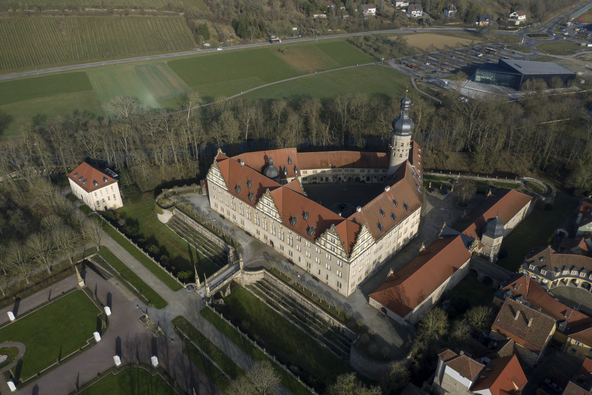
  <div class="cbdd-figure__caption">
    Schloss Weikersheim; Bildarchiv Foto Marburg; Bunz, Achim; https://www.deckenmalerei.eu/42d06165-58e7-4653-bfe4-3d5f7091fc33#top
  </div>
</div>


Weikersheim had been in the possession of the Lords of Hohenlohe since 1178, although the family split repeatedly into different lines. In 1586, the site fell by lot to Count Wolfgang II of Hohenlohe, who had the medieval moated castle transformed into a contemporary Renaissance comital residence. During the Baroque period, a pleasure garden was added to the south of the complex [1,2].
The palace complex consists of several buildings. The oldest structure that still stands today is the hall, begun in 1595. On its first floor is the Great Hall, which extends over two storeys and contains ceiling paintings by Balthasar Katzenberger.


<div class="cbdd-figure">
  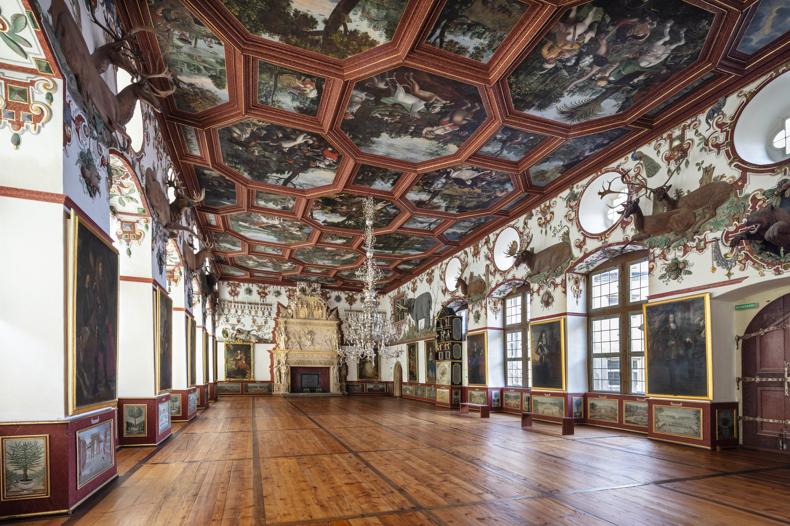
  <div class="cbdd-figure__caption">
    Schloss Weikersheim; Rittersaal; Bildarchiv Foto Marburg; Bunz, Achim
  </div>
</div>

<div id="rittersaal-saal-card" class="room-card-container"></div>

<script type="module">
(async function() {
    while (!BaroqueDB.isReady()) {
        await new Promise(r => setTimeout(r, 100));
    }
    await BaroqueViz.renderRoomCard('#rittersaal-saal-card', '15685f4a-3727-4110-8967-1d8287431997');
})();
</script>


This Great Hall, today known as the "Rittersaal," measures 36.4 x 11.7 meters, rises to a height of 8.25 meters [3], and was furnished between 1601 and 1605. The ceiling paintings were created by Balthasar Katzenberger, who completed the entire cycle roughly thirteen months after signing the contract, around 1602 [2,4]. Only in the early 18th century was the room adapted to Baroque taste and reinterpreted as the "Rittersaal" [5].

#### Hunting and Social Order in the Rittersaal

In the early modern period, hunting was far more than a means of obtaining food. It functioned as an instrument for securing and displaying rule and social order and was understood as a concrete practice of power [6]. At the same time, hunting rights were reserved for the nobility, while the wider population was burdened by hunting prohibitions, compulsory services, and damage caused by game. Demands for free hunting even became part of the peasants' program during the German Peasants' War, but remained unsuccessful [7,8].

In the Baroque period, this development reached its peak. Elaborately prepared parforce hunts and enclosed hunts were staged with enormous personnel and financial expenditure and celebrated as courtly festivities serving princely self-representation [7]. High hunting remained reserved for the nobility, whereas small-game hunting and preparatory work were carried out by gamekeepers and peasants [9]. Hunting thus became a social event and a status symbol of the aristocracy [10].

This broader historical function of hunting provides the context for the decoration of the "Rittersaal" at Weikersheim Palace: the ceiling paintings present hunting scenes in a carefully ordered sequence that reflects contemporary ideas about hunting and social hierarchy in the Baroque period.

#### Contract Conditions, Ceiling Paintings and Sources

The furnishing of the hall was not conceived as a purely artistic creation, but followed precise specifications. A surviving contract between Count Wolfgang II and Katzenberger stipulates that the ceiling was to be executed on canvas in water- or glue-based paint and was to depict scenes of hunting and venery. Themes and motifs were determined by the patron and could be supplemented continuously [11]. The paintings were produced in the workshop and installed afterwards. As payment, the painter received 195 guilders as well as daily meals of bread and soup; execution in oil would have increased the remuneration [12]. Katzenberger worked without a partner, assisted only by helpers, exclusively in daylight, and required thirteen months for the entire cycle, which he completed on 22 November 1602 [13]. This corresponds to an average of roughly five working days per painting [14]. Only a reworking of 1710/11 intensified the colors and gave the room its more strongly Baroque appearance of today [15].

The spatial arrangement likewise followed a fixed concept. The ceiling was designed to be viewed from the fireplace side; access, viewing direction, and the positioning of the figures all refer to this standpoint [16,17]. From there, a sequence unfolds from west to east [18], beginning with Orpheus, followed by scenes of exotic big-game hunting, then red and black game, and finally small game [19]. In the western half of the hall, richly dressed courtly hunters on horseback predominate, whereas farther east peasants and servants without horses increasingly enter the scenes [19]. Many images are also based on printed models. Numerous depictions follow the engraving series by Johannes Stradanus from 1578, while others show parallels to Netherlandish emblematic traditions. In Weikersheim, both this series and the "Venationes" published from 1596 were available, and Katzenberger adopted several plates from them. In total, the ceiling comprises 69 paintings structured into three pictorial groups: mammal hunting in large octagonal fields, bird hunting in rectangular fields, and fishing in half-octagons [20,21].

On this basis, the ceiling paintings can now be explored from their intended viewing point at the fireplace, following the sequence from west to east. Selected works from each section of the cycle are presented as examples. In the visualization, mammal hunting is marked in orange, bird hunting in white, and fishing in blue in order to indicate the three thematic zones of the ceiling. Clicking on the highlighted areas reveals more detailed information about each scene.


<!-- ================= RITTERSAAL: OVERVIEW (3 SECTIONS) + INTERAKTIV (Hotspots) ================= -->
<div class="rittersaal-block">
<!-- ================= 1) OVERVIEW: 3 SECTION TILES (West -> East) ================= -->
<div class="rs-overview">
<div class="rs-overview-title">Explore the ceiling from west to east — choose a section to jump in:</div>

<div class="rs-overview-grid">
<!-- WEST -->
<div class="rs-tile" onclick="jumpToRoom(0)">
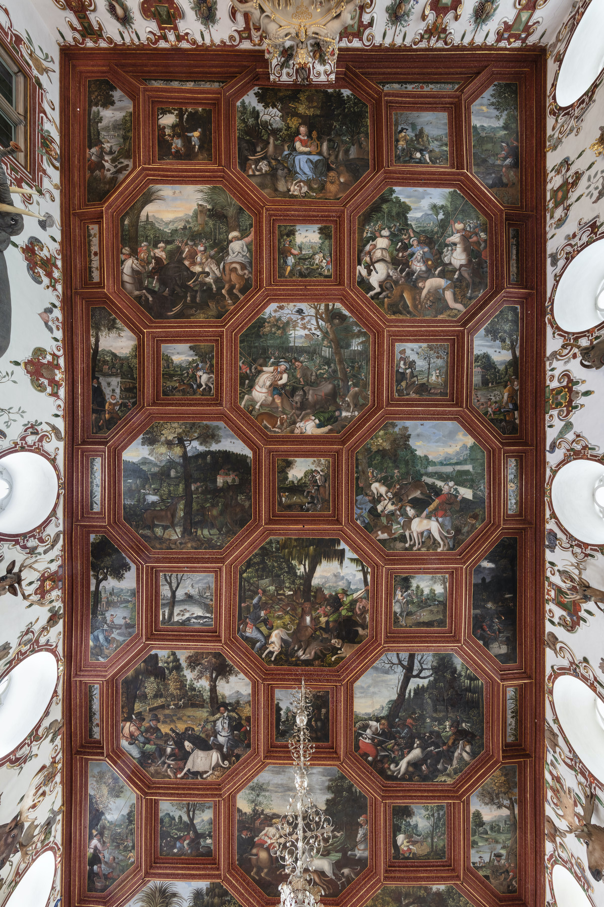
<div class="rs-tile-label">West — Fireplace side</div>
</div>

<!-- CENTER -->
<div class="rs-tile" onclick="jumpToRoom(1)">
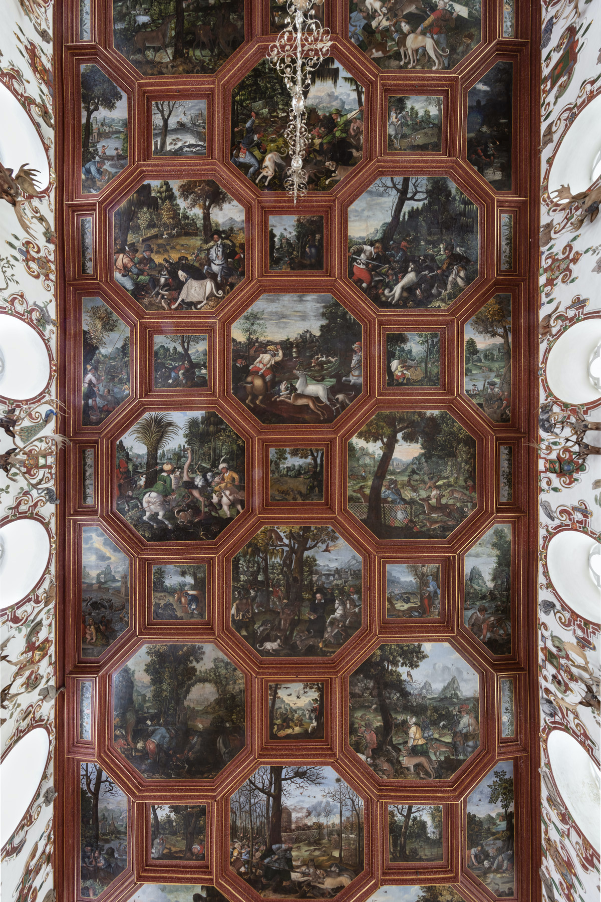
<div class="rs-tile-label">Central section</div>
</div>

<!-- EAST -->
<div class="rs-tile" onclick="jumpToRoom(2)">
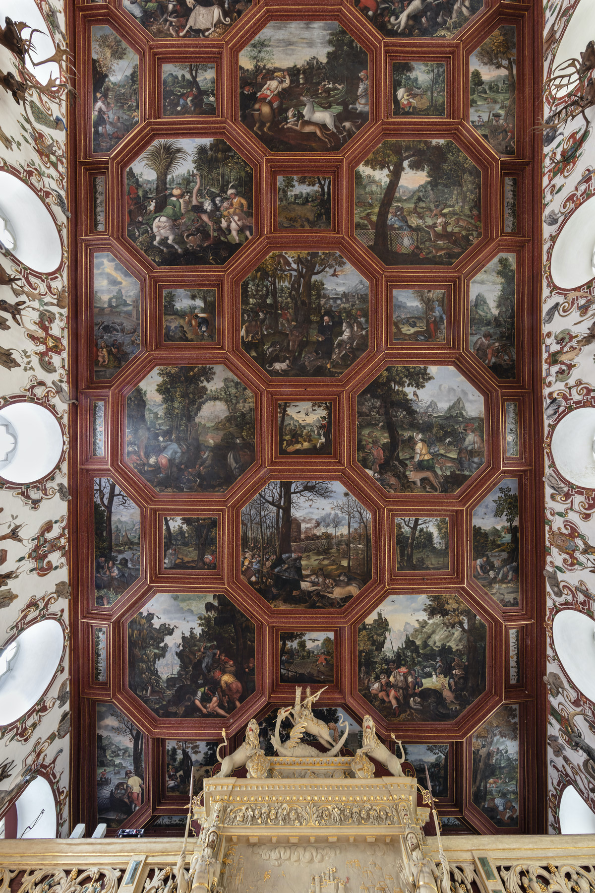
<div class="rs-tile-label">East — Towards the Tafelstube</div>
</div>
</div>
</div>

<!-- ================= 2) INTERAKTIV: Slider + Hotspots + Popups ================= -->
<a id="rittersaal-interactive"></a>

<div class="rittersaal-wrapper" id="rittersaalInteractive">

<!-- NAVIGATION -->
<button class="navbtn prev" onclick="prevImg()">❮</button>
<button class="navbtn next" onclick="nextImg()">❯</button>

<!-- DECKENBILD -->


<!-- LEGENDE -->
<div class="legend">
<div class="legend-title">Types of hunting</div>
<div class="legend-item">
<div class="legend-color legend-mammal"></div>
mammal hunting
</div>
<div class="legend-item">
<div class="legend-color legend-bird"></div>
bird hunting
</div>
<div class="legend-item">
<div class="legend-color legend-fish"></div>
fishing
</div>
</div>

<!-- ================= HOTSPOTS ================= -->

<!-- Bild 1 (Rittersaal1 / West) — A1 ORPHEUS (mammal) -->
<button class="hotspot mammal"
data-room="0"
style="left:38%; top:10%; width:27%; height:12%;"
data-title="A1 – Orpheus"
data-img="A1_Orpheus.jpg"
data-text="A1 Orpheus: The mammal-hunting cycle begins not with a hunt, but with Orpheus, who gathers animals around him through his song and the lyre of Apollo. He sits before a densely wooded landscape, while in the distance to the left a city by a lake comes into view. Numerous animals assemble around Orpheus in peaceful unity, including elephant, elk, stag, roe deer, wolf, fox, hedgehog, and wildcat. Further species are distributed across the scene, among them wild boar, bear, leopard, lion, badger, and rabbit. Two monkeys sit in the tree; one accompanies Orpheus on a self-made violin, imitating a human musician. The only creature not affected by the spell is a hunting dog: it grooms itself, looks directly at the viewer, and reappears as the same dog later in the ox hunt. The dog and the physiognomy of Orpheus thus function as connecting elements linking the following hunting cycle to the viewer."
></button>


<!-- Bild 2 (Rittersaal1 / West) — A5 HIRSCHJAGD (mammal) -->
<button class="hotspot mammal"
data-room="0"
style="left:58%; top:47%; width:22%; height:14%;"
data-title="A5 – Hirschjagd"
data-img="A5_Hirschjagd.jpg"
data-text="A5 Stag hunting: The stag hunt unfolds in two settings. On the right, the painting shows an enclosed hunt: stags and roe deer have been driven into an area surrounded by hanging cloths, and at the center stands a green tent from which a courtly hunting party observes the scene through viewing slits. Two hunters shoot at the animals from the side of the tent with firearms. In the foreground on the left, a stag that had previously attacked a hunter is itself attacked by dogs. At the front right stands a hunter whose facial expression recalls Orpheus. His noble status is indicated by the coat-of-arms collar of one of his hunting dogs. He stands with his back to the viewer, turns his head, and gestures invitingly with his right hand toward the enclosed hunt. In the background, Hercules appears in miniature fighting the Ceryneian hind.
For this scene, Katzenberger combined two models by Stradanus: the stag (Nachdruck Olms, pl. 10) and the hunter with his hunting dogs (Nachdruck Olms, pl. 11). It has also been noted explicitly that, through this constellation of figures, Katzenberger once again takes up the motif of princely care through hunting."
></button>


<!-- Bild 3 (Rittersaal2 / Central) — A13 WILDKATZENJAGD (mammal) -->
<button class="hotspot mammal"
data-room="1"
style="left:38%; top:58%; width:22%; height:14%;"
data-title="A13 – Wildkatzenjagd"
data-img="A13_Wildkatzenjagd.jpg"
data-text="
<p>A13 Wildcat hunting: The wildcat hunt has been described as an art-historical highlight. Katzenberger includes himself prominently in the scene, apparently in reference to his surname. He divides the image with a tree: on the left, peasant-clad hunters try to drive cats out of the trees with long lances. On the right stands Katzenberger himself, wearing yellow trousers, a black coat, a white collar, and a black hat. As signs of his profession, he holds a brush and palette as well as a mahlstick. At the lower right edge of the image, he places the signature: “Balthasar Katzenberger … hat diese gantze Decken in 13 monat alleins gemalet 1602.” The model for this painting can be seen here (Nachdruck Olms, Tf. 17):</p>

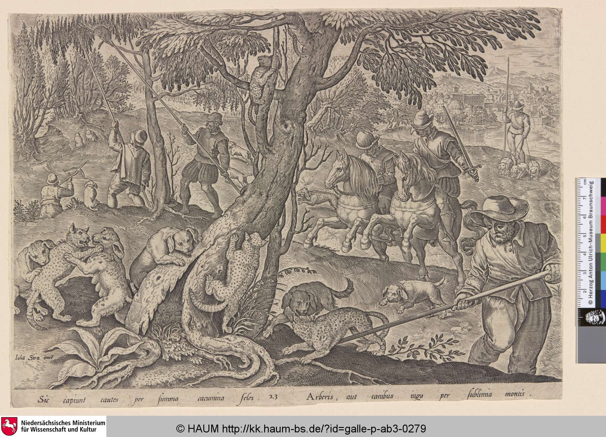

<p>The tree, a climbing cat, and the close combat were retained from the model. Katzenberger himself and a peasant with a lance were added.</p>
"
></button>


<!-- Bild 4 (Rittersaal2 / Central) — A14 HASENJAGD (mammal) -->
<button class="hotspot mammal"
data-room="1"
style="left:58%; top:72%; width:22%; height:14%;"
data-title="A14 – Hasenjagd"
data-img="A14_Hasenjagd.jpg"
data-text="
<p>A14 Rabbit hunting: In the middle ground, the hare hunt is carried out almost single-handedly by the dogs. In the foreground, a man in a yellow doublet leads a hunting dog on a leash while blowing a hunting horn as he walks. On the left, another hunter gives commands to a dog barking at a fox. On the right, a man rides a horse wearing a slouch hat with striking red pom-poms. Behind him, a wildcat or leopard sits chained to a box. The model for this painting can be seen here:</p>

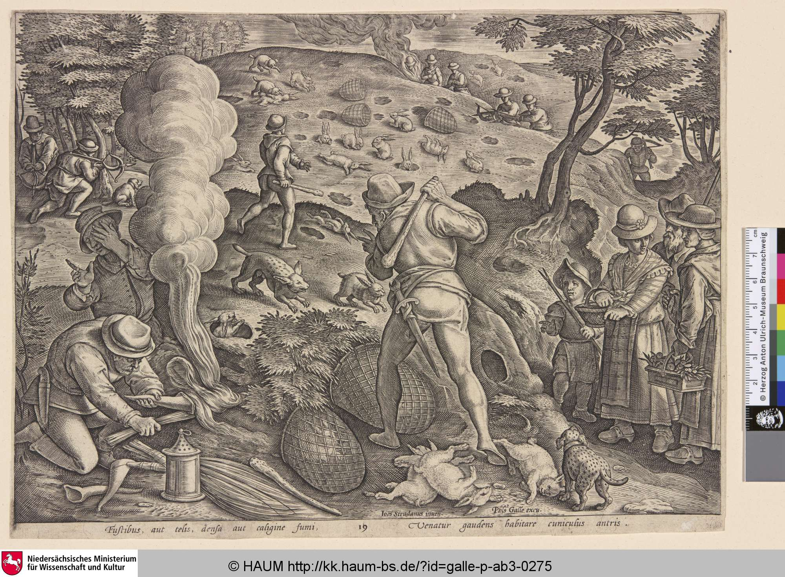

<p>Independent additions include a landscape view with a pointed mountain range, an owl, and a detail on a figure seen from behind whose puffed trousers slip down slightly. The literature describes this as a possible indication of the peasant character of small-game hunting.</p>
"
></button>


<!-- Bild 5  -->
<button class="hotspot bird"
data-room="0"
style="left:65%; top:10%; width:10%; height:10%;"
data-title="Q1 – Entenjagd"
data-img="Q1_Entenjagd.jpg"
data-text="
<p>Q1 Duck hunting: The first scene in the bird-hunting cycle occupies a special position. With the black-bearded man in a black slouch hat seated in front of a tree at the left edge of the picture, it probably contains another portrait in addition to those of Count Wolfgang and/or his sons in the large octagonal paintings. The man wears a shiny yellow hunting suit, and a black fox tail hangs from his hat. On the right, a hunter with a shotgun crawls along the ground. Together with his dog, he observes ducks in a body of water in the middle ground. The landscape is wintry, with bare trees, and a monumental rock crowned by a castle rises from a broad river valley at the center. The model for this painting can be seen here (Nachdruck Olms, Tf. 42):</p>

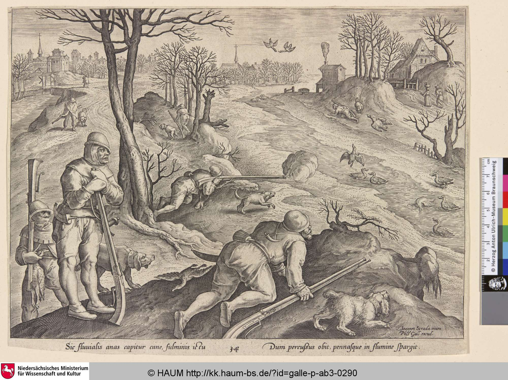
<p></p>
"
></button>

<!-- Bild 6  -->
<button class="hotspot bird"
data-room="2"
style="left:27%; top:57%; width:10%; height:8%;"
data-title=""
data-img="Q17.jpg"
data-text="The best-known tourist image of the Weikersheim ceiling shows a hunter squatting, smoking a pipe, and watching a net in which a partridge has been caught. At the same time, another hunter at the right edge of the picture relieves himself, turning his bare backside toward the viewer."
></button>

<!-- Bild 7  -->
<button class="hotspot bird"
data-room="2"
style="left:27%; top:31%; width:10%; height:8%;"
data-title="Q14 - Quail hunting with a cow decoy"
data-img="Q14.jpg"
data-text="
<p>Q14 Quail hunting with a cow decoy: A hunter carrying a shotgun and hunting bag approaches from the right toward quails pecking at grain in a field. A large brown cow dummy with a bell gives him cover. The image is based on an engraving by Stradanus (reprint Olms, Tf. 39):</p>

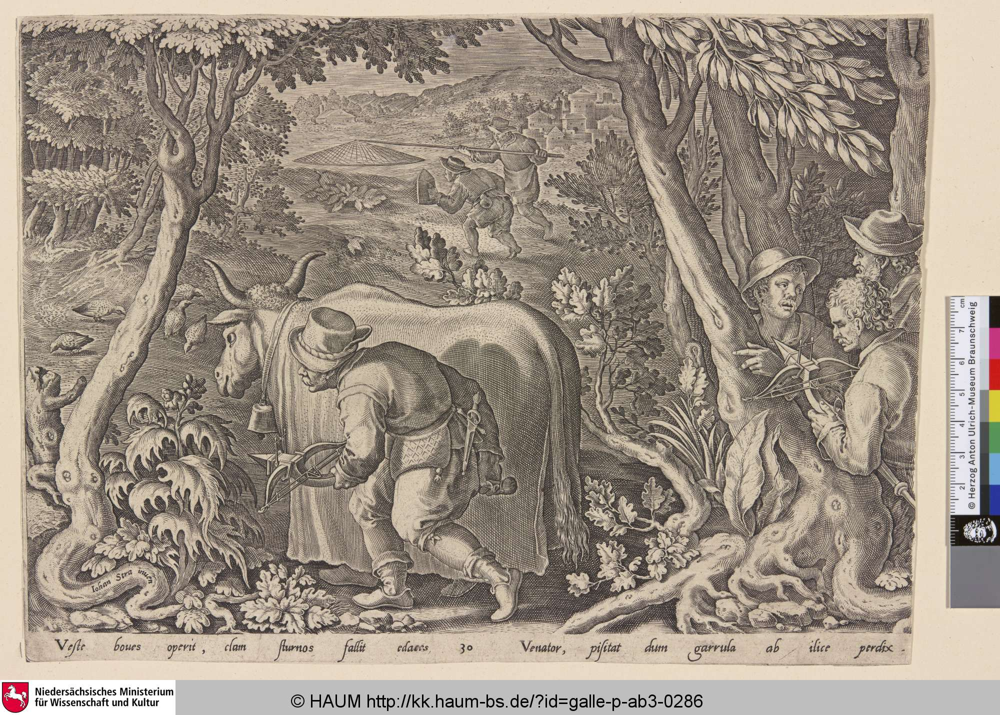
<p>In addition to the hunter, the cow dummy, and the pecking birds, the large plant in the foreground was also retained.</p>
"
></button>

<!-- Bild 8  -->
<button class="hotspot fish"
data-room="0"
style="left:75%; top:10%; width:11%; height:13%;"
data-title="Otter hunting"
data-img="HA1.jpg"
data-text="HA1 Otter hunting: A man wearing short trousers, a red doublet, and rolled-up sleeves stands on the riverbank holding a trident. An otter swims in the river with a fish in its mouth, while a black poodle beside the man bends down toward the water. In the background, beyond a small wooden bridge, lies the Weikersheim palace garden, at the end of which the palace and the town can be seen. The castle appears perfectly symmetrical and carefully finished. The knights' hall, with only seven window axes, is symmetrically flanked by three-axis risalits. The east wing, not yet built at the time, is crowned by large triangular gables, as is the south wing. On the ridge behind it stands a gallows as a sign of the count's high jurisdiction. The sky is overcast, but just above the town an opening in the clouds allows broad rays of yellow sunlight to fall. In keeping with its function of depicting the castle grounds encircled by the Lauter River, including the town and domain, the painting was given the highest place in the fishing cycle. It is located heraldically on the right, close to the fireplace."
></button>


<!-- Bild 9  -->
<button class="hotspot fish"
data-room="0"
style="left:75%; top:35%; width:11%; height:13%;"
data-title="HA3 Duck hunting with reed barriers"
data-img="HA3.jpg"
data-text="HA3 Duck hunting with reed barriers: The duck hunt depicted in this painting and its counterpart belongs biologically to the category of bird hunting, which has already been discussed in relation to the square paintings. Here, however, the ducks are not shot with firearms, as in the bird cycle (Q1), but captured on the water with traps and other devices. Technically, this approach resembles fishing and probably explains the painting's inclusion in the fishing cycle.
The duck hunt is represented as a courtly event. On the shore stands a three-storey stone house in the latest Renaissance style. From a loggia on the upper floor, a courtly company looks down onto the pond below. There, naked men wearing hats use sticks to drive an otter before them, which in turn drives an entire flock of ducks ahead of it. The goal is a specially constructed reed enclosure on the shore, where the ducks are to be caught in cages. In the foreground at the right edge of the picture, a magnificently dressed couple with a dog observes the scene. They are probably Count Wolfgang and his wife Magdalena von Nassau-Katzenelnbogen. The countess in particular, with her portrait-like features, is rendered in especially elegant dress."
></button>


</div>

<!-- ================= POPUP ================= -->
<div id="popup" class="popup" onclick="closePopup()">
<div class="popup-box" onclick="event.stopPropagation()">

<div class="popup-text">
<h2 id="popup-title"></h2>
<p id="popup-desc"></p>
</div>
</div>
</div>

<script>
document.addEventListener('DOMContentLoaded', function() { BaroqueViz.initRittersaal(); });
</script>

</div><!-- /rittersaal-block -->

### From Orpheus to Authority

The central ceiling painting of Orpheus forms the key to the hall's overall program. In early modern tradition, Orpheus was regarded as a symbol of the good ruler who pacifies the world not through violence, but through order, reason, and moderation. In Weikersheim, this figure is deliberately associated with Count Wolfgang II: the placement above the fireplace, recurring portrait-like features in the hunting scenes, and the orientation of the sculpted animals toward the fireplace all symbolically link the count with Orpheus as a figure of ordering authority.

Against this background, the hunting scenes acquire their full meaning. Hunting appears not merely as an activity, but as an expression of princely responsibility: the mastery of dangerous animals stands for protection and care toward the subjects. The landscapes depicted therefore present an ordered and peaceful world, an image of legitimate rule.


## Warfare and Conflict Representation

While hunting imagery presented an ordered and controlled world, depictions of warfare introduced conflict and violence into interior decoration. Baroque interiors used such scenes to visualize military reality in different ways, ranging from generalized combat scenes to clearly identifiable historical events.

### Generic Combat Scenes - Leutenberg ("Schloss Friedensburg")

In the 17th century, Count Albert Anton von Schwarzburg-Rudolstadt had Friedensburg Castle decorated with room-filling murals by the court painter Seivert Lammers in two campaigns, in 1688 and 1698. The paintings remained intact for a long time and were destroyed only by a fire in 1934.

<div class="cbdd-figure">
  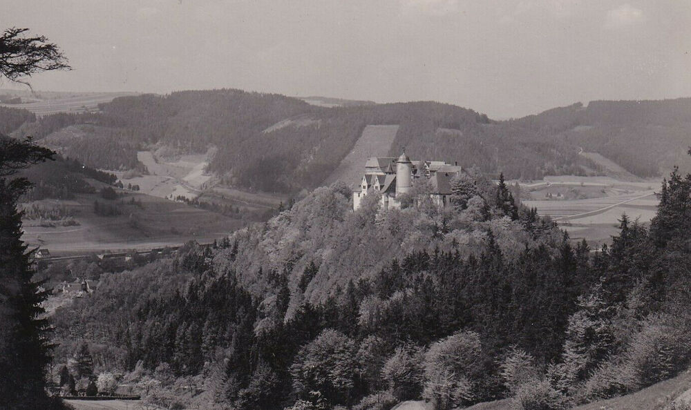
  <div class="cbdd-figure__caption">
    Leutenberg, Schloss Friedensburg; Postkarte; Corpus der barocken Deckenmalerei; https://www.deckenmalerei.eu/de638dcc-a435-4778-8a28-e9c3276e1843 
  </div>
</div>


The so-called Battle Hall ("Schlachtensaal") on the third floor was probably the castle's principal hall. Its seven wall panels, framed by heart-shaped friezes, mainly depicted war scenes in grisaille with strong light-dark contrasts, which gave the room its name.

War was depicted "in all its diversity, but not glorified." No specific historical event can be identified: "The scenes are neither from the Old Testament nor ancient mythology, nor are they depictions of current events - such as the Turkish Wars." Above the windows and doors were additional painted curtain draperies.

The imagery is distributed across all walls of the room and includes battle scenes, cavalry skirmishes, and scenes of camp and everyday life.


<!-- =========================
     Leutenberg (Schloss Friedensburg) — Battle Hall (2x2)
     - click card opens image in lightbox (bigger)
     - separate link opens CbDD anchor
     - adds metadata (artist, date, patron, technique, location)
========================= -->

<div class="leutenberg-block">
<div class="cbdd-grid-2x2">

<!-- SOUTH -->
<div class="cbdd-card">
<button class="cbdd-imgbtn"
data-full="sued.jpg"
data-caption="South wall — Large battle painting (“Das Schlachtfeld”), executed in glue paint (grisaille). Estimated size: 2.2 × 5.5 m."
aria-label="Open image larger">
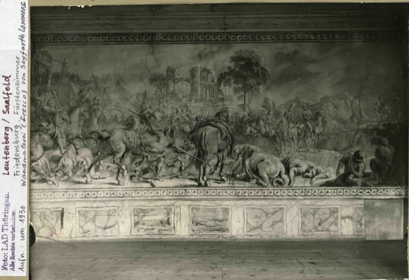
</button>
<div class="cbdd-body">
<p class="cbdd-title">South wall</p>

<p class="cbdd-metaLine">
<strong>Artist:</strong> Seivert Lammers ·
<strong>Date:</strong> 1698 (inscribed) ·
<strong>Technique:</strong> glue paint, grisaille
</p>
<p class="cbdd-metaLine">
<strong>Site:</strong> Schloss Friedensburg, Battle Hall (3rd floor, north wing) ·
<strong>Status:</strong> destroyed by fire (1934)
</p>

<p class="cbdd-desc">A large multi-figure battle panorama covers the entire wall above the socle zone (known in research as “Das Schlachtfeld”). The background includes a temple ruin and a tree. The center is emphasized by the rear view of a packhorse.</p>

<div class="cbdd-meta">
<a target="_blank" rel="noopener"
href="https://www.deckenmalerei.eu/d8ff05f9-cca7-4875-8f82-be4e1670678d">
Open on CbDD →
</a>
</div>
</div>
</div>

<!-- EAST -->
<div class="cbdd-card">
<button class="cbdd-imgbtn"
data-full="ost.jpg"
data-caption="East wall — Two cavalry combats (“Das Gemetzel” / “Der Überfall”), documented by photographs (1925). Connected by a continuous heart-band frieze."
aria-label="Open image larger">
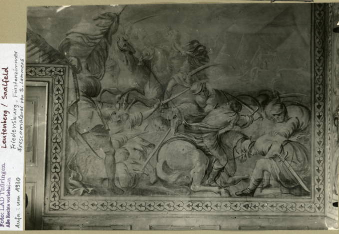
</button>
<div class="cbdd-body">
<p class="cbdd-title">East wall</p>

<p class="cbdd-metaLine">
<strong>Artist:</strong> Seivert Lammers ·
<strong>Date:</strong> before/around 1698 ·
<strong>Evidence:</strong> photo documentation (1925)
</p>
<p class="cbdd-metaLine">
<strong>Technique:</strong> glue paint, grisaille ·
<strong>Status:</strong> destroyed by fire (1934)
</p>

<p class="cbdd-desc">On either side of the central door, one cavalry combat is shown. Research refers to them as “Das Gemetzel” and “Der Überfall”. Both scenes were originally conceived as one composition connected by the frieze.</p>

<div class="cbdd-meta">
<a target="_blank" rel="noopener"
href="https://www.deckenmalerei.eu/cf9d56be-2913-4cbb-a9f5-e62c036ceac7">
Open on CbDD →
</a>
</div>
</div>
</div>

<!-- WEST -->
<div class="cbdd-card">
<button class="cbdd-imgbtn"
data-full="west.jpg"
data-caption="West wall — Pack animals and canteen women (Marketenderinnen). Partial photographic survival; a tent weather-vane reportedly carried the date 1695."
aria-label="Open image larger">
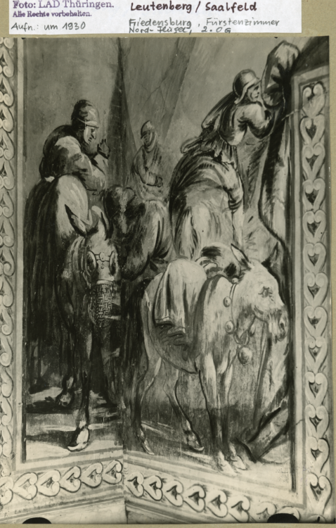
</button>
<div class="cbdd-body">
<p class="cbdd-title">West wall</p>

<p class="cbdd-metaLine">
<strong>Artist:</strong> Seivert Lammers ·
<strong>Date:</strong> 1698 (room) / 1695 (reported detail) ·
<strong>Evidence:</strong> partial photos
</p>
<p class="cbdd-metaLine">
<strong>Motifs:</strong> pack donkey with rider; canteen scene ·
<strong>Status:</strong> destroyed by fire (1934)
</p>

<p class="cbdd-desc">The surviving documentation shows a pack donkey with rider and canteen women. At the transition from the south to the west wall, riders continued across the corner of the room.</p>

<div class="cbdd-meta">
<a target="_blank" rel="noopener"
href="https://www.deckenmalerei.eu/6559a9c1-e9e7-4ef5-8be2-24c266714c4f">
Open on CbDD →
</a>
</div>
</div>
</div>

<!-- NORTH -->
<div class="cbdd-card">
<button class="cbdd-imgbtn"
data-full="nord.jpg"
data-caption="North wall — Scenes between three windows: a wine-serving scene and a fight over a flag. Photographically documented."
aria-label="Open image larger">
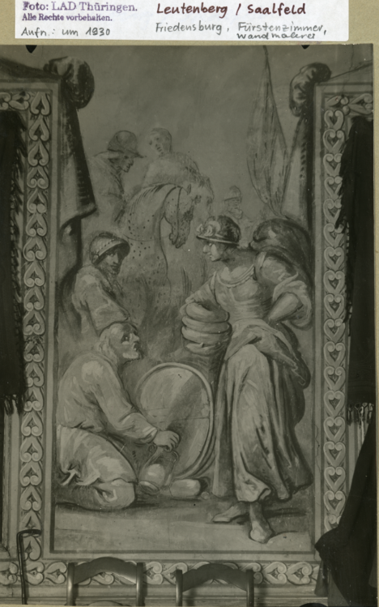
</button>
<div class="cbdd-body">
<p class="cbdd-title">North wall</p>

<p class="cbdd-metaLine">
<strong>Artist:</strong> Seivert Lammers ·
<strong>Date:</strong> 1698 (inscribed) ·
<strong>Evidence:</strong> photos (scenes between windows)
</p>
<p class="cbdd-metaLine">
<strong>Technique:</strong> glue paint, grisaille ·
<strong>Status:</strong> destroyed by fire (1934)
</p>

<p class="cbdd-desc">Between the windows, one scene shows a wine-serving situation (tapper, woman with bread, soldier).</p>

<div class="cbdd-meta">
<a target="_blank" rel="noopener"
href="https://www.deckenmalerei.eu/96d3d340-bcd1-4d5c-ad4f-3be8bc4ddfba">
Open on CbDD →
</a>
</div>
</div>
</div>

</div>

<!-- Lightbox -->
<div class="cbdd-lightbox" id="cbdd-lightbox" aria-hidden="true">
<div class="cbdd-lightbox__panel" role="dialog" aria-modal="true">
<button class="cbdd-lightbox__close" id="cbdd-lightbox-close" aria-label="Close">✕</button>

<div class="cbdd-lightbox__cap" id="cbdd-lightbox-cap"></div>
</div>
</div>

<script>
document.addEventListener('DOMContentLoaded', function() { BaroqueViz.initBattleHallLightbox(); });
</script>

</div><!-- /leutenberg-block -->


While the Battle Hall in Leutenberg presents war without reference to a specific historical conflict, other Baroque interiors depict clearly identifiable military events. In several rooms, battles are no longer represented as generic combat scenes, but are tied to concrete historical confrontations. The wars against the Ottoman Empire, in particular, appear as a recurring theme. To illustrate this, the following section considers two representative examples: a fresco in the Asamkirche in Munich and a cycle of siege paintings in Weikersheim.


### Wars against the Ottoman Empire - Asamkirche

<div class="cbdd-figure">
  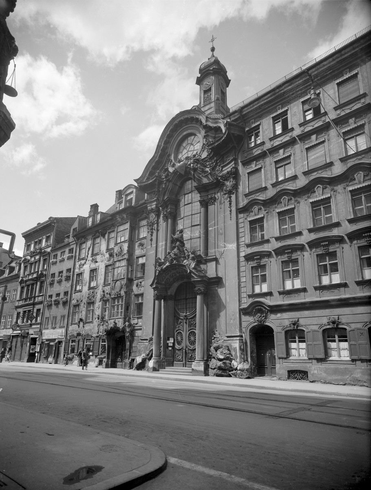
  <div class="cbdd-figure__caption">
    Asamkirche in Munich; Bildarchiv Foto Marburg; Schmidt-Glassner, Helga; https://www.deckenmalerei.eu/ee55b797-2950-49b8-9204-1c0fcf6b671b
  </div>
</div>

<div id="asamkirche-card" class="building-card-container"></div>
<script type="module">
(async function() {
    while (!BaroqueDB.isReady()) {
        await new Promise(r => setTimeout(r, 100));
    }
    await BaroqueViz.renderBuildingCard('#asamkirche-card', '5d7628b4-b9ce-4d66-bcc4-65ebf58c0fac');
})();
</script>


The Asam Church (St. Johann Nepomuk) in Munich was built by Egid Quirin Asam as a private chapel next to his house from 1733 onward and was consecrated in 1746. Its frescoes were painted by his brother Cosmas Damian Asam beginning in 1734, and a chronogram dates the main fresco to 1735. The church is regarded as one of the most important works of South German Baroque and Rococo fresco painting.


<!-- =========================
     Image Detail Viewer 
========================= -->

<div class="turk-carousel">

  <div class="turk-frame">
    <button class="turk-btn turk-prev" onclick="turkChange(-1)">❮</button>
    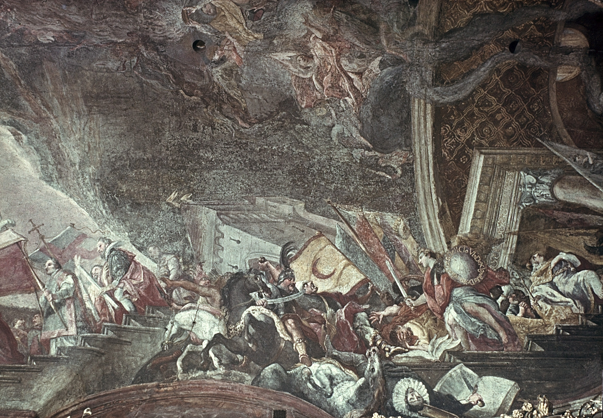
    <button class="turk-btn turk-next" onclick="turkChange(1)">❯</button>
  </div>

  <div class="turk-meta">
    <b>Artist:</b> Cosmas Damian Asam<br>
    <b>Location:</b> Asamkirche, Munich (Germany)<br>
    <b>Date:</b> 1735
  </div>

</div>

<script>
document.addEventListener('DOMContentLoaded', function() {
  BaroqueViz.initAsamCarousel('.turk-carousel', [
    'asam1.jpg', 'asam2.jpg', 'asam3.jpg', 'asam4.jpg'
  ]);
});
</script>

The archangel Michael, armed with sword and shield, charges into the battlefield from the right. Riders marked by crescent banners and curved sabers identify the opponents as Ottoman soldiers. The inscription on Michael's shield, "DeXtra rebeLLes DeLLo VlnDeX IgnaVos," presents him as a defender of the Christian faith. Among the defeated figures is also a heretic in Calvinist dress falling into the abyss. Behind Michael, a procession of allied rulers advances toward the main altar scene.


### Wars against the Ottoman Empire - Schloss Weikersheim

Another example of this mode of representation can be found at Schloss Weikersheim, already introduced earlier in this story.

The twelve large-format siege scenes originally belonged to the ceiling of the former dining room of Weikersheim Palace. They were removed when the room was subdivided in 1837 and reappeared in the palace in 1946. Today, some of them are displayed in the hallway in front of Count Wolfgang's former apartment in the kitchen building [22,23]. Stylistically, they can be attributed almost entirely to Balthasar Katzenberger and were probably created immediately after the ceiling paintings in the hall, that is, around 1603-1604 [24].

The paintings depict sieges of Hungarian fortresses during the Long Turkish War (1593-1606) between the Ottoman Empire and the Habsburgs [25]. This was a war of fortresses, marked by repeated sieges of fortified complexes, and it ended with the Peace of Zsitvatorok [25]. The events shown range from 1594 to 1604 at the latest.

Copper engravings from Hieronymus Oertl's chronicle, published in Nuremberg in 1602, served as the basis for the images [26,27]. The scenes were adopted from these engravings together with their captions naming places and dates [28]. The selection included actions on both the imperial and the Ottoman side and was presumably shaped by the participation of members of the House of Hohenlohe [29]. The latest scene commemorates the death of Ludwig Kasimir during the siege of Gran in 1604 and functions as a memorial image [30].

The scenes follow a uniform structure: a battle scene in the foreground, and in the middle and background the siege of a fortress set within a broad landscape of tents, skirmishes, and smaller battles [24]. Their order follows the chronology of events [31].

Taken together, the paintings do not depict generic battle scenes, but a sequence of identifiable historical sieges derived from contemporary printed war chronicles and connected to the participation of the Hohenlohe family.


<!-- =========================
     Schloss Weikersheim — 12 siege scenes (click-through gallery)
     - uses direct image URLs (no local jpg needed)
     - click image opens CbDD page/anchor in new tab
     - includes: prev/next, dots, keyboard arrows, swipe
========================= -->

<div class="wk-gallery" id="wk-gallery-12">
  <div class="wk-top">
    <div>
      <p class="wk-title">Schloss Weikersheim — Siege scenes of the Long Turkish War (12 paintings)</p>
      <p class="wk-sub">
        Click through the sequence (Prev/Next or dots). Click the image to open the corresponding CbDD entry in a new tab.
        Use ← / → on your keyboard; swipe on mobile.
      </p>
    </div>
  </div>

  <div class="wk-stage" id="wk-stage">
    <button class="wk-navBtn wk-prev" type="button" aria-label="Previous" id="wk-prev">‹</button>

    <!-- Clicking image opens CbDD -->
    <a id="wk-link" href="#" target="_blank" rel="noopener">
      
    </a>

    <button class="wk-navBtn wk-next" type="button" aria-label="Next" id="wk-next">›</button>
    <div class="wk-counter" id="wk-counter">1 / 12</div>
  </div>

  <div class="wk-caption" aria-live="polite">
    <p class="wk-capTitle" id="wk-capTitle">—</p>
    <p class="wk-capMeta" id="wk-capMeta">—</p>
    <p class="wk-capText" id="wk-capText">—</p>
  </div>

  <div class="wk-dots" id="wk-dots" aria-label="Slide navigation"></div>

  <!-- Optional: thumbnail overview -->
  <div class="wk-thumbrow" id="wk-thumbs" aria-label="Thumbnails"></div>

  <p class="wk-hint">Tip: If a thumbnail doesn’t load, the URL is probably not a direct image file. Make sure it opens as an image in a browser tab.</p>
</div>


<script>
document.addEventListener('DOMContentLoaded', function() {
  BaroqueViz.initSiegeGallery('wk-gallery-12', [
    { key:'I', title:'Siege I — Vestung Tottis (night capture) — 1590', img:'https://previous.bildindex.de/bilder/fmd10005851a.jpg', href:'https://www.deckenmalerei.eu/74e85492-8198-4a28-bd77-17d107f9b9a0#42d6f0a1-179a-4193-9904-7386e0dc61da', meta:'Schloss Weikersheim · former dining room ceiling (Tafelstube) · Long Turkish War', text:'Wide format: riders with large flags enter from the front right. In the background is the Hungarian fortress Totis (Tata) after Sibmacher’s copper engraving. The very dark scene is sparsely lit by two lanterns. The date 1590 may be “an error,” since Totis was captured in 1597/1598.' },
    { key:'II', title:'Siege II — Vestung Gran (besieged by Christians) — 1594', img:'https://previous.bildindex.de/bilder/fmd10005841a.jpg', href:'https://www.deckenmalerei.eu/74e85492-8198-4a28-bd77-17d107f9b9a0#aa3bf686-14d2-4d2e-b5d8-abf9200e3867', meta:'Schloss Weikersheim · former dining room ceiling (Tafelstube) · Long Turkish War', text:'Narrow format: a halberdier and an assistant handling black cannonballs appear in the foreground, while a rider in a red cloak enters dynamically from the right and can “presumably” be identified as Count Georg Friedrich (eldest son of Count Wolfgang II.). In the middle ground the imperial camp is shown and the water town of Gran is shelled; above it lies the fortress with the cathedral façade and several minarets.' },
    { key:'III', title:'Siege III — Vestung Raab (besieged by the Turks) — 1594', img:'https://previous.bildindex.de/bilder/fmd10005843a.jpg', href:'https://www.deckenmalerei.eu/74e85492-8198-4a28-bd77-17d107f9b9a0#29c6c293-693f-4d34-b6ee-c36a90fe6d8e', meta:'Schloss Weikersheim · former dining room ceiling (Tafelstube) · Long Turkish War', text:'Wide format: Turkish riders enter from the right; across the Danube the square fortress of Raab (Győr) is visible with cannon-occupied bastions and is heavily bombarded. In the foreground, close combat between Christians and Turks unfolds near two transport wagons; fortress and fighting follow the model in Ortelius “faithfully.”' },
    { key:'IV', title:'Siege IV — Vestung Comorna (besieged by the Turks) — 1594', img:'https://previous.bildindex.de/bilder/fmd10005850a.jpg', href:'https://www.deckenmalerei.eu/74e85492-8198-4a28-bd77-17d107f9b9a0#d3bb7616-fecf-4589-8763-4a03df87a8d5', meta:'Schloss Weikersheim · former dining room ceiling (Tafelstube) · Long Turkish War', text:'Wide format: Turkish riders enter from the left, including a blue-clad figure thrusting a lance with a blue flag diagonally into the image. At the lower right two dromedaries kneel in front of Turkish tents. The Danube divides the scene, and opposite lies the Christian-held fortress of Komorn (Komárom), which survived the siege while the adjoining town burns.' },
    { key:'V', title:'Siege V — Vestung Gran (recaptured by Christians)', img:'https://previous.bildindex.de/bilder/fmd10005848a.jpg', href:'https://www.deckenmalerei.eu/74e85492-8198-4a28-bd77-17d107f9b9a0#43223295-fe64-4973-9722-6a29c8a4b649', meta:'Schloss Weikersheim · former dining room ceiling (Tafelstube) · Long Turkish War', text:'Wide format: at the left a figure bends forward as a back view; at the lower right stands the half-figure of a courtly man with a musket and a brown horse, whose face suggests “one of Count Wolfgang’s sons.” In the background the fortress of Gran, the water town and the Ratzenstadt are clearly visible. The flags indicate the stage of conquest as explained by Ortelius (including the Turkish flag above the fortress and imperial flags over other positions).' },
    { key:'VI', title:'Siege VI — Vestung Vizzegrad (besieged by Christians)', img:'https://previous.bildindex.de/bilder/fmd10005840a.jpg', href:'https://www.deckenmalerei.eu/74e85492-8198-4a28-bd77-17d107f9b9a0#1a5f9651-0bc5-4052-82c2-931af07e304b', meta:'Schloss Weikersheim · former dining room ceiling (Tafelstube) · Long Turkish War', text:'Wide format: two richly dressed officers dominate the left foreground (one as a back view in armour with a plume, one in a grey shimmering garment with a striking helmet), while men work at cannons on the right. In the background, the citadel of Visegrád rises on a conical hill by the Danube and commands a large natural harbour with many transport ships.' },
    { key:'VII', title:'Siege VII — Statt Waitzen (besieged by the Turks) — 1597', img:'https://previous.bildindex.de/bilder/fmd10005842a.jpg', href:'https://www.deckenmalerei.eu/74e85492-8198-4a28-bd77-17d107f9b9a0#eec605b1-e1e4-4ecc-83f6-808bb11130a6', meta:'Schloss Weikersheim · former dining room ceiling (Tafelstube) · Long Turkish War', text:'Narrow format: in the right foreground a Turk with turban and mace rides frontally toward the viewer. A Turkish tent stands to the left beneath him. In the background Waitzen (Vác) lies on the Danube as a fortified town with a fortified monastery; several houses burn, and town and monastery are shown “mirror-reversed” compared to Ortelius.' },
    { key:'VIII', title:'Siege VIII — Vestung Raab (night recapture by Christians)', img:'https://previous.bildindex.de/bilder/fmd10005846a.jpg', href:'https://www.deckenmalerei.eu/74e85492-8198-4a28-bd77-17d107f9b9a0#f4327f2f-39e6-4656-bd63-976685a535ed', meta:'Schloss Weikersheim · former dining room ceiling (Tafelstube) · Long Turkish War', text:'Narrow format: the siege is presented as a night scene. At the front right two sentries stand with armour and clothing catching the lantern light. In the background the fortress of Raab (Győr) is shown with two large explosions at its bastions, which Katzenberger copied “exactly” from Sibmacher.' },
    { key:'IX', title:'Siege IX — Hauptstatt Offen (besieged by Christians) — 1598', img:'https://previous.bildindex.de/bilder/fmd10005847a.jpg', href:'https://www.deckenmalerei.eu/74e85492-8198-4a28-bd77-17d107f9b9a0#a175d3bc-d51a-41ce-adc3-dc879519b644', meta:'Schloss Weikersheim · former dining room ceiling (Tafelstube) · Long Turkish War', text:'Wide format: in the foreground a large cannon is pulled left by horses. The driver sits on the cannon and swings a long whip, while a hunting dog runs behind. In the background Offen (Óbuda/Buda) appears as a splendid walled city with castle, churches and minarets. The pleasure garden and the Turkish cemetery are taken from Sibmacher.' },
    { key:'X', title:'Siege X — Hauptstatt Offen (besieged by Christians)', img:'https://previous.bildindex.de/bilder/fmd10005844a.jpg', href:'https://www.deckenmalerei.eu/74e85492-8198-4a28-bd77-17d107f9b9a0#038123be-6142-456c-a90e-ff6e1366e272', meta:'Schloss Weikersheim · former dining room ceiling (Tafelstube) · Long Turkish War', text:'Wide format: at the front right an armoured imperial commander on a grey horse rides into the picture with a white plume and, by facial features and blond beard, appears to be “a son of Count Wolfgang.” A page in a red cloak runs ahead to guide him toward the camp. Troops stand in formation beyond a Danube tributary and cannons are fired from an entrenchment, while the city of Offen is cropped at the left edge and recognizable via the Danube islands and bridges.' },
    { key:'XI', title:'Siege XI — Hauptstatt Offen (besieged by Christians)', img:'https://previous.bildindex.de/bilder/fmd10005845a.jpg', href:'https://www.deckenmalerei.eu/74e85492-8198-4a28-bd77-17d107f9b9a0#3b70965e-4f71-4793-b841-5de99378db4e', meta:'Schloss Weikersheim · former dining room ceiling (Tafelstube) · Long Turkish War', text:'Wide format: in the foreground a brown horse is shown in profile with a rider in a white doublet and a voluminous red sash; “the figure depicted is Count Ludwig Kasimir,” who died during the siege of Gran (Eszergom) in 1604. At the bottom edge, on a smaller scale, a courtly dressed woman is shown being guided by a soldier. She holds a goldfinch that “was regarded as a symbol of Christ’s sacrificial death”.' },
    { key:'XII', title:'Siege XII — Vestung Gran (besieged by the Turks) — 1604', img:'https://previous.bildindex.de/bilder/fmd10005849a.jpg', href:'https://www.deckenmalerei.eu/74e85492-8198-4a28-bd77-17d107f9b9a0#c6bc65b4-9705-4a71-a121-1d3531542230', meta:'Schloss Weikersheim · former dining room ceiling (Tafelstube) · Long Turkish War', text:'Narrow format: two horses seen from behind carry cannon barrels, wagon wheels and kettledrums; beside them walks a man dressed in black with a grey floppy hat. In the background, the Danube near Offen (Óbuda) and Pest is rendered in steep bird’s-eye view like a map. A small skirmish takes place on open ground in front of tents and a hill with cannons, and the broad fortified city of Offen appears at the upper left.' }
  ]);
});
</script>


</div><!-- /topic-society -->

<!-- ═══════════════════════════════════════════════════════════════════════
     TOPIC 3 — CLASSICAL MYTHOLOGY
     ═══════════════════════════════════════════════════════════════════ -->
<div id="topic-mythology" class="micro-topic micro-topic--mythology" markdown="1">

<button class="topic-back-bar topic-back-bar--mythology" onclick="backToTopics()">
  <span class="back-arrow">←</span> Back to Topic Selector
</button>

<a id="analysis-mythology"></a>

## Classical Mythology

The Baroque period in the German-speaking lands produced a remarkable number of ceiling and wall paintings devoted to classical mythology. These grand frescoes and allegorical programs served not only as decoration, but also as visual statements about princely virtue, power, and learned ambition. Commissioned for palaces and ceremonial halls, they wove ancient myths into the narratives of contemporary rulers, celebrating peace after war, exalting dynastic glory, and praising the arts and sciences. This section follows several emblematic Baroque interiors in Germany in order to show how mythology transformed architecture into a theater of statecraft. From the Olympian gods on the ceilings of Munich's Nymphenburg Palace to Ovidian transformations in a Thuringian residence, the case studies reveal a shared allegorical language through which early modern patrons sought to legitimize and memorialize their rule. The section also considers how the pace of commissions rose and fell with historical circumstances, and it concludes with two Italian painters whose works exemplify the mythological strand within the corpus.

<div id="mythology-intro-gallery"></div>

<script type="module">
(async function() {
    while (!BaroqueDB.isReady()) {
        await new Promise(r => setTimeout(r, 100));
    }
    await BaroqueViz.renderMythologyIntroGallery('#mythology-intro-gallery', { count: 3 });
})();
</script>


### Nymphenburg Palace: An Olympian Vision of Peace and Prosperity

The ceiling of the Steinerner Saal (Stone Hall) at Nymphenburg Palace presents an Olympian assembly celebrating the return of a golden age of peace. Painted by Johann Baptist Zimmermann in 1755-57, this monumental fresco, framed by rich Rococo stucco, allegorically links the reign of the Bavarian elector to a period of prosperity and abundance.

Nymphenburg Palace was founded in 1664 as a summer residence for Elector Ferdinand Maria of Bavaria and his wife Henriette Adelaide, in celebration of the birth of their heir Max Emanuel. The central pavilion, the nucleus of today's palace, was built in the late 1660s, but major expansions stalled during subsequent conflicts. During the War of the Spanish Succession, for example, work on Nymphenburg was halted after Bavaria's defeat at the Battle of Höchstädt in 1704; at that point only the main pavilion and one wing were habitable. Construction resumed with renewed energy only after peace had been restored and Elector Max Emanuel returned from exile in 1715. By the mid-18th century, Max Emanuel's grandson Max III Joseph undertook a final magnificent refurbishment of the palace's great hall, the Steinerner Saal, to make it the symbolic center of his court.

Under Max III Joseph's patronage, Johann Baptist Zimmermann, one of Bavaria's leading fresco painters, created his final masterpiece on the ceiling of the Steinerner Saal between 1755 and 1758. The composition is explicitly allegorical. As the official palace description notes, it alludes to the ruler's duty to create and preserve peace by depicting the Olympian sky. At the center, the gods of Mount Olympus gather beneath a radiant sky and celebrate the restoration of peace and prosperity under the elector's enlightened rule. Jupiter presides, while Apollo in his sun chariot brings light, a clear allusion to the ruler as a source of illumination for his lands. On the west side of the fresco, facing the gardens, a procession of cheerful nymphs pays homage to Flora, the goddess of flowering abundance, thereby alluding pointedly to the palace's name and its idyllic park.

Surrounding the central scene are smaller mythological vignettes that reinforce the message of peace and flourishing. One corner shows Mars and Venus, an allegory of love triumphing over war; another depicts Zephyr and Flora, symbols of gentle winds and springtime fertility. Fama and Clio, the personifications of Fame and History, suggest that the fame of the Wittelsbach dynasty will endure in memory, while Astronomy and Urania underscore the patronage of knowledge and science. Even cautionary narratives appear: the cycle includes Latona turning the Lycian peasants into frogs, a myth of punishment for impiety, and playful putti that symbolize the joy and innocence of a peaceful age. Together, these seven mythological scenes and the monumental central tableau form a visual hymn to the *Wohlstand und Blüte des Landes im Frieden*, the prosperity and blossoming of the land in peace, as contemporary sources described the theme. Completed in 1758, Zimmermann's ceiling has remained untouched across the centuries and still greets visitors with its authentic Rococo splendor, a testament to the way Baroque art glorified peace after turmoil.

<div id="steinerer-saal-card" class="room-card-container"></div>

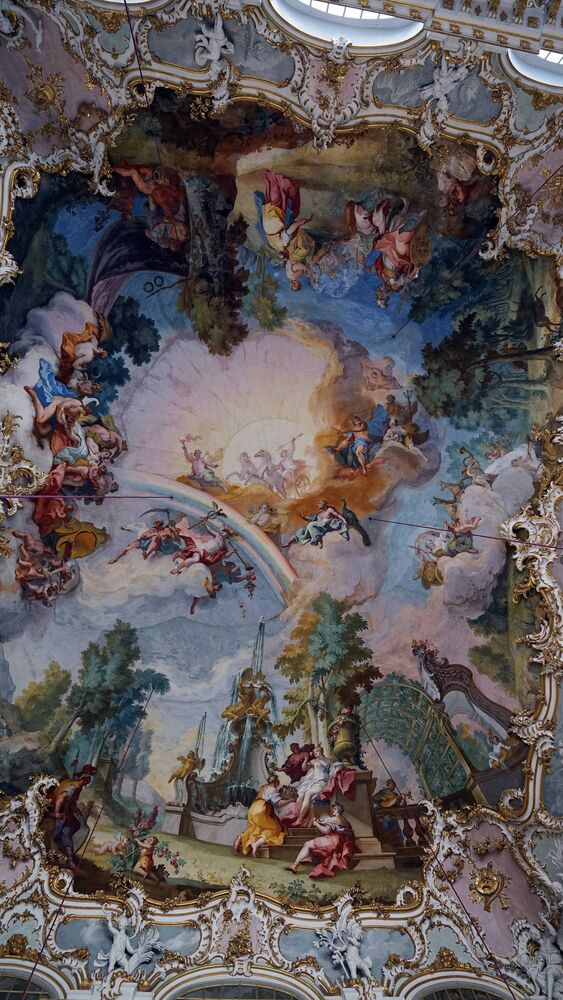 
*caption: Schloss Nymphenburg, Steinerer Saal Hauptfresko: Wohlstand und Blüte des Landes im Frieden (c) CbDD*

<script type="module">
(async function() {
    while (!BaroqueDB.isReady()) {
        await new Promise(r => setTimeout(r, 100));
    }
    await BaroqueViz.renderRoomCard('#steinerer-saal-card', 'ca990351-642b-4739-9753-59c5f7c1da1f');
})();
</script>

### Mannheim Palace: Epic Tales of Destiny and Dynasty

While Nymphenburg's frescoes celebrate peace and abundance, mythological painting elsewhere took on more martial and dynastic themes. In the Electoral Palace of Mannheim, built in the 1720s and 1730s, Elector Carl Philipp of the Palatinate commissioned monumental ceiling paintings for the main stairhall (*Haupttreppenhaus*) and adjoining state rooms. The task fell to the renowned Bavarian artist Cosmas Damian Asam. Between 1729 and 1730, Asam created a trilogy of frescoes for the stairhall that drew on Virgil's *Aeneid* and related myths, thereby constructing an erudite iconographic program linking the elector's lineage to the heroes and gods of antiquity.

At the center of the Mannheim stairway ceiling was "Das Urteil des Paris," the Judgment of Paris, the episode that set the Trojan War in motion and ultimately led to the founding of Rome. Asam's original fresco, signed "Cosmas D. Asam von München 1730," was destroyed in World War II, but descriptions and reconstructions still allow its iconography to be understood. Paris, shown as a shepherd prince beneath a tree, is approached by Mercury (Hermes), who brings the gods' command that he choose the fairest goddess. Before him stand the three contenders for the golden apple: Juno (Hera) with her peacock, Venus (Aphrodite) receiving the prize, and Minerva (Athena) at the side with attendant nymphs. A winged Fama brings a wreath to crown Venus as the victor in this fateful contest. By including this scene, the fresco alluded to the origins of the Trojan War, an epic conflict that ultimately led, through Aeneas, to the rise of Rome and thus, in medieval dynastic thinking, to the ancestry of European rulers. In this way, the Palatine elector inserted his own rule into the grand arc of classical destiny.

<div id="parisurteil-card" class="painting-card-container"></div>

<script type="module">
(async function() {
    while (!BaroqueDB.isReady()) {
        await new Promise(r => setTimeout(r, 100));
    }
    await BaroqueViz.renderPaintingCard('#parisurteil-card', '56698022-bbf7-4859-94b5-10646493da8e');
})();
</script> 

Flanking the central Paris panel were two large oval tondi with further episodes from the Aeneid, one on each side of the ceiling vault. On the eastern side, Asam painted "Venus and Aeneas in the Forge of Vulcan": Venus, Aeneas's mother, persuades Vulcan to forge weapons for her son before he goes to war. In Asam's version, Venus descends in her swan-drawn chariot and sits enthroned at the center, accompanied by the young hero Aeneas and the smith-god Vulcan himself. Around them bustle Cyclopes and helpers carrying a heavy shield, while in the background three elegant ladies in contemporary Baroque court dress observe the scene. This striking anachronism was likely intended to represent the three granddaughters of Elector Carl Philipp and thus to connect the ancient myth directly to the living dynasty. On the western side, the fresco "Juno, Aeolus and the Storm at Sea" depicts the episode in which Juno, queen of the gods, enlists Aeolus, god of the winds, to wreck Aeneas's fleet. Asam shows Juno enthroned beneath a billowing canopy with her peacocks, commanding Aeolus on a rocky shore; below them, muscular personifications of winds and waters unleash the tempest. This scene of divine wrath balances the Venus vignette on the opposite side of the hall and illustrates both divine favor and divine opposition in Aeneas's journey.

Taken together, Mannheim's stairhall paintings formed a three-part narrative: the Judgment of Paris, the cause of the Trojan War, at the center, flanked by Aeneas's divine aid in the scene of Venus and Vulcan and by his trial in Juno's storm. The choice of subject matter was rich in meaning. In Baroque art, the *Aeneid* was a favored source because Aeneas, the legendary survivor of Troy and ancestor of the Romans, was understood as a model of *pietas* and as a mythical forefather of rulers. By having Asam depict Aeneas's story, Elector Carl Philipp aligned himself with the hero's virtues and destiny. Contemporary guidance on fresco programs advised that depictions of ancient battles and adventures could, through example, incite the viewer to virtuous living, and Virgil's epic was especially valued for its themes of heroism, foundation, and devotion to the gods. Mannheim's program was therefore didactic as well as dynastic: as the viewer ascended the grand staircase, gods and heroes staged the illustrious antecedents of the ruler and implicitly called for loyalty and courage.

<div id="mannheim-treppenhaus-card" class="room-card-container"></div>

<script type="module">
(async function() {
    while (!BaroqueDB.isReady()) {
        await new Promise(r => setTimeout(r, 100));
    }
    await BaroqueViz.renderRoomCard('#mannheim-treppenhaus-card', '7430f064-80a8-4b74-b447-55c655cfab4e');
})();
</script>

Cosmas Damian Asam's originals were lost to wartime fires in the 1940s, but the ceiling paintings were reconstructed between 1955 and 1961 by the artist Carolus Vocke on the basis of surviving photographs. Although Vocke's secco reconstructions lack some of Asam's original vibrancy and Baroque dynamism, and one critic described their colors as "cool and dry, without radiance," the iconography was preserved intact. Today visitors can once again view Paris with the golden apple and Aeneas among the gods on Mannheim's reconstructed staircase, a modern echo of the Baroque ambition to connect local dynastic glory with epic myth.


### Arolsen Castle: Apollo and the Muses – Patronage of the Arts

Not all Baroque mythological ceilings emphasized war or political allegory; some celebrated cultural enlightenment and the arts themselves. A striking example is the Residenzschloss Arolsen in Hesse, residence of the Princes of Waldeck. Built largely in the early 18th century, from 1713 to 1728, with interior work continuing into the 1740s, Arolsen included a splendid *Gartensaal* (Garden Hall), also known as the Steinerner Saal. Around 1721-1722, the Italian painter Carlo Ludovico Castelli was commissioned to decorate its vaulted ceiling with a fresco exalting the arts and sciences in classical form.

Castelli's ceiling painting in the Garden Hall depicts Apollo, god of light and the arts, accompanied by the nine Muses. Apollo sits at the center on an elevated cloud, strumming his lyre as leader of the Muses, who gather around him on the billowing clouds of Mount Parnassus. A key detail is the presence of Pegasus, shown flying into the background sky. In mythology, Pegasus's hooves released the spring of the Muses, Hippocrene, which symbolized poetic inspiration and thus fit the gathering perfectly. Putti carrying laurel wreaths and branches move through the composition, bringing signs of glory toward Apollo and the poetic goddesses. The laurel, sacred to Apollo, signifies enduring fame bestowed on artistic achievement. Set against an ethereal blue sky, the scene radiates serenity and harmony. Apollo's presence as sun-god and leader of the chorus suggests that under the Waldeck princes the arts flourished in a divinely sanctioned golden age. For a small princely court eager to present itself as an enlightened cultural center, this message would have been unmistakable.

<div id="arolsen-musen-card" class="painting-card-container"></div>

<script type="module">
(async function() {
    while (!BaroqueDB.isReady()) {
        await new Promise(r => setTimeout(r, 100));
    }
    await BaroqueViz.renderPaintingCard('#arolsen-musen-card', 'd1c42fea-214e-4652-b77e-74e9978ccbb8');
})();
</script>


Stylistically, Castelli's work in Arolsen is notable for its blend of influences. Research has shown that Castelli, who came from the Italian-Swiss Ticino region, assembled his design from prints after celebrated Roman Baroque works. Apollo's pose, for example, derives from a depiction of the gods by Giovanni Lanfranco from 1624, while some of the Muses were inspired by Andrea Sacchi's fresco of *Divine Wisdom* from 1629-30, probably known to Castelli through engraved reproductions. Such borrowing was common practice and enabled artists working far from Rome to remain current with leading artistic models. Castelli executed the Arolsen ceiling in a mixed secco technique, painting on dry plaster with layered glazes rather than in true fresco. This method allowed the work to survive, though darkened, into the 21st century. Between 1987 and 2006, the Apollo and Muses painting was carefully restored, so that its delicate colors and lively figures can once again be appreciated.

The iconography of Apollo and the Muses was ideally suited to the ceremonial hall of an Enlightenment-era prince. By featuring Apollo Musagetes, the leader of the Muses, Prince Friedrich Anton Ulrich of Waldeck presented himself as a cultivated ruler under whose beneficent light the arts could flourish. The hall would have hosted musical performances and literary receptions, literally bringing the theme to life. In this sense, Arolsen's mythological ceiling is less concerned with military or political power than with cultural prestige. It proclaims that this relatively small German court participates in the great tradition of artistic patronage under Apollo's divine inspiration. Such imagery formed an important part of princely self-fashioning in the Baroque period and complemented the more overtly political allegories found elsewhere.


### Sondershausen Palace: Ovidian Transformations and Princely Elevation

One of the most extensive mythological programs of the German Baroque adorns the Riesensaal (Giants' Hall) of Residenzschloss Sondershausen in Thuringia. Sondershausen was the seat of the Counts of Schwarzburg-Sondershausen, who were elevated to princely rank within the Holy Roman Empire in 1697. To reflect this rise in status, Prince Christian Wilhelm undertook a lavish redecoration of the palace's state rooms around 1700. At the center of this effort stood the Riesensaal, a great hall on the second floor of the south wing, completed by 1703 with an elaborate stucco ceiling containing no fewer than 22 painted scenes from Ovid's *Metamorphoses*. This unified cycle of myths of transformation was especially apt because it subtly paralleled the "metamorphosis" of Christian Wilhelm's own dynasty, from minor counts to princes, and placed the court within the broader European vogue for Ovidian imagery.

The ceiling of the Riesensaal is a remarkable combination of quadratura stuccowork and narrative painting. Ornate plaster frames divide the surface into a grid of oval and rectangular compartments, each containing a vividly rendered mythological episode. The broad coves of the ceiling also carry larger monochrome grisaille scenes that mediate visually between the main panels. All chosen stories derive from Ovid's *Metamorphoses*, the classical poem recounting the transformations of gods and mortals. In Sondershausen, the selection emphasizes heroic quests, divine justice, and the consequences of desire, all fitting themes for a princely Baroque hall. One oval, for example, shows Apollo slaying the Python and thus the triumph of light over darkness; another depicts Apollo and Daphne, where the nymph transforms into a laurel tree to escape the god's pursuit. Other scenes present youthful hubris punished, such as Phaeton's fall from the sun chariot and the flaying of Marsyas, while narratives of piety rewarded, such as Philemon and Baucis, also seem to have been included. Hunting appears prominently in episodes like Meleager and Atalanta defeating the Calydonian boar, and scenes from the Trojan cycle, including Achilles and Penthesilea or adventures of Aeneas, connect the program to a wider heroic tradition.

This Ovidian gallery of gods and heroes in action created a dense allegorical environment. A contemporary description notes that the Sondershausen ceiling "shows hunting, battle, and love scenes from the Metamorphoses of Ovid" in a lively and dramatic manner. The paintings employ a warm palette of earthy reds, greens, and blues with bright highlights, and the figures are rendered in the energetic, somewhat provincial Baroque idiom of central Germany around 1700. The stucco framing was supplied by the Italian brothers Carlo Domenico and Antonio Carcani, whose workshop of Ticinese stuccoists was active throughout Thuringia. They sculpted life-sized Atlas figures at the corners to appear as though they support the vault and added trophy reliefs of weapons and armor in the coves, an allusion to martial prowess suited to a knightly hall.

Most importantly, the choice of the *Metamorphoses* as the unifying theme carried symbolic force for the patron. Christian Wilhelm's elevation to imperial princely rank was itself a dramatic social transformation, and the ceiling's parade of metamorphoses could be read as an elaborate metaphor for that change. Although no written program survives to explain the intention directly, scholars have reasonably suggested that the prince sought to associate his rule with the cycle of renewal and transformation described by Ovid. Just as the figures in the frescoes are elevated, punished, or transfigured by divine forces, so too had the House of Schwarzburg been transformed by imperial grace. For contemporaries gathered in the hall for ceremonies or festivities, the abundance of mythological exempla made a clear statement: this small principality understood the great stories of classical antiquity and positioned its own history within that continuum.

<div id="sondershausen-card" class="building-card-container"></div>
<script type="module">
(async function() {
    while (!BaroqueDB.isReady()) {
        await new Promise(r => setTimeout(r, 100));
    }
    await BaroqueViz.renderBuildingCard('#sondershausen-card', 'c644529c-1edc-4ad4-9b48-c8348b14283b');
})();
</script>

Beyond its political subtext, the decorative scheme of the Riesensaal also addressed Baroque viewers on a moral level. The scenes offered lessons in virtue and vice: Apollo's victory over Marsyas taught humility before the gods, Mercury's theft of Apollo's cattle illustrated cunning and its consequences, and other episodes conveyed similar exempla. A 19th-century restoration by the artist Julius Meyer in 1859 repainted parts of the frescoes, refreshing some colors, especially skies and landscapes, but otherwise leaving the compositions intact. The cycle therefore remains a rare surviving example of a fully Ovidian ceiling in northern Europe. It stands as a Baroque encyclopedia of metamorphosis, both artistic and dynastic, and shows how a newly elevated prince used mythology to legitimize his authority.


### Rastatt Palace: Hercules in Olympus – The Apotheosis of a Warrior Prince

If one Baroque fresco cycle epitomizes personal dynastic glorification, it is the ceiling of the Ancestral Hall (*Ahnensaal*) at Schloss Rastatt in Baden. Its central theme is the apotheosis of a hero, a transparent parallel to the glorification of the palace's owner, Margrave Ludwig Wilhelm of Baden-Baden. Ludwig Wilhelm (1655-1707), famous as the military hero "Türkenlouis" for his battles against Ottoman forces, built Rastatt Palace around 1700 in conscious competition with the grandest European courts. For the ceiling of his great hall, he engaged the Bolognese painter Giuseppe Maria Roli, who in 1704-1705 painted "Die Aufnahme des Herkules in den Olymp," the reception of Hercules into Olympus. Surrounded by smaller corner scenes and sumptuous stucco, the fresco casts the margrave's life in allegorical terms as Herculean virtue rewarded with eternal fame.


<div id="ahnensaal-saal-card" class="room-card-container"></div>

<script type="module">
(async function() {
    while (!BaroqueDB.isReady()) {
        await new Promise(r => setTimeout(r, 100));
    }
    await BaroqueViz.renderRoomCard('#ahnensaal-saal-card', '72df9922-340f-42fa-b7cc-df0ef351cc57');
})();
</script>

Roli stages the apotheosis of Hercules within a circular opening of painted sky in which the Olympian gods receive him. Jupiter presides above, accompanied by his eagle, sometimes only implied. Hercules rises at the right, muscular and cloaked in blue, carrying club and laurel wreath. He looks downward rather than up toward Jupiter, directing his gaze toward the ancestral portrait gallery at the cornice and thereby turning Hercules into a surrogate for Margrave Ludwig Wilhelm, who acknowledges lineage even as he ascends to divine status. Virtue accompanies him, and putti remove the lion skin and weapons, signaling that his labors are completed and that peace has been achieved.

Opposite him, Venus reclines among cherubs but recoils in rejection, shielding her face with red drapery as Hercules chooses immortal virtue over temptation. One Cupid breaks his bow and another spills arrows, showing that lust and sin have been overcome. Above, Minerva, Mars, and above all Justitia appear. Justice sits near Jupiter within a zodiac ring touching Libra and raises a sword that marks the composition's highest point, framing righteous rule as the culminating virtue. A flying Fama blows a trumpet and carries a laurel wreath to proclaim Hercules' eternal fame.

At the lower edge of the fresco, Roli adds a large eagle's nest with a mother bird and eaglets, painted as though it rested on the architectural rim. In a surviving preparatory drawing in Karlsruhe, he labels it with Horace's motto "Non generant aquilae columbas" ("eagles do not beget doves"), thus linking the House of Baden-Baden to power, imperial favor, and dynastic continuity. Positioned between earth and Olympus, the nest suggests that the margrave's heirs will inherit and continue his virtues, a point reinforced by Jupiter's gaze in its direction.


<div id="hercules-rastatt-card" class="painting-card-container"></div>

<script type="module">
(async function() {
    while (!BaroqueDB.isReady()) {
        await new Promise(r => setTimeout(r, 100));
    }
    await BaroqueViz.renderPaintingCard('#hercules-rastatt-card', '32229efd-3f75-4a6a-80c4-470b40e7e79d');
})();
</script>

Taken as a whole, the ceiling of the Rastatt *Ahnensaal* is an example of Baroque political theater. The ruler-as-Hercules theme is tailored directly to Ludwig Wilhelm, the "Türkenlouis," and to his victories against the Ottomans, an association reinforced by the corner sculptures of chained Turks supporting the cornice. The program celebrates military success, moral virtue, just sovereignty, and dynastic continuity. The fresco survives in a good state of preservation and is often cited as one of the major Italian Baroque works north of the Alps; its iconography also influenced comparable Hercules apotheosis cycles, including those in Würzburg in the 1740s.

#### Excursus: Hercules in Baroque Art

Hercules (German: Herkules) was among the most popular mythological figures in Baroque ceiling painting. His labors symbolized virtuous struggle, and his apotheosis represented the reward of immortal fame for earthly deeds. These themes resonated strongly with noble patrons seeking to glorify their dynasties:


<div id="hercules-gallery" class="baroque-gallery"></div>

<script type="module">
(async function() {
    while (!BaroqueDB.isReady()) {
        await new Promise(r => setTimeout(r, 100));
    }
    await BaroqueViz.renderMythFigureGallery('#hercules-gallery', 'Herkules', { limit: 9 });
})();
</script>

### Commissions Over Time: War, Peace, and the Rhythm of Baroque Art

Commissions for ceiling painting at German Baroque courts rose and fell with cycles of war and peace. Between 1650 and 1750, peaks in activity corresponded to periods of stability, while troughs coincided with conflicts that drained money, labor, and attention.

**Post-1648 rebound:** After the end of the Thirty Years' War in 1648, recovery during the 1650s-1670s revived commissions, first in churches and then in palaces. Early palace projects included the first phase of Nymphenburg in the 1660s, once Bavaria had stabilized. Prince-bishops and electors, for example in Würzburg and Mainz, also initiated smaller refurbishments.

**1680s-1690s boom, then setbacks:** In the late 17th century, rulers often trained in or inspired by Italy and France launched major palace programs and employed numerous Italian painters. This boom was interrupted by the Nine Years' War (1688-1697) and the War of the Spanish Succession (1701-1714). The French devastation of the Palatinate in 1689, including Mannheim and Heidelberg, stalled projects there. Some courts shifted their building activity elsewhere; Ludwig Wilhelm, for example, moved from Baden-Baden to Rastatt and began his palace there in 1698. Nymphenburg shows the same pattern: by 1704 construction had halted, parts of the complex were repurposed, and artists lost work as resources were redirected toward war.

**1715-1730 high Baroque flourishing:** After the Treaty of Rastatt ended the War of the Spanish Succession in 1714, commissions increased sharply. Many princes returned and resumed building, and fresco patronage intensified between roughly 1715 and 1730. Major cycles include Asam's paintings for the Mannheim stairhall and chapel in the 1720s, the grand halls at Würzburg and Bruchsal, Roli's *Ahnensaal* in Rastatt from 1704-05, Castelli's Garden Hall in Arolsen from 1721-22, and the Riesensaal in Sondershausen, completed in 1703. Peace and prosperity in the 1720s made it possible to import Italian artists and train local ones, producing a pan-German moment of "painted heavens" that impressed contemporaries.

**Mid-century adjustments:** New wars again strained budgets, above all the War of the Austrian Succession (1740-1748) and the Seven Years' War (1756-1763). Projects slowed in the early 1750s, although some rulers continued commissioning. In Bavaria, Max III Joseph supported Zimmermann's fresco for Nymphenburg's Steinerner Saal in the 1750s, and in Würzburg Prince-Bishop Adam Friedrich von Seinsheim continued patronage, with Tiepolo completing the Residenz fresco in 1753, shortly before the Seven Years' War. Even so, these conflicts marked the approach of the final great peak of high Baroque fresco.

**1760s-1770s shift to Neoclassicism:** By the 1760s, Baroque and Rococo ceilings had fallen from favor as Enlightenment taste increasingly preferred a cleaner Neoclassicism and treated mythological allegory as old-fashioned. In Bavaria, Max III Joseph and later Karl Theodor curtailed Rococo decoration; Nymphenburg's refurbishment of 1766 already appeared more restrained, and in 1769 Karl Theodor effectively ended Rococo decoration in Bavaria, accelerating the turn toward Neoclassicism. Prussia and Saxony followed similar developments by the 1770s. Large mythological ceiling commissions dwindled, some were left incomplete, and others shifted from fresco to canvas. The upheavals of the Napoleonic era finally extinguished the tradition.

Overall, periods of peace and economic strength, roughly the 1660s, the 1720s, and the mid-1740s to mid-1750s, align with bursts of commissions, while wars and fiscal crises produced noticeable gaps. Ceiling paintings functioned as luxury propaganda: they were among the first expenditures to be reduced in hard times and among the clearest signs of confidence and resources in good times.


<div id="commissions-timeline" class="baroque-chart"></div>

<script type="module">
(async function() {
    while (!BaroqueDB.isReady()) {
        await new Promise(r => setTimeout(r, 100));
    }
    await BaroqueViz.renderCommissionsTimeline('#commissions-timeline', { startYear: 1550, endYear: 1800 });
})();
</script>

### Italian Masters in German Courts: Carlo Ludovico Castelli and Alessandro Paduano

Castelli and Paduano were two prolific painters of mythological scenes in Baroque Germany. Their works often featured gods, heroes, and allegorical figures, which makes them particularly suitable representatives of the mythology theme. The galleries below highlight some of their most notable mythological ceiling paintings:

#### Carlo Ludovico Castelli (1671–1738)

Carlo Ludovico Castelli was an Italian painter and decorator from Melide in the Ticino region, part of a well-known family of artists. Active in Germany in the early 18th century, he worked primarily in Thuringia, Franconia, and Hesse. He was one of many itinerant craftsmen from Ticino who brought Baroque stucco and painting to central Europe. Castelli specialized in ceiling frescoes and secco paintings for palaces. His work has already appeared in this story in connection with Arolsen Castle, where he painted the Apollo and the Muses ceiling in 1721-22. Before that, he collaborated on projects in Kassel, including work at the Orangerie around 1715-1719, and possibly at other smaller courts. In 1728 he completed the decoration of the Arolsen palace chapel and other rooms, although the Garden Hall remains his best-known work there.

Castelli's style was shaped by the high Baroque models of Italy. As already noted, he adapted compositions from artists such as Lanfranco and Sacchi and recombined them into new syntheses. Working often in fresco-secco, a technique that allowed more time for detail by painting on dry plaster with binder, he produced durable works that could withstand the northern climate. Outside Arolsen, Castelli is documented as having participated in decorative programs in Würzburg, including the Juliusspital church in the early 1720s, and perhaps also in Altenburg and Gera. Records indicate that he sometimes worked together with his brother or cousin, the stuccoist Giovanni Pietro Castelli. Carlo Ludovico was sufficiently esteemed that several German princes sought his services; the Duke of Sachsen-Gotha, for example, engaged him briefly. By the mid-1730s, Castelli had returned to Italy, where he died in 1738.


<div id="castelli-gallery" class="baroque-gallery"></div>

<script type="module">
(async function() {
    while (!BaroqueDB.isReady()) {
        await new Promise(r => setTimeout(r, 100));
    }
    await BaroqueViz.renderPainterGallery('#castelli-gallery', ['Castelli, Carlo Ludovico'], { limit: 6 });
})();
</script>

### Alessandro Paduano (active 1568–1596)

Alessandro Paduano was an earlier Italian artist whose career foreshadowed the later Baroque fascination with myth in Bavaria. Active roughly between 1568 and 1596, he was an Italian painter, likely from Padua, who became a *Hofkünstler* in Munich during the late Renaissance. He is best known as the close collaborator, indeed the "right hand," of the architect-painter Friedrich Sustris, who served Duke Wilhelm V of Bavaria. In the 1570s and 1580s, the Munich court was a center of artistic innovation, and Paduano played an important role in executing the large decorative programs designed by Sustris.


One of Paduano's notable contributions was his work on the so-called *Narrentreppe* (Fools' Staircase) at the ducal residence in Landshut, Trausnitz Castle. Between 1575 and 1579, he and Sustris adorned this staircase with life-sized fresco scenes of *Commedia dell'arte* characters, an unusual mixture of theatrical wit and allegory that was unprecedented north of the Alps. Paduano's hand can still be sensed in the lively figures of masked actors and courtly spectators that survive there in faint traces. He was also involved in creating mythological grottos and bath-hall decorations for Duke Wilhelm V. One example is the famous Grottenhof in the Munich Residenz, created around 1580, an artificial grotto courtyard rich in mosaic and painted scenes of classical gods such as Venus and water deities. Paduano probably executed or assisted in these paintings, translating Sustris's designs into finished works.


Historically, Alessandro Paduano is documented in the Bavarian court accounts and is described there as an indispensable assistant. He is even said to have been Sustris's brother-in-law, which would explain the closeness of their partnership. His range extended from secular to religious projects, but it is his secular mythological work that is especially significant here. Paduano brought Italian Mannerist training to Bavaria and thereby helped lay the groundwork for what would later become the German Baroque ceiling tradition. Although he worked generations before artists such as Zimmermann or Asam, he influenced the courtly practice of integrating classical myth into architectural space. After about 1596, he disappears from the documentary record and is presumed either to have died or to have left Bavaria. By then, however, he had participated in the decoration of multiple palatial interiors and may even have trained younger German artists; Hans Werl, for example, apprenticed under him in 1588-89.


<div id="paduano-gallery" class="baroque-gallery" style="margin-top: 20px;"></div>

<script type="module">
(async function() {
    while (!BaroqueDB.isReady()) {
        await new Promise(r => setTimeout(r, 100));
    }
    await BaroqueViz.renderPainterGallery('#paduano-gallery', 'Paduano, Alessandro', { limit: 6 });
})();
</script>


Taken together, the mythological ceiling and wall paintings of the German Baroque were far more than opulent ornament. They were visual manifestos of an age. Through the examples of Nymphenburg, Mannheim, Arolsen, Sondershausen, and Rastatt, it becomes clear how ancient myths were repurposed to articulate contemporary concerns: peace after war, the heroism and legitimacy of rulers, the flourishing of the arts, the transformation and continuity of dynasties, and the aspiration to eternal fame. These compositions required the collaboration of patrons, painters, stucco sculptors, and architects, and they could flourish only under favorable historical conditions. When those conditions changed, whether through war or changing taste, the commissions slowed and eventually ceased, giving way to new artistic paradigms.

</div><!-- /topic-mythology -->

---

<a id="painter-explorer"></a>
## Painter Biography Explorer

Use the explorer below to trace the lives and works of individual Baroque ceiling painters through an interactive map and a chronological list. Select a painter to see:

- **Geographic journey**: Where they worked throughout their career
- **Chronological works**: All paintings ordered by date and grouped by building
- **Detailed information**: Click any painting or building for more details

<div id="painter-explorer-container" class="baroque-explorer"></div>

<script type="module">
(async function() {
    while (!BaroqueDB.isReady()) {
        await new Promise(r => setTimeout(r, 100));
    }
    const hash = window.location.hash;
    let initialPainter = null;
    if (hash.startsWith('#painter=')) {
        initialPainter = decodeURIComponent(hash.replace('#painter=', ''));
    }
    await BaroqueViz.renderPainterExplorer('#painter-explorer-container', initialPainter);
})();
</script>

**Tips for using the explorer:**

- **Search**: Type into the search box to find a painter by name
- **Navigate**: Use the `◀ Previous` and `Next ▶` buttons to move chronologically between buildings
- **Click on map**: Click a marker to view building details and jump to that location in the list
- **Click on building header**: Click any building name to center its location on the map
- **View details**: Click `Info` for building details, or click any painting for full information
- **Direct links**: You can link directly to a painter by using `#painter=Name` in the URL

### Featured Painters to Explore

Try exploring these notable Baroque ceiling painters:

<div class="painter-grid">
    <button class="painter-grid__btn" onclick="if(window.loadPainterInExplorer){window.loadPainterInExplorer('Asam, Cosmas Damian');document.getElementById('painter-explorer-container').scrollIntoView({behavior:'smooth'});}">
        🎨 Cosmas Damian Asam
    </button>
    <button class="painter-grid__btn painter-grid__btn--rose" onclick="if(window.loadPainterInExplorer){window.loadPainterInExplorer('Lammers, Seivert');document.getElementById('painter-explorer-container').scrollIntoView({behavior:'smooth'});}">
        🎨 Seivert Lammers
    </button>
    <button class="painter-grid__btn painter-grid__btn--cyan" onclick="if(window.loadPainterInExplorer){window.loadPainterInExplorer('Castelli, Carlo Ludovico');document.getElementById('painter-explorer-container').scrollIntoView({behavior:'smooth'});}">
        🎨 Carlo Ludovico Castelli
    </button>
    <button class="painter-grid__btn painter-grid__btn--pastel" onclick="if(window.loadPainterInExplorer){window.loadPainterInExplorer('Katzenberger, Balthasar');document.getElementById('painter-explorer-container').scrollIntoView({behavior:'smooth'});}">
        🎨 Balthasar Katzenberger
    </button>
</div>

## Sources

### Church and Religion


### Society and Culture

The art-historical descriptions and contextual interpretations presented in the Society and Culture section are primarily based on the research interpretations documented in the [CbDD](https://www.deckenmalerei.eu/42d06165-58e7-4653-bfe4-3d5f7091fc33#6e73f774-4b7f-4e37-937b-e11cc35c5bc8) and the primary sources referenced therein. The specific sources used are listed in the references below.

<div class="cbdd-references" markdown="0">
<ol>
<li> Freeden, Georg Robin, 1943/44. Speziell zu Weikersheim im Jahr 1586: ebd., S.&nbsp;38. Abgerufen am 7. Februar 2026, von https://www.deckenmalerei.eu/</li>
<li> Freeden, Georg Robin, 1943/44, S.&nbsp;38. Abgerufen am 7. Februar 2026, von https://www.deckenmalerei.eu/ </li>
<li> Ziegler, Idealplan, 2019, S.&nbsp;140–142. Abgerufen am 7. Februar 2026, von https://www.deckenmalerei.eu/ </li>
<li> Freeden, Georg Robin, 1943/44, S.&nbsp;39. Abgerufen am 7. Februar 2026, von https://www.deckenmalerei.eu/ </li>
<li> Ziegler, Idealplan, 2019, S.&nbsp;140. Abgerufen am 7. Februar 2026, von https://www.deckenmalerei.eu/</li>
<li> University of Konstanz: symbolic means for representing concepts of order. Abgerufen 7. Februar 2026, von https://kops.uni-konstanz.de/server/api/core/bitstreams/a191c70e-e145-45e2-83eb-ddb302cee269/content </li>
<li> Joachim Hamberger: Eine kurzer Abriss der Jagdgeschichte. Von Hirschen und Menschen. In: <em>LWF aktuell</em>, Nr.&nbsp;44, 2004, S.&nbsp;28. Abgerufen am 7. Februar 2026, von https://www.deckenmalerei.eu/</li>
<li> Peter Blickle: <em>Die Revolution von 1525</em>. 2.&nbsp;Auflage. Oldenbourg Verlag, München 1983, ISBN&nbsp;3-486-44652-5, S.&nbsp;58. Abgerufen am 7. Februar 2026, von https://www.deckenmalerei.eu/</li>
<li> Bernd Ergert: <em>Die Jagd in Bayern – von der Vorzeit bis zur Gegenwart</em>. Rosenheimer Verlagshaus, Rosenheim 1984, S.&nbsp;123–127. Abgerufen am 7. Februar 2026, von https://www.deckenmalerei.eu/</li>
<li> Barockjagd.de: Jagen vor 250 Jahren, Abgerufen 7. Februar 2026, von http://barockjagd.de </li>
<li> Poser, Deckenbilder, 1980, S.&nbsp;160. Abgerufen am 7. Februar 2026, von https://www.deckenmalerei.eu/</li>
<li> Poser, Deckenbilder, 1980, S.&nbsp;160. Abgerufen am 7. Februar 2026, von https://www.deckenmalerei.eu/</li>
<li> Poser, Deckenbilder, 1980, S.&nbsp;161. Abgerufen am 7. Februar 2026, von https://www.deckenmalerei.eu/</li>
<li> Poser, Deckenbilder, 1980, S.&nbsp;160, dort ohne das Wort „alleins". Die genaue Transkription: Drös, Inschriften Mergentheim, 2002, Nr.&nbsp;353. Abgerufen am 7. Februar 2026, von https://www.deckenmalerei.eu/</li>
<li> Abschlussbericht der Restaurierung vom 05.03.1998. Dipl.&nbsp;Ing. Erik Reinhold. Abgerufen am 7. Februar 2026, von https://www.deckenmalerei.eu/</li>
<li> Poser, Deckenbilder, 1980; Kniep, Glück, 2005; Käpplinger, Jagd, 2011; Käpplinger, Auf's Schönste, 2019, S.&nbsp;197. Abgerufen am 7. Februar 2026, von https://www.deckenmalerei.eu/</li>
<li> Käpplinger, Jagd, 2011, S.&nbsp;76. Abgerufen am 7. Februar 2026, von https://www.deckenmalerei.eu/</li>
<li> Käpplinger, Jagd, 2011. Abgerufen am 7. Februar 2026, von https://www.deckenmalerei.eu/</li>
<li> Käpplinger, Jagd, 2011. Abgerufen am 7. Februar 2026, von https://www.deckenmalerei.eu/</li>
<li> Poser, Deckenbilder, 1980, S.&nbsp;161. Abgerufen am 7. Februar 2026, von https://www.deckenmalerei.eu/</li>
<li> Käpplinger, Jagd, 2011, S.&nbsp;81–85. Abgerufen am 7. Februar 2026, von https://www.deckenmalerei.eu/</li>
<li> Merten, Weikersheim, o.&nbsp;J., S.&nbsp;40. Abgerufen am 9. Februar 2026, von https://www.deckenmalerei.eu/</li>
<li> Freeden, Kamin, 1950, S.&nbsp;142. Abgerufen am 9. Februar 2026, von https://www.deckenmalerei.eu/</li>
<li> Inschriften Mergentheim, 2002, S.&nbsp;248. Ebd., S.&nbsp;249. Abgerufen am 9. Februar 2026, von https://www.deckenmalerei.eu/</li>
<li> Zum Langen Türkenkrieg: Niederkorn, Langer Türkenkrieg, 1993. Abgerufen am 9. Februar 2026, von https://www.deckenmalerei.eu/</li>
<li> Fandrey, Weikersheim, 2010, S.&nbsp;60. Abgerufen am 9. Februar 2026, von https://www.deckenmalerei.eu/</li>
<li> Ortelius, Chronologia, 1602. Abgerufen am 9. Februar 2026, von https://www.deckenmalerei.eu/</li>
<li> Ortelius, Chronologia, 1602, „Ad Lectorem". Abgerufen am 9. Februar 2026, von https://www.deckenmalerei.eu/</li>
<li> Drös, Inschriften Mergentheim, 2002, S.&nbsp;248–249. Abgerufen am 9. Februar 2026, von https://www.deckenmalerei.eu/</li>
<li> Drös, Inschriften Mergentheim, 2002, S.&nbsp;248–250. Abgerufen am 9. Februar 2026, von https://www.deckenmalerei.eu/</li>
<li> Drös, Inschriften Mergentheim, 2002, Nr.&nbsp;366. Abgerufen am 9. Februar 2026, von https://www.deckenmalerei.eu/</li>
</ol>
</div>


### Mythology

Art and the thirty years’ war. Die Welt Der Habsburger. Abgerufen 5. Februar 2026, von https://www.habsburger.net/en/chapter/art-and-thirty-years-war

Bayerische schlösserverwaltung | nymphenburg | schloss | rundgang. Abgerufen 5. Februar 2026, von https://www.schloss-nymphenburg.de/deutsch/schloss/raum01.htm

Corpus der barocken Deckenmalerei in Deutschland (Cbdd). Abgerufen 5. Februar 2026, von https://www.deckenmalerei.eu/

Mannheim, kurfürstliches residenzschloss, haupttreppenhaus, ausschnitt aus dem deckengemälde von cosmas damian asam, „urteil des paris“. Google Arts & Culture. Abgerufen 5. Februar 2026, von https://artsandculture.google.com/asset/mannheim-kurfürstliches-residenzschloss-haupttreppenhaus-ausschnitt-aus-dem-deckengemälde-von-cosmas-damian-asam-„urteil-des-paris“/RwHZdS1VCPSpzw

Romoe conservators network. Residenzschloss, riesensaal, deckengemälde. Romoe Netzwerk. Abgerufen 5. Februar 2026, von https://www.romoe.com/de/artikel/residenzschloss-riesensaal-deckengemaelde_ef5kcvlt.html

Residenzschloss Mannheim. Abgerufen 5. Februar 2026, von https://www.zum.de/Faecher/G/BW/Landeskunde/rhein/ma/schloss/treppenhaus.htm

Pietro, Carlo. Die Stuckateure und Baumeister Castelli aus Melide und Bissone. Abgerufen 5. Februar 2026, von https://www.sueddeutscher-barock.ch/PDF-Bio_M/Castelli_Melide.pdf


