NFDI4Culture Data Story
{: .text-overline-m}

# An Italian Data Journey

## Analysing research data about 18th century Italian opera using the Culture Knowledge Graph and federated European research infrastructures

/// html | div[class='tile']
**Author:** [Torsten Schrade](https://orcid.org/0000-0002-0953-2818)  
**Persistent Identifier:** https://nfdi4culture.de/id/E6263  
**Metadata:** https://nfdi4culture.de/id/E6263/about.html  
**License:** [CC-BY 4.0](https://creativecommons.org/licenses/by/4.0/)
///

[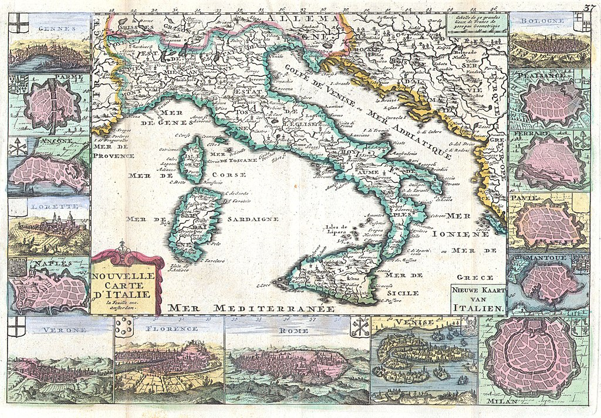](https://commons.wikimedia.org/wiki/File:1706_de_la_Feuille_Map_of_Italy_-_Geographicus_-_Italy-lafeuille-1706.jpg)

/// caption
Daniel de Lafeuille, Nouvelle Carte D’Italie - Nieuwe Kaart van Italien, 1706, [Wikimedia Commons](https://commons.wikimedia.org/wiki/File:1706_de_la_Feuille_Map_of_Italy_-_Geographicus_-_Italy-lafeuille-1706.jpg), Public Domain
///

**Abstract:** This data story illustrates a digital exploration of reserach data on opera holdings of the [Doria Pamphilj Archive](https://www.doriapamphilj.it/en/rome/the-place/the-archives/) by the [*Partitura*](http://partitura.dhi-roma.it/) project of the [German Historical Institute in Rome (DHI Rome)](http://dhi-roma.it/). By enriching the *Partitura* dataset with established authority sources such as [Wikidata](https://www.wikidata.org/), [RISM](https://rism.online/), [GeoNames](https://www.geonames.org/), and transforming it to LOD, new analytical insights into the historical and musicological dimensions of the opera collection are revealed. Leveraging services provided by [NFDI4Culture](https://nfdi4culture.de/) and [EOSC](https://open-science-cloud.ec.europa.eu/), the study exemplifies how data federation with European infrastructures can significantly enhance interoperability of research data and create multimodal research perspectives. Methodologically, the story uses examples ranging from genre distribution analyses to geospatial mappings of opera premiere locations as well as music information retrieval through federated SPARQL queries. 
{: .intro}

---

## Introduction

The Archivio Doria Pamphilj in Rome houses a significant yet largely unexplored collection of operatic materials dating from the 16th to the 19th centuries. Originally assembled between 1764 and 1777 by Giorgio Andrea IV Doria Landi Pamphilj (1747–1820), this archive includes approximately 300 bibliographic units encompassing sacred music from the 16th and 17th centuries, vocal and instrumental music from the 18th century, and printed music from the 19th century. Notably, the archive contains 27 complete opera scores, 21 collections of varied arias ("Arie diversi"), and 128 individual aria manuscripts from the late 18th and early 19th centuries.

[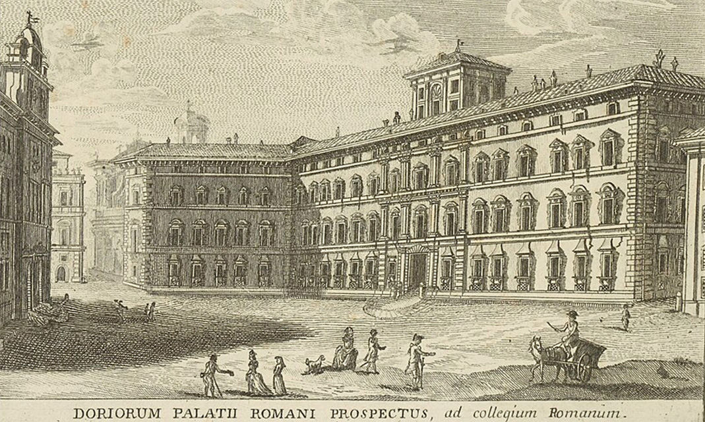](https://commons.wikimedia.org/wiki/File:Calcografia_degli_edifizj_di_Roma_1779_(69608988).jpg)

/// caption
Palazzo Doria Pamphilj, Rome / 1779; [Wikimedia Commons](https://commons.wikimedia.org/wiki/File:Calcografia_degli_edifizj_di_Roma_1779_(69608988).jpg), Public Domain
///

To facilitate scholarly access and promote deeper musicological research, the German Historical Institute in Rome (DHI) initiated the "Partitura Project," supported by the German Research Foundation (DFG) between 2008 and 2015 under the leadership of Dr Roland Pfeiffer. The project accomplished comprehensive digitisation of opera scores from both the Doria Pamphilj and the Massimo collections, resulting in a digital archive comprising approximately 115,000 images and a database of around 30,000 aria incipits.

---

## Research questions

Our data story addresses two research questions: 

1. firstly, whether selected datasets from the DHI can be effectively federated within European data spaces using data-driven methods, thereby generating novel insights that surpass the original data; 
2. and secondly, how these federated data can be employed to unlock new research potentials and concrete scholarly advancements in music-historical studies.

Methodologically, the exploration was designed as a structured experiment, constrained to a 100-hour timeframe spread across four weeks. The investigation exclusively utilised cloud-based European infrastructures, notably those provided by NFDI4Culture and the European Open Science Cloud (EOSC). 

A key aspect involved employing artificial intelligence and knowledge graphs, particularly for data curation, semantic enrichment, and assisted programming. Quality control was maintained through a "human-in-the-loop" approach, while data federation occurred in real-time during analyses. The experiment aimed at demonstrating measurable improvements in data interoperability, enhanced discoverability and interpretative value, and the creation of new multimodal interaction opportunities with historical datasets.

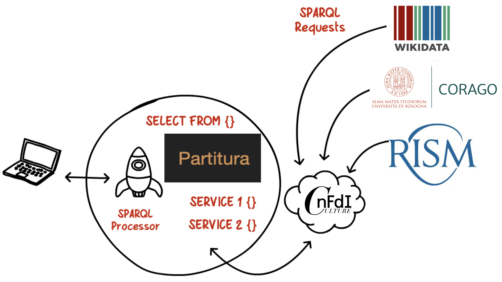

/// caption
Envisaged data federation and methodological approach
///

---

## Data preparation

### Initial Dataset

Although openly accessible via the Partitura website, the initial metadata set presented significant challenges, such as inconsistent spellings, variations in dates, and non-standardised attribution of composers, operas, and arias. Additionally, the metadata utilised RISM identifiers but lacked further authoritative references or standardised interfaces for data exchange.

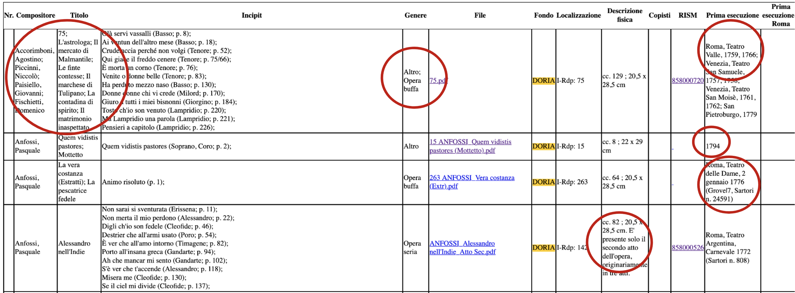

/// caption
Challenges in the Partitura source data
///

### Application of 5 Star Linked Open Data Principles

The data preparation adhered strictly to Sir Tim Berners-Lee’s 5 Star Linked Open Data principles, progressing from basic availability as open licensed data online, through structured and standardised formats, ultimately reaching the highest level of interlinking with external datasets using W3C standards (RDF and SPARQL). This process ensured robust semantic interoperability and facilitated scholarly reuse and citation of data.

### Step 1: Migration to relational database with REST API

As a preliminary step, data were systematically transferred into a no-code database environment from NFDI4Culture (NocoDB). This enabled initial data disambiguation and created structured access via APIs suitable for automated processing. The resulting structured dataset consisted of clearly disambiguated entities:

* 387 opera scores (partituras)
* 49 composers
* 2,200 premieres (partially disambiguated)
* 36 geographical locations
* 57 theatres
* 94 inventory entries

<iframe src="https://nocodb.nfdi4culture.de/dashboard/#/base/c148f081-7a60-4b4e-8da7-deadec7904b0" width="100%" height="600px" style="border: none; margin-bottom: 2rem"></iframe>

### Step 2: Semi-automated enrichment with authority data

Subsequent enrichment involved semi-automated linking of entities with authority data sources. The achieved accuracies and efforts involved in linking were documented precisely as follows:

| Entity Type         | Linked Source | Accuracy (%) | Duration |
|---------------------| --- | --- | --- |
| Composers           | Wikidata | 78.05 | 10 min |
| Composers           | RISM | 95.12 | 10 min |
| Locations           | Wikidata | 75.00 | 30 min |
| Theatres            | Wikidata | 100.00 | 180 min |
| Inventory Entries   | RISM | 19.15 | 20 min |
| Operatic Scores     | RISM | 27.65 | 0.5 days |
| Additional curation | Manual | - | 1.5 days |

This enrichment process substantially improved the dataset’s scholarly value and interoperability.

### Step 3: Application of the NFDIcore ontology

The structured data were then annotated using the NFDIcore ontology, which provided a standardised semantic framework specifically designed for representing scholarly data within the NFDI4Culture research data infrastructure. Applying this ontology ensured that metadata about operatic resources and related scholarly information could seamlessly integrate into federated research infrastructures.


/// caption
NFDIcore and its different modules (Creator: Tabea Tietz)
///

### Step 4: Transformation into Linked Open Data

Finally, the enriched and structured data were transformed into Linked Data (RDF triples), stored within a Triple Store to facilitate federation and interoperability with other linked datasets. The resulting dataset was made publicly accessible via a dedicated SPARQL endpoint, hosted on the LOD.ACADEMY infrastructure. This transformation allowed live querying and federated analyses, significantly enhancing scholarly accessibility and the potential for novel analytical perspectives.

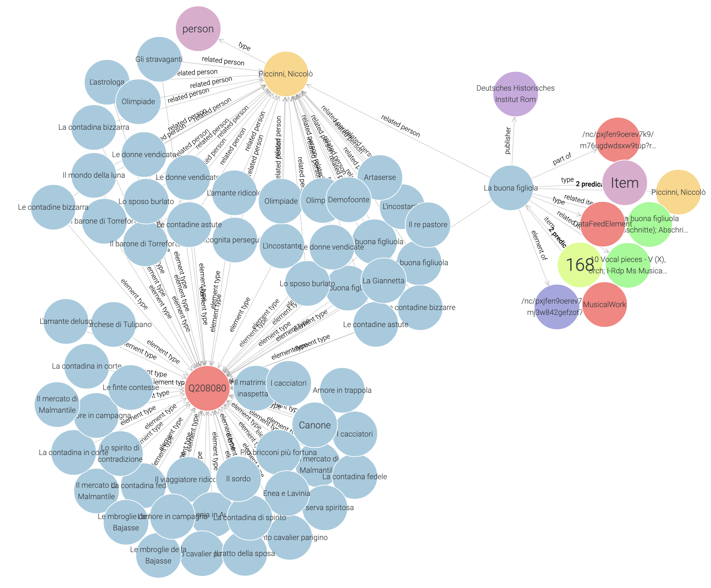

/// caption
Final structure of the data as Partitura Knowledge Graph
///

---

## Data analysis

### Analysis 01: Distribution of opera seria, opera buffa and oratorio in the collection

/// details | **Show SPARQL query 01**
    type: plain
``` sparql linenums="1" title="query-01.rq"
--8<-- "query-01.rq"
```
///

/// details | **Show query result 01**
    type: plain
``` shmarql linenums="1" title="query-01.rq"
--8<-- "query-01.rq"
```
///

---

### Analysis 02: Get the amount of opera seria, opera buffa and oratoria per composer

/// details | **Show SPARQL query 02**
    type: plain
``` sparql linenums="1" title="query-02.rq"
--8<-- "query-02.rq"
```
///

/// details | **Show query result 02**
    type: plain
``` shmarql linenums="1" title="query-02.rq"
--8<-- "query-02.rq"
```
///

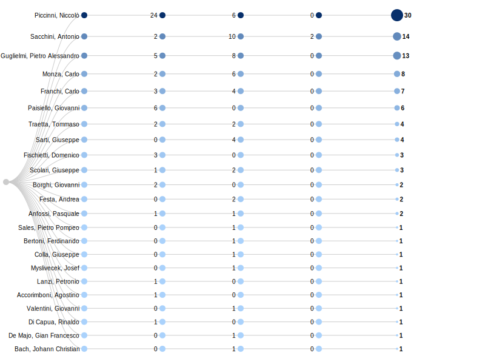

/// caption
Statistics on opera buffa, opera seria and oratorio in the Doria Pamphilj dataset
///

---

### Example 03: Show all places where operas in the Doria Pamphilj collection were performed

/// details | **Show SPARQL query 03**
    type: plain
``` sparql linenums="1" title="query-03.rq"
--8<-- "query-03.rq"
```
/// 

--8<-- "query-03.md"

---

### Analysis 04: Federate with Wikidata and get images of theaters that occur in the Partitura dataset

/// details | **Show SPARQL query 04**
    type: plain
``` sparql linenums="1" title="query-04.rq"
--8<-- "query-04.rq"
```
/// 

--8<-- "query-04.md"

---

### Example 05: Show all places of opera premieres on an interactive map

/// details | **Show SPARQL query 05**
    type: plain
``` sparql linenums="1" title="query-05.rq"
--8<-- "query-05.rq"
```
/// 

--8<-- "query-05.md"

---

### Example 06: Combining Persons in RISM and Partitura

Find all operas in the Doria Pamphilj collection that are based on libretti of Pietro Metastasio.

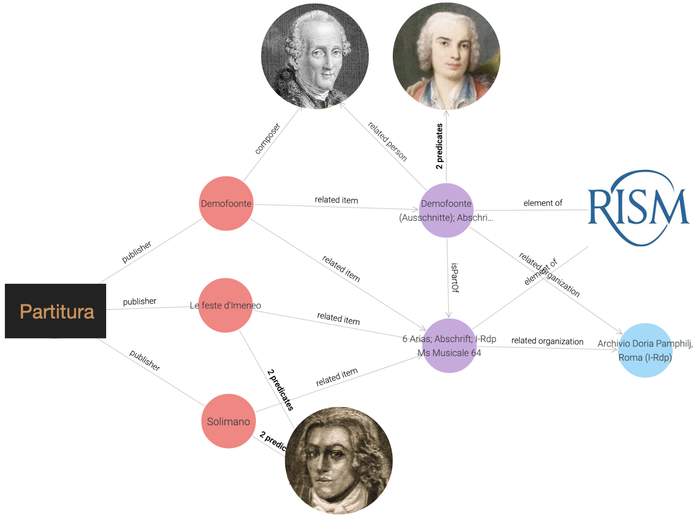

/// details | **Show SPARQL query 06**
    type: plain
``` sparql linenums="1" title="query-06.rq"
--8<-- "query-06.rq"
```
/// 

/// details | **Show query result 06**
    type: plain
``` shmarql
--8<-- "query-06.rq"
```
///

---

### Example 07: All operas of Nicolo Piccinni in Doria Pamphilj

/// details | **Show SPARQL query 07**
    type: plain
``` sparql linenums="1" title="query-07.rq"
--8<-- "query-07.rq"
```
/// 

/// details | **Show query result 07**
    type: plain
``` shmarql
--8<-- "query-07.rq"
```
///

---

### Example 08: All operas of Nicoló Piccinni with libretti of Pietro Metastasio

/// details | **Show SPARQL query 08**
    type: plain
``` sparql linenums="1" title="query-08.rq"
--8<-- "query-08.rq"
```
/// 

/// details | **Show query result 08**
    type: plain
``` shmarql
--8<-- "query-08.rq"
```
///

---

### Example 09: All works of Nicoló Piccinni with places of premiere

/// details | **Show SPARQL query 09**
    type: plain
``` sparql linenums="1" title="query-09.rq"
--8<-- "query-09.rq"
```
/// 

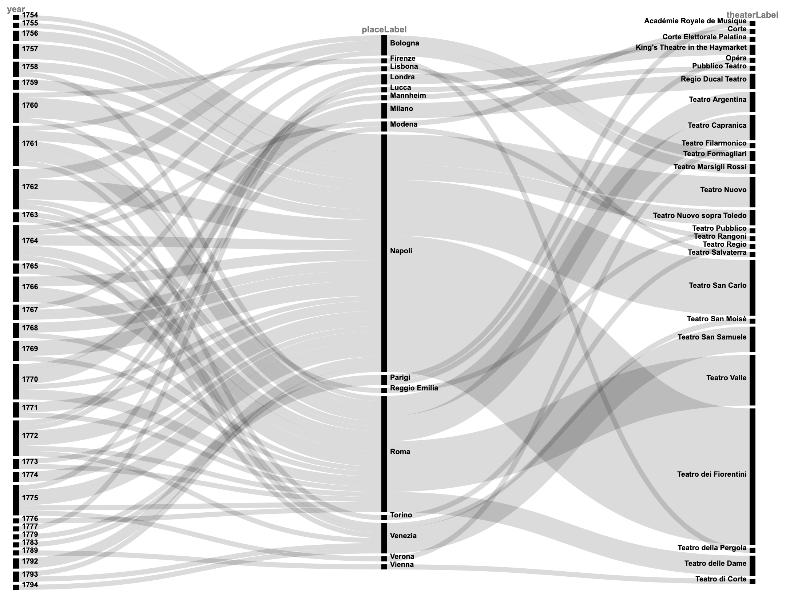

/// caption
Alluvial diagram showing the relation between works and places of premiere
///

---

### Example 10: Staging history of the opera Demofoonte in the 18th century

/// details | **Show SPARQL query 10**
    type: plain
``` sparql linenums="1" title="query-10.rq"
--8<-- "query-10.rq"
```
/// 

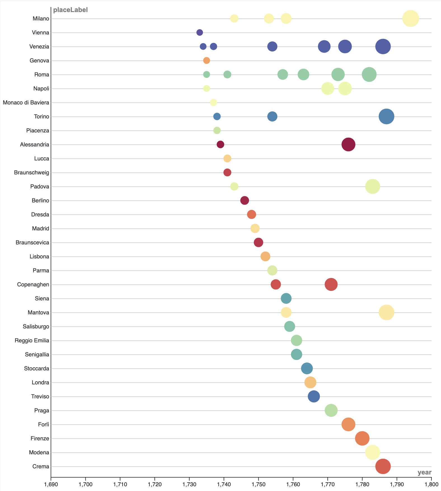

/// caption
Beeswarm plot showing the staging history of Demofoonte
///

---

### Example 11: Music information retrieval using RISM and Partitura

/// details | **Show SPARQL query 11**
    type: plain
``` sparql linenums="1" title="query-11.rq"
--8<-- "query-11.rq"
```
/// 

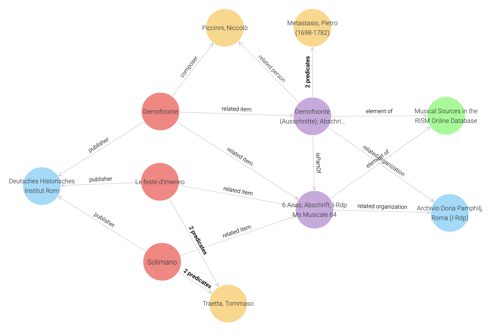

/// caption
Relation between RISM incipits and resources from Partitura
///

**Experimental Search interface for notated music (Plaine & Easy format)**


**Try it out live:** https://nfdi4culture.de/kg-incipit-search.html

---

## Summary and Outcomes

The digital data exploration experiment described in this data story has successfully demonstrated the scholarly value and feasibility of federating the operatic holdings of the Doria Pamphilj Archive with broader European data infrastructures. The data preparation process involved extensive semantic enrichment, ultimately achieving an average enrichment quotient of 64.3%. Starting from an original metadata table of 154 rows and 13 columns, the data evolved through two distinct integration stages: firstly, into a relational database comprising 2,849 records, and subsequently into a knowledge graph containing 3,400 semantic statements.

The technical implementation required approximately 1,400 lines of program code, notably supported by AI-assisted programming tools (co-piloting). Data preparation utilised 432 lines of code (around 90% AI-generated), data integration required 211 lines of code (also approximately 90% AI-assisted), and analysis scripts comprised 757 lines of code (around 30% AI-generated). Importantly, the federated data workflows leveraged infrastructures spanning four European countries: Germany, Italy, Poland, and Switzerland.

In broader terms, the experiment achieved its primary objectives by demonstrating the practical benefits of federating cultural data with European data spaces. The use of cloud-based European research infrastructures and linked data services (such as NFDI4Culture, EOSC, and related authority data services) proved highly productive. Artificial Intelligence, especially in data preprocessing and assisted programming tasks, significantly enhanced efficiency, although manual curation efforts remained unexpectedly high. Nevertheless, this manual work yielded additional exploratory analytical insights, suggesting a valuable symbiosis between automated and manual curation processes.

Finally, the project underscored the need for developing new quality assurance methods suitable for federated research data, an ongoing discussion within the research data community. The NFDI framework provides a vital platform for dialogue among researchers, funding bodies, and policymakers. Through federation with external sources like RISM, Corago, and NFDI4Culture, several promising new research perspectives on operatic and music-historical scholarship emerged, offering substantial avenues for future scholarly investigation.

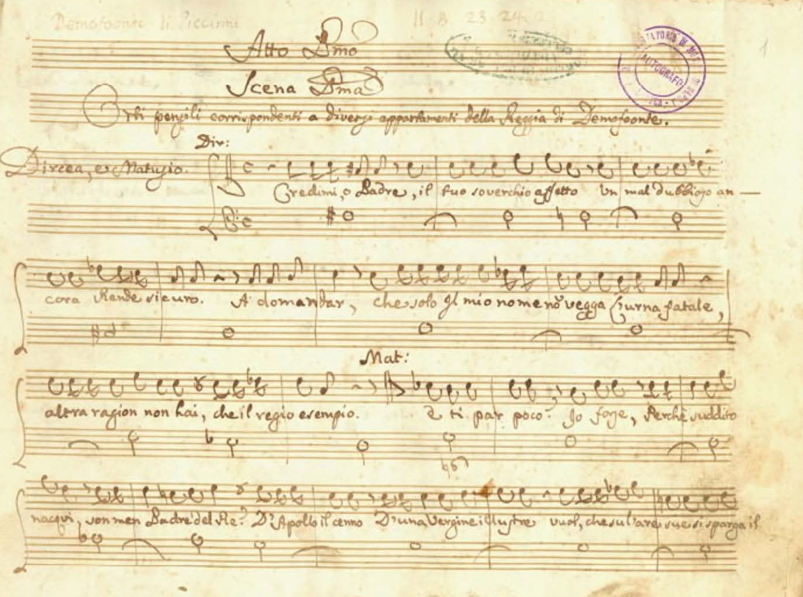

/// caption
Nicoló Piccinni, Demofoonte; Bibl. del Cons. di Musica S. Pietro a Majella / [IMSLP](https://imslp.org/wiki/Demofoonte_(Piccinni%2C_Niccol%C3%B2)), Public Domain
///