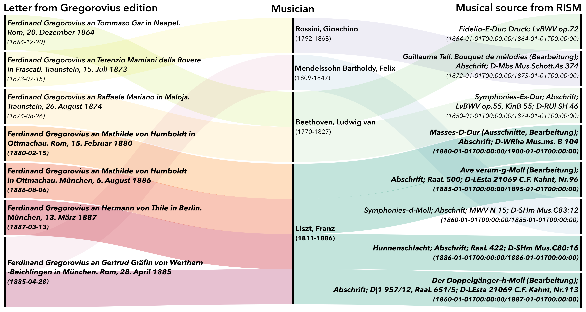
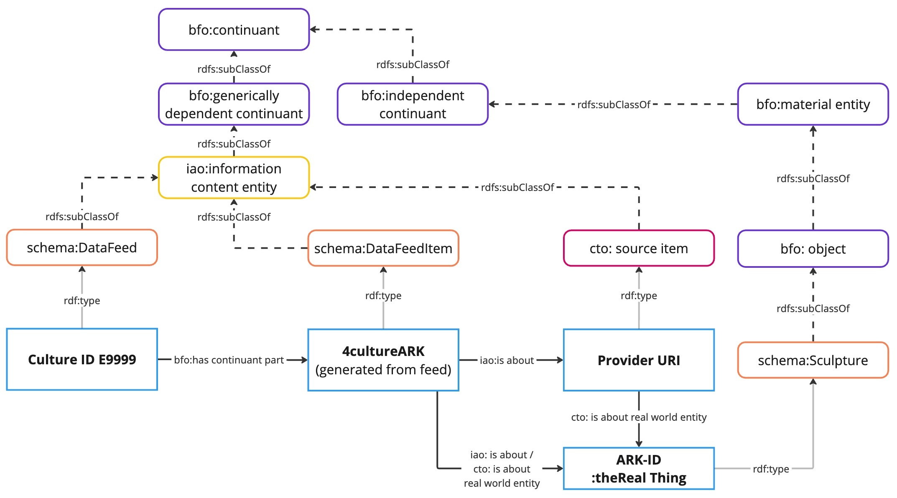
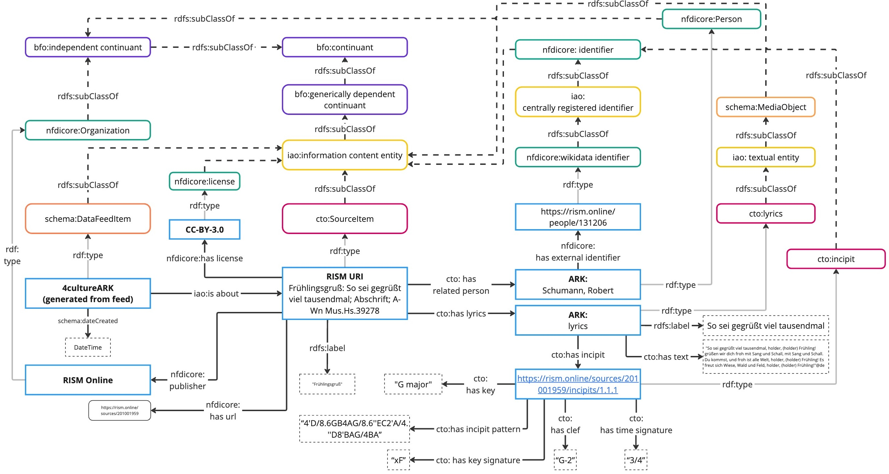
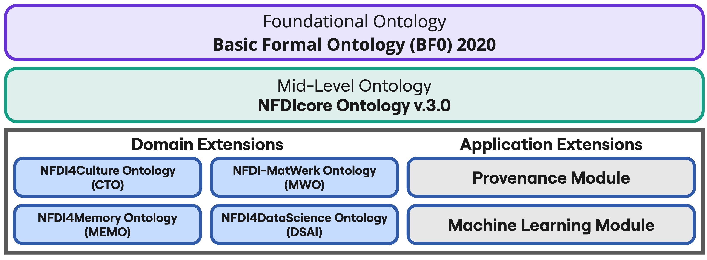
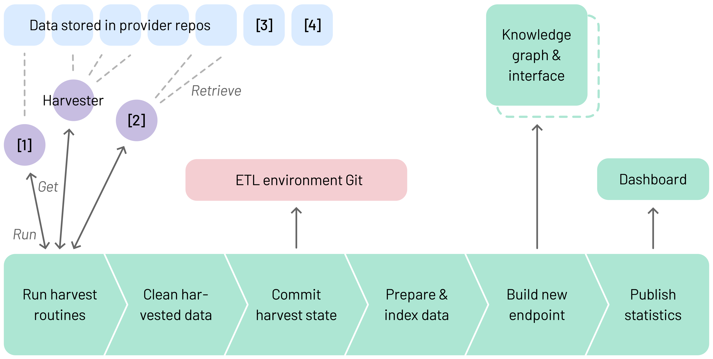

NFDI4Culture Data Story
{: .text-overline-m}

# A Deep Dive into NFDI4Culture's Integration Workflows

## Connecting RISM Online Musical Sources and the Gregorovius Letters Through the NFDI4Culture Knowledge Graph

/// html | div[class='tile']
**Authors:** [Linnaea Söhn](https://orcid.org/0000-0001-8341-1187), [Tabea Tietz](https://orcid.org/0000-0002-1648-1684), [Jonatan Jalle Steller](https://orcid.org/0000-0002-5101-5275), [Paul Kehrein](https://orcid.org/0009-0004-6540-6498), [Alexandra Büttner](https://orcid.org/0000-0002-4950-0941), [Oleksandra Bruns](https://orcid.org/0000-0002-8501-6700), [Etienne Posthumus](https://orcid.org/0000-0002-0006-7542), [Jan Grünewälder](https://orcid.org/0009-0006-9112-4042), [Jörg Hörnschemeyer](https://orcid.org/0000-0001-8788-5718), [Christoph Sander](https://orcid.org/0000-0003-4452-0107), [Vera Grund](https://orcid.org/0000-0003-2453-9388), [Heike Fliegl](https://orcid.org/0000-0002-7541-115X), [Harald Sack](https://orcid.org/0000-0001-7069-9804), [Torsten Schrade](https://orcid.org/0000-0002-0953-2818)  
**Persistent Identifier:** https://nfdi4culture.de/id/E6477  
**Metadata:** https://nfdi4culture.de/id/E6477/about.html  
**License:** [CC-BY 4.0](https://creativecommons.org/licenses/by/4.0/)
///

[](example-interconnections-RISM-Online-Gregorovius-Liszt.png)

/// caption
Alluvial diagram showing example interconnections between resources in the Gregorovius Letter Edition and RISM Online based on references, e.g. to the composer Franz Liszt. Creator: L. Söhn.
///

**Abstract:** Cultural heritage (CH) data offer valuable insights into CH networks and hidden connections across disciplines. However, despite the use of authority files such as GND, VIAF, Wikidata, and Iconclass, most CH data lack standardized indexing, limiting accessibility for querying or federation. This complicates navigation across diverse datasets, including texts, images, musical sources, events, 3D models, and historical landmarks. In NFDI4Culture, we are therefore developing an overarching metadata index to enable queries across distributed resources, as illustrated in the visualisation above through interconnections between letters from the digital edition *Ferdinand Gregorovius: Poesie und Wissenschaft* and musical sources from *RISM Online*, based on temporal and personal overlaps. In this data story, we provide a deep dive into the underlying technological choices and integration routines to create cross-connections between distributed research resources.
{: .intro}

---
## NFDI4Culture Knowledge Graph

The NFDI4Culture Knowledge Graph is completely integrated into the NFDI4Culture Information Portal and together, they provide a unified access point to the decentralized research data of the culture community by means of a data index. The NFDI4Culture Knowledge Graph and Portal aim to improve the findability and interoperability of heterogeneous and diverse data for the consortium's core domains *Performing Arts*, *Art History*, *Musicology*, *Architecture*, and *Media Studies*. Currently, the NFDI4Culture Knowledge Graph holds more than 18 million resources and more than 105 million triples. The current status of the NFDI4Culture Knowledge Graph, including statistics on the amount of triples, and integrated data feeds can be explored in the public [dashboard](https://superset.nfdi4culture.de/superset/dashboard/culture-kg-kitchen/). 

--8<-- "ckg-dashboard.md"

/// caption
The public NFDI4Culture Knowledge Graph dashboard displaying statistics on the current number of integrated resources and data feeds in the graph.
///

## Ontologies 

The [NFDI4Culture Ontology (CTO)](https://nfdi.fiz-karlsruhe.de/4culture/) supports this integration by enabling semantic linking across diverse datasets via authority data and controlled vocabularies. CTO a strategically designed lightweight ontology that represents CH research resources by means of a research data index and bridges the gap between specialized domain requirements and interoperability demands across diverse cultural heritage fields and beyond. 

The core structure of CTO consists of four main elements. `schema:DataFeed` represents a data feed in the Research Information Graph (RIG). This data feed is created in the Culture Information Portal using TYPO3 and its LOD extension. The metadata associated with the data feed include contact persons, export formats, licenses, and related projects and organizations. For each item (`cto: source item`) in the data feed, a permanent ARK (`schema:DataFeedItem`) is created as its stable reference entity. The `schema:DataFeedItem` does not contain content-related information about the source item, aside from a license issued by NFDI4Culture and the creation and modification dates. This stable reference entity functions as a persistent identifier in the knowledge graph, remaining valid even if the content of the source item is changed or deleted. The main content-related metadata are associated with `cto: source item`. This includes associated media, related entities and their identifiers in external vocabularies, temporal data, and subject-area-specific metadata, such as musical incipits. Furthermore, it is possible to express which real-world entity `cto: source item` is about. These entities could be sculptures, buildings, persons, books, etc. 

[](cto-core-structure.jpg)

/// caption
Core Structure of CTO. Creator: T. Tietz.
///

The modeling example below illustrates the use of CTO in the musicology domain. The source item *Frühlingsgruß* is published by the organization RISM Online, which aggregates musical records from international collections. The associated person *Robert Schumann* is referenced in the original provider data. To preserve the lightweight design, the relationship type only represented using the *cto:has related person* property, because in the index it is merely relevant to know, which persons are related to this data feed.  The same modeling approach applies to related events, organizations, and locations. An ARK-ID is assigned to the entity *Robert Schumann* in the KG due to its relation to *Frühlingsgruß* in the provider metadata. Since the RISM identifier is provided in the source metadata, and such identifiers must be queryable (e.g., *Select all entities with a RISM identifier*), the class *nfdicore: rism identifie*) is introduced. Additionally, the representation of lyrics and incipits addresses a subject-specific requirement in the musicology domain.

[](musicology-example.jpg)

/// caption
Domain example Musicology modeled in the NFDI4Culture Ontology. Creator: T. Tietz.
///

CTO is built as an extension of [NFDIcore](https://ise-fizkarlsruhe.github.io/nfdicore/docs/), a Basic Formal Ontology-aligned mid-level ontology developed collaboratively across several NFDI consortia. NFDIcore provides shared concepts for research infrastructure, datasets, persons, organizations, services, and identifiers, and is designed for reuse and extension. CTO builds on this foundation to capture domain-specific metadata for CH research resources, including cultural objects, events, performers, classifications, and media. CTO is one of four currently released domain-specific extensions of NFDIcore. Further extensions include the [NFDI-MatWerk Ontology](https://ise-fizkarlsruhe.github.io/mwo/docs) in the domain of materials science, the [NFDI4Memory Ontology (MemO)](https://nfdi.fiz-karlsruhe.de/4memory/ontology/) in the domain of history, and the [NFDI4DataScience Ontology (NFDI4DSO)](https://ise-fizkarlsruhe.github.io/NFDI4DS-Ontology/). Next to the existing domain extensions, application oriented functional extensions are currently under development, including a provenance model and a machine learning component. This design supports interoperability across the diverse domains represented within the NFDI without sacrificing domain-specific expressivity and facilitates federated querying across a broad range of disciplines.

[](nfdicore.jpg)

/// caption
Visualization of NFDIcore and its domain and application extensions. Creator: T. Tietz.
///


---

## Source Data

There are personal and temporal overlaps between the data in the Gregorovius Letter Edition and RISM Online. For example, both reference the GND identifier of the composer Franz Liszt. Yet resources from these two sources could not be searched through a common interface, due not only to differences in the types of source data but also to variations in data formats and access methods.

### RISM Online

RISM Online (Répertoire International des Sources Musicales) provides access to over 1.5 million historical musical sources. These include manuscripts and printed music, which are searchable via a graphical user interface using filters and incipit search. The metadata is enriched with external identifiers such as VIAF and GND and is available in multiple formats, including JSON-LD and MARCXML. Each entry is accessible via a stable permalink. Additionally, RISM Online offers an API that enables access to the data in JSON-LD format for programmatic use.

As an example of personal and content-related overlap, the composition Hunnenschlacht appears in RISM Online. The metadata includes information on the notated music, such as incipits (musical notation snippets), the year of creation, details about the physical material, and the GND identifier of the ascertained composer Franz Liszt.

[](rism-liszt-example.gif)

/// caption
Screencast showing the *Hunnenschlacht; Manuscript copy; RaaL 422; D-SHm Mus.C80:16* in RISM Online and its connection to Franz Liszt’s GND identifier.
///

### Gregorovius Letter Edition

The Gregorovius Letter Edition contains 1,093 annotated pieces of correspondence from the 19th-century historian Ferdinand Gregorovius (1821–1881), whose writings reflect a deep engagement with the intellectual history and musical culture of his time. The letters are edited in TEI-XML and enriched with authority data via GND and GeoNames identifiers. They are accessible through a graphical user interface, and the edition also provides programmatic access via several APIs. In addition to BEACON and CMIF (Correspondence Metadata Interchange Format), the edition supports targeted data requests for individual resource types, such as letters, persons, places, and works using JSON via a RESTful API.

An example of personal and content-related overlap is a letter from Ferdinand Gregorovius to Mathilde von Humboldt, written in Ottmachau and included in the Gregorovius Letter Edition. The metadata for this resource includes the sender and recipient, the date and place of writing, as well as a reference to the GND identifier of Franz Liszt, indicating a connection to the composer.

[](gregorovius-liszt-example.gif)

/// caption
Screencast showing the letter *Ferdinand Gregorovius an Mathilde von Humboldt in Ottmachau* in the Gregorovius Letter Edition, including its connection to Franz Liszt’s GND identifier.
///

Through the use of external identifiers and based on personal, temporal and spatial references, the data from the Gregorovius Letter Edition and RISM Online are related in terms of content. However, prior to the integration into the NFDI4Culture Knowledge Graph, it was not possible to query or search these via a common access point.

---

## Integration Workflow

Due to the diversity of access methods and data formats, a flexible workflow is needed to integrate data from multiple sources into the NFDI4Culture Knowledge Graph. To achieve this, the Culture Knowledge Graph Kitchen was developed.

### The Culture Knowledge Graph Kitchen

The Culture Knowledge Graph Kitchen is an Extract-Transform-Load (ETL) environment. It is designed to harvest data from various endpoints and transform it CTO-compatible. The ETL-environment consists of six modules that can be used in combination or independently.

1: Executing harvesting routines based on RDF-action files with step definitions to harvest data with external tools.

2: Cleaning the collected data by harmonisation with the associated action file, triples representing the harvest state are added or deleted.

3: Committing the harvesting status by pushing changes made during a harvesting run to the pipeline repository.

4: Preparing and indexing data by updating or creating data directories and search indexes.

5: Creating a new endpoint with zero downtime by deploying a new triple store container when the new endpoint is operational.

6: Publishing statistics about the integrated data feeds via a dashboard with visualisations based on provided SPARQL-queries.

[](components-culture-knowledge-graph-kitchen.png)

/// caption
Data Integration workflow:[1] RISM-Harvester, [2] Gregorovius-Jupyter-Notebook, [3] RISM-Online API, [4] Gregorovius Letter Edition API. Creator: J. J. Steller.
///

This setup allows different tools for harvesting and transformation to be integrated into the first module. While a comprehensive harvester, the Hydra Scraper, is being developed for the integration of research data provided according to standards, such as the Lightweight Information Describing Objects (LIDO) or the Culture Graph Interchange Format (CGIF), other tools can be used according to the requirements of data providers, or data dumps can be requested directly.

A custom harvester for RISM Online was developed that fetches the data in JSON-LD and transforms it CTO-compatible. In contrast, a simple transformation workflow using a Jupyter notebook was applied to integrate metadata from the JSON-API of the Gregorovius Letter Edition.

---

## Interconnections in the NFDI4Culture Knowledge Graph

It is now possible to find interconnections between musical sources from RISM Online and letters from the Gregorovius Letter Edition e.g. via relations to the composer Franz Liszt in the NFDI4Culture Knowledge Graph. This enables researchers to carry out analyses via the graph itself or to continue working with the more detailed source data from the providers with their technical workflows.

/// details | **Show SPARQL query**
type: plain
``` sparql linenums="1" title="E6477-query-01.rq"
--8<-- "E6477-query-01.rq"
```
///

[](ckg-gregorovius-rism.gif)

/// caption
Screencast showing example interconnections between RISM Online and the Gregorovius Letter Edition in the NFDI4Culture Knowledge Graph.
///

Besides those also other data and cross-connections can be found in the NFDI4Culture Knowledge Graph, e.g. event metadata from musiconn.performance or image metadata from the Corpus Vitrearum Germany.